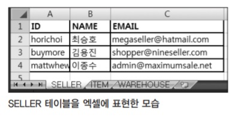

# 데이터베이스 테스트: DbUnit

## DbUnit의 장점

DB를 사용하는 부분은 프로그래밍 언어 외적인 부분이 상당 부분 포함되기 때문에 TDD를 적용하기가 종종 쉽지 않다. 특히 데이터베이스의 상태를 일정하게 유지하면서 테스트를 지속적으로 수행 가능하게 만드는 데는 고통스러운 작업이 필요하다. 또한 테스트 전후의 데이터베이스 상태를 비교하는 것도 손쉬운 일은 아니다.

이럴 때 도움을 받을 수 있는 대표적인 유틸리티로 DbUnit(www.dbunit.org)이 있다. DbUnit은 다음과 같은 기능을 제공함으로써 DB를 사용하는 테스트 케이스 작성 시에 도움을 준다.

- #### 독립적인 데이터베이스 연결을 지원한다.

   JDBC, DataSource, JNDI 방식 지원

- ####  데이터베이스의 특정 시점 상태를 쉽게 내보내거나(export) 읽어들일(import) 수 있다.

  xml 파일이나 csv 파일 형식을 지원한다. import 계열 동작일 경우에는 엑셀 파일도 지원한다.

- ####  테이블이나 데이터셋을 서로 쉽게 비교할 수 있다.

보통 DbUnit은 독립적으로 사용하기보다는 JUnit 등의 테스트 프레임워크 등과 함께 사용한다. 그래서 DbUnit은 테스트 프레임워크라기보다는 테스트 지원 라이브러리에 더 가깝다. DbUnit을 알면 테스트 케이스 작성 시 DB 관리가 매우 편리해진다. 하지만 그러기 위해서는 제일 먼저 알아야 하는 DbUnit의 개념이 하나 있다. 바로 데이터셋(Dataset)이다.

## 데이터셋

DbUnit에서 이야기하는 데이터셋(DataSet)은 데이터베이스나 그 안에 존재하는 테이블 혹은 그 일부를 xml이나 csv(comma separated value) 파일로 나타낸 모습이다. 이를테면 다음과 같은 판매자(SELLER) 테이블이 있다고 하자.


##### 판매자 테이블에 들어 있는 데이터

| ID        | NAME   | EMAIL              |
| --------- | ------ | ------------------ |
| seongmink | 김성민 | sminggo5@naver.com |
| wooyoung  | 장우영 | tmlu48@naver.com   |
| kidong    | 강기동 | ki0050@naver.com   |

위 내용을 DbUnit의 데이터셋으로 만들면 다음과 같이 표현된다.

##### seller.xml 파일

```xml
<?xml version='1.0' encoding='UTF-8'?>
<dataset>
    <seller ID="seongmink" NAME="김성민" EMAIL="sminggo5@naver.com"/>
    <seller ID="wooyoung" NAME="장우영" EMAIL="tmlu48@naver.com"/>
    <seller ID="kidong" NAME="강기동" EMAIL="ki0050@naver.com"/>
</dataset>
```

위 XML은 DbUnit에서 제공하는 여러 데이터셋 중 가장 대표적인 형식인 FlatXmlDataSet 형식의 데이터셋이다. XML에서 seller라고 표시된 요소(element)는 DB 테이블 이름에 해당하고 ID, NAME, EMAIL 등의 속성(attribute)명은 해당 테이블의 컬럼 이름을 나타낸다. DbUnit은 이런 데이터셋이라 불리는 형식을 이용해서 DB의 상태를 저장하거나 변경, 유지한다. 그리고 데이터베이스 전체나 특정 테이블 등을 비교할 때도 이 데이터셋을 사용한다. 

### 데이터베이스 연결과 테이블 초기화

앞서 살펴본 판매자 테이블을 이용해서 판매자 정보를 DB에 저장하는 DatabaseRepository 클래스를 만들어보자. 이제, DatabaseRepository 클래스를 구현 하기 위해 테스트 케이스를 작성해야 한다. 그래서 DatabaseRepository 클래스가 가져야 하는 기능들을 떠올리다 보니, 문득 향후에는 DB가 아닌 파일이나 다른 매체에 저장될 수 있다는 생각이 들었다. 그렇다면, 인터페이스를 먼저 만들면 좋겠다. 그리고 이 인터페이스를 이용해서 DatabaseRepository를 만들면 좀 더 유연한 구조가 될 것 같다. 다음은 저장소를 대표하는 Repository 인터페이스다.

##### 저장소(Repository) 인터페이스

```java
public interface Repository {
    public Seller findById(String id);
    public void add(Seller seller);
    public void update(Seller seller);
    public void update(Seller selller);
}
```

이제 Repository 인터페이스를 이용해 DatabaseRepository를 만들어보자. DatabaseRepository는 Repository 스펙에 맞춘 구현체 중 하나로 판매자들을 관리하는 기능을 제공한다. 우선, Respository 인터페이스에 정의되어 있는 여러 기능 중, 판매자의 ID를 기준으로 판매자 정보를 가져오는 findById 기능을 구현해보자. 다음은 findById 기능을 구현하기 위해 만든 테스트 클래스와 테스트 메소드다.

```java
public class DatabaseRepositoryTest {
    @Test
    public void testFindById() throws Exception {
        Seller expectedSeller = new Seller("akahwl","이호원", "akahwl12@gmail.com");
        Repository repository = new DatabaseRepository();
        Seller actualSeller = repository.findById("seongmink");
        
        assertEquals(expectedSeller.getId(),actualSeller.getId());
        assertEquals(expectedSeller.getName(),actualSeller.getName());
        assertEquals(expectedSeller.getEmail(),actualSeller.getEmail());
	}
    ...
}
```

위 테스트 케이스는 단순히 ID 값으로 조회해서 나온 결과를 예상 결과와 비교하는 로직이기 때문에, 이 상태에서 곧바로 DatabaseRepository 구현에 들어가도 별 무리는 없다. 하지만 현재 가정한 테이터베이스 내의 데이터 내용이 변경된다면, 기능 구현에 문제가 없음에도 불구하고 테스트 케이스가 실패할 수 있다. 따라서 **현재 가정되어 있는 DB 안의 데이터 상태가 테스트를 수행하기 전에 가정했던 모습으로 한결같이 유지됐으면 좋겠다**고 생각하여 다음과 같은 전략을 세웠다.


이제 DbUnit을 테스트 케이스 작성에 이용해보자. DbUnit의 테이블 초기화 기능을 이용해서 위와 같은 형태로 테스트 케이스가 수행되도록 만들 생각이다. DBMS는 Apache Derby DB를 사용했다. Derby DB는 설치 및 사용 방법이 매우 간단한 DB이다.

```java
public class DatabaseRepositoryTest {
    private final String driver = "org.apache.derby.jdbc.EmbeddedDriver";
    private final String protocol = "jdbc:derby:";
    private final String dbName = "shopdb";
    
    private IDatabaseTester databaseTester; // (1)
    
    @Before
    public void setUp() throws Exception {
        databaseTester = new JdbcDatabaseTester(driver, protocol + dbName); // (2)
        try {
            IDataSet dataSet = new FlatXmlDataSetBuilder().build(new File("seller.xml")); // (3)
            DatabaseOperation.CLEAN_INSERT.execute(databaseTester.getConnection(), dataSet); // (4)
        } finally {
        databaseTester.getConnection().close();
        }
    }
}
```

(1) : DbUnit을 사용하기 위해서는 테스트 클래스가 DbUnit에서 제공하는 DBTestCase 를 상속하도록 작성한다. 하지만 상속받아도 도움받는 부분이 많지 않은데다, 이 경우 JUnit 3 버전을 사용해야 한다는 단점이 있다. DBTestCase 클래스를 상속하지 않고, DbUnit에서 제공하는 기능을 이용하려면 IDatabaseTester라는 인터페이스를 사용하면 된다. 사실 DBTestCase 클래스도 내부적으로는 IDatabaseTester를 사용하고 있기 때문에 동작상 큰 차이는 없다. IDatabaseTester에는 DB 연결과 데이터 셋 관련 기능이 정의되어 있다.

(2) : 이 예제에서는 IDatabaseTester 구현체로 JDBC 연결 방식을 이용하는 JdbcDatabaseTester 클래스를 사용했다. DbUnit에서는 기본적으로 다음과 같은 네 개의 구현체를 제공한다.

| 구현체                            | 설명                                                         |
| --------------------------------- | ------------------------------------------------------------ |
| JdbcDatabaseTester                | DriverManager를 이용해 DB 커넥션을 생성                      |
| PropertiesBasedJdbcDatabaseTester | DriverManager를 이용해 DB 커넥션을 생성. <br />단, 연결 설정은 시스템 프로퍼티로부터 읽어들인다. |
| DataSourceDatabaseTester          | javax.sql.DataSource를 이용해 DB 커넥션을 생성               |
| JndiDatabaseTester                | JNDI를 이용해 DataSource를 가져온다                          |

(3) : 데이터셋을 지정한다. 위 예제의 경우엔 앞에서 보여준 판매자 데이터셋인 seller. xml을 지정했다.

(4) : DB 커넥션과 데이터셋을 이용해 DB에 특정 작업을 수행한다. DatabaseOperation에는 여러 종류가 있는데, 그중 CLEAN_INSERT는 데이터셋에 지정된 DB 테이블의 내용을 모두 지운 다음, 데이터셋에 들어 있는 값으로 채워넣는다. 의미적으로 DatabaseOperation의 DELETE_ALL과 INSERT 두 동작을 연속적으로 수행한 것과 동일하다.


이제 위 setUp 메소드는 테스트 메소드가 수행되기 전에 항상 seller.xml에 지정된 상태로 테이블을 초기화한다. 다음은 위 테스트 케이스를 이용해 작성한 DatabaseRepository 클래스다. JDBC 드라이버를 이용해 DB에 접속한 다음, ID에 해당하는 판매자를 받아오는 아주 기본적인 코드다.

##### DB를 저장소로 사용하는 DatabaseRepository 클래스

```java
package main.eshop;
import Java.sql.*;

public class DatabaseRepository implements Repository {
    private final String driver = "org.apache.derby.jdbc.EmbeddedDriver";
    private final String protocol = "jdbc:derby:";
    private final String dbName = "shopdb";
    private Connection conn;
    
    public DatabaseRepository() throws Exception {
        Class.forName(driver).newInstance();
        conn = DriverManager.getConnection(protocol + dbName);
    }
    
    public Seller findById(String id) {
        PreparedStatement stmt = null;
        ResultSet rs = null;
        Seller seller = null;
        
        try {
        	String query = "select ID, name, email" 
                + " from seller where ID = ?"; // (1)
        stmt = conn.prepareStatement(query);
        stmt.setString(1, id);
        rs = stmt.executeQuery();
        if ( !rs.next() ){
        	throw new SQLException("No Data Found!"); // (2)
        }
        seller = new Seller(rs.getString(1), rs.getString(2),
        rs.getString(3)); // (3)
        rs.close();
        stmt.close();
        conn.close();
        } catch (SQLException e) {
            e.printStackTrace();
        }
        return seller;
    }
    
    @Override
    public void remove(Seller seller) {}
    
    @Override
    public void update(Seller seller) {}
    
    @Override
    public void add(Seller seller) {}
}
```

(1) : ID를 기준으로 판매자 정보(ID, NAME, EMAIL)를 불러온다.

(2) : 1건도 존재하지 않으면 SQLException을 발생시킨다.

(3) : SQL 실행 결과를 Seller 클래스에 담는다.

### 데이터셋 비교

이번엔 판매자를 추가하는 기능을 구현하고자 한다. 테스트 케이스를 다음과 같이 추가했다.

##### 판매자 추가 기능 구현을 위해 작성한 테스트 케이스

```java
@Test
public void testAddNewSeller() throws Exception {
    Seller newSeller = new Seller("akahwl","이호원","akahwl12@gmail.com");
    Repository repository = new DatabaseRepository();
	repository.add(newSeller); // 새로운 판매자 추가
    Seller sellerFromRepository = repository.findById("akahwl");
    
    assertEquals(newSeller.getId(),sellerFromRepository.getId());
    assertEquals(newSeller.getName(),sellerFromRepository.getName());
    assertEquals(newSeller.getEmail(),sellerFromRepository.getEmail());
}
```

테스트 케이스의 흐름을 살펴보면, 이호원이라는 판매자를 생성해서 저장소에 추가하고, 정상 저장됐는지 확인하기 위해 판매자의 아이디로 저장소에서 찾아온다. 그리고는 저장소에서 ID로 찾아낸 판매자의 정보가 예상값과 같은지 비교한다. 앞서 작성한 @Before 애노테이션이 붙은 setUp 메소드로 인해 seller 테이블은 계속 초기화될 테니, 향후에도 지속적으로 동일한 테스트가 가능할 것이다. 이제는 특별히 고민할 필요 없이 테스트 케이스를 기준으로 구현을 진행해나가면 된다.

흔히 CRUD 기능을 구현할 때 테스트 케이스 작성 시 취하는 흔한 방식은, 우선 조회 계열 기능을 제일 먼저 TDD로 구현하고, 그 다음 추가/수정/삭제 등은 해당 조회 기능을 이용해 검증하도록 작성한다. 위 예제에서도 비슷한데, testAddNewSeller 테스트 메소드는 테스트의 성공/실패 판단을 findById 기능에 전적으로 의존하고 있다. 이런 식의 테스트 케이스 작성이 별다른 문제처럼 느껴지진 않는다. 다만 나중에는 문제가 될 소지는 남아 있다. 그럼, 어떤 경우에 문제가 생길까? 어느 날, 다음과 같은 상황이 발생했다고 생각해보자

- 조회 기능 구현에 오류가 있는 걸 발견한다.
- 조회 기능을 수정해야 할 일이 발생한다.

이런 경우, 조회 기능을 수정했더니 다른 테스트 메소드들이 한꺼번에 와장창 깨져버리는 일이 발생할 수 있다. 해당 테스트 메소드 내에서 검증하고자 하는 실제 기능들엔 아무런 문제가 없음에도 말이다. 비슷한 식으로, 만일 TDD로 작업된 소스에서 어느 한 부분을 고쳤더니 여러 개의 테스트 케이스가 동시에 실패한다면, 이런 경우가 아닌지 의심해볼 필요가 있다. 테스트 케이스 작성의 기본 원칙은, 하나의 테스트 케이스는 다른 부분에서 영향받는 부분이 최소화되어 있어야 한다는 것이다. 위 예제도 조회 기능에 의존하지 않고, 결과를 검증할 수 있게 만들려면 어떻게 하면 좋을까? 여러 가지 방법을 사용할 수 있지만, 여기서는 DbUnit의 데이터셋을 이용해 검증해보자. 다음은 결과 비교에 데 이터셋을 사용하는 테스트 실행계획이다.


##### DbUnit의 테이블 비교 기능을 이용해 다시 작성한 테스트 메소드

```java
@Test
public void testAddNewSeller() throws Exception {
    Seller newSeller = new Seller("akahwl","이호원","akahwl12@gmail.com");
    Repository repository = new DatabaseRepository();
    repository.add(newSeller);
    
    IDataSet currentDBdataSet = databaseTester.getConnection().createDataSet(); // (1)
    ITable actualTable = currentDBdataSet.getTable("seller"); // (2)
    IDataSet expectedDataSet = new FlatXmlDataSetBuilder().build(new File("expected_seller.xml")); // (3)
	ITable expectedTable = expectedDataSet.getTable("seller"); // (4)
    
    Assertion.assertEquals(expectedTable, actualTable); // (5)
}
```

(1) : 현재 데이터베이스의 상태를 테이터셋으로 추출한다. createDataSet에 파라미터로 테이블 이름을 지정할 수도 있다. 지정하지 않으면 접속 유저 소유의 전체 테이블과 데이터를 데이터셋으로 만든다.

(2) : 데이터셋에서 특정 테이블(seller)을 가져온다.

(3) : 미리 만들어놓은 예상 데이터셋을 읽어들인다.

##### expected_seller.xml

```xml
<?xml version='1.0' encoding='UTF-8'?>
<dataset>
    <seller ID="seongmink" NAME="김성민" EMAIL="sminggo5@naver.com"/>
    <seller ID="wooyoung" NAME="장우영" EMAIL="tmlu48@naver.com"/>
    <seller ID="kidong" NAME="강기동" EMAIL="ki0050@naver.com"/>
    <seller ID="akahwl" NAME="이호원" EMAIL="akahwl12@gmail.com"/>
</dataset>
```

(4) : 예상 데이터셋 중에서 비교에 사용할 테이블을 읽어들인다. 

(5) : DbUnit에서 제공하는 Assertion 클래스의 메소드를 이용해 결과를 비교한다.

##### DbUnit에서 제공하는 Assertion 클래스의 메소드

```java
public class Assertion {
    public static void assertEquals(ITable expected, ITable actual)
    public static void assertEquals(IDataSet expected, IDataSet actual)
}
```

 JUnit에서는 제공하지 않는 ITable 타입과 IDataSet 타입의 비교를 지원해준다. 만일 데이터셋을 직접 비교하고 싶으면 다음과 같이 작성한다.

```java
…
	IDataSet currentDBdataSet 
	    = databaseTester.getConnection().createDataSet(new String[]{"seller"});
	IDataSet expectedDataSet 
        = new FlatXmlDataSetBuilder().build(new File("expected_seller.xml"));
	Assertion.assertEquals(expectedDataSet, currentDBdataSet);
…
```

> ##### 주의
>
> DbUnit은 위 예제의 경우처럼 데이터베이스의 스냅샷(Snapshot, 특정 시점의 상태나 이미지)을 잡아 테이블로 추출 할 때, 해당 테이블의 기본키(primary key, PK) 값으로 정렬한다. 하지만 데이터셋을 파일로부터 읽어들일 때는 해당 테이블을 정렬하지 않는다. 그래서 만일 새로운 데이터가 테이블에 추가되어 PK 정렬로 인해 순서가 달라지면 동일한 내용의 데이터셋임에도 오류가 발생할 수 있다. 이럴 경우에는 SQL을 이용해 데이터셋의 일부만을 추출할 수 있게 도와주는 createQueryTable을 사용해서 직접 sql에 “ORDER BY” 구문을 포함시켜 버리거나, 아니면 파일로부터 읽어들인 데이터셋 테이블을 SortedTable 클래스로 정렬한 다음 비교하면 된다.
>
> ```java
> // 자동 정렬이 일어나지 않도록 SQL 문을 지정하든가
> ITable actualTable = connection.createQueryTable("seller", "select * from seller");
> 
> // 예상 결과 데이터셋 값을 정렬시켜 버리든가
> Assertion.assertEquals(new SortedTable(expectedTable), actualTable); 
> ```

## DbUnit 데이터셋의 종류

데이터셋이란 개념은 하나의 타입을 나타냄과 동시에 테이블들의 집합체를 표현하는 IDataSet 인터페이스의 구현체를 의미하기도 한다. 앞서 본 seller. xml 파일은 그중 FlatXmlDataSet으로 표현된 데이터셋이다

### FlatXmlDataSet

- 테이블 이름을 XML TAG 구성요소로 적는다.
- 컬럼 이름은 속성으로 적는다.
- 널(null)값을 넣을 컬럼은 표현하지 않는다. 자동으로 널값이 들어간다.
- XML DTD(Document Type Definitions)를 지정하지 않아도 된다.
- 데이터셋 중 가장 흔하게 사용된다.

##### FlatXmlDataSet 형식으로 작성된 XML 파일

```xml
<dataset>
    <EMPLOYEE NO="101" NAME="김성민" EMAIL="sminggo5@naver.com"/>
    <EMPLOYEE NO="102" NAME="강기동" />
    <DEPARTMENT />
</dataset>
```

### XmlDataSet

- 다소 장황한 버전의 데이터셋
- DTD를 반드시 포함해야 한다.
- 잘 사용하지 않는다.

### StreamingDataSet

- 데이터베이스의 커서(cursor) 개념처럼 단방향으로 동작하며 현재 레코드만 메모리에 존재한다.
- UPDATE, INSERT, REFRESH 같은 동작을 하는 XML 데이터셋을 읽어들일 때 매우 효율적으로 동작한다.

```java
IDataSetProducer producer = new FlatXmlProducer(new InputSource("dataset.xml"));
IDataSet dataSet = new StreamingDataSet(producer);
```

### DatabaseDataSet

- 데이터베이스 인스턴스에 대한 접근을 제공한다.
- 직접 new로 생성하지 않고 팩토리 메소드로 만들어낸다

```java
IDataSet currentDBdataSet = IDatabaseConnection.createDataSet();
```

### QueryDataSet

- 쿼리문으로 데이터셋을 만들어낸다.

##### 사번이 600번 이상인 직원과 DEPARTMENT 테이블 전체를 데이터셋에 담는다.

```java
QueryDataSet dataSet = new QueryDataSet(connection);
dataSet.addTable("NEW_EMPLOYEE", "SELECT * FROM EMPLOYEE WHERE EMPNO >
600");
dataSet.addTable("DEPARTMENT");
```

### XlsDataSet

- MS 엑셀 문서를 데이터셋으로 인식한다.
- 엑셀 문서 내의 각 시트(sheet)를 테이블로 인식한다.
- 시트의 첫 번째 줄을 컬럼 이름으로 인식한다.
- 나머지 줄은 데이터 값으로 인식한다.



ITEM 테이블과 WAREHOUSE 테이블도 다른 시트에서 표현하고 있다.

### ReplacementDataSet

- 데이터셋에서 특정한 문자열을 치환하기 위해 사용한다.
- 보통은 null 값을 다르게 표현하고 런타임 시에 치환하는 데 많이 사용한다.

```xml
<dataset>
    <EMPLOYEE NO="101" NAME="김성민" EMAIL="sminggo5@naver.com"/>
    <EMPLOYEE NO="102" NAME="강기동" EMAIL="[null]"/>
</dataset>
```

데이터셋 파일은 위와 같이 만든 다음 아래와 같은 코드로 읽어들여서 null 값을 변환 한다.

```java
ReplacementDataSet dataSet = new ReplacementDataSet(new FlatXmlDataSet(... ...));
dataSet.addReplacementObject("[NULL]", null);
```

이 외에도 CompositeDataSet과 FilteredDataSet 등이 있다.