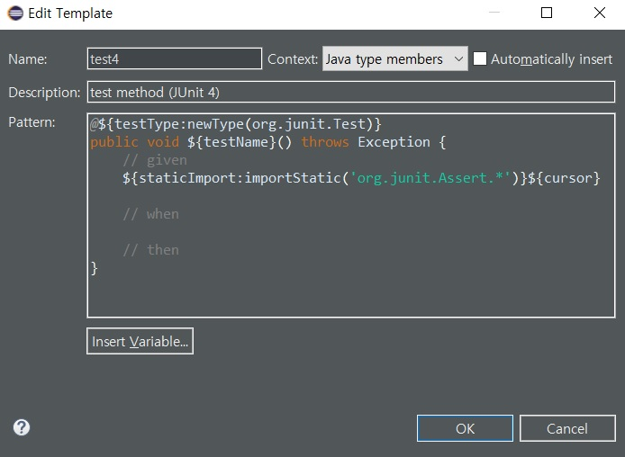

# Mock을 이용한 TDD

## Mock 객체

설계도면을 보면서, 나무를 깎아 붙여 거의 실제 크기에 맞먹는 크기로 만든 다음 다각도로 살펴보는 장면이 나오는 CF가 있었다. 이때 나온 자동차 모형을 Mock이라고 한다. 자동차의 디자인을 검토하기 위해 실제 재료로 만들려면 비용과 시간이 많이 들기 때문에, 비교적 제작하기 쉽고 비용이 덜 드는 나무를 재료로 만들어본 것이다. 이렇듯 일반적으로 Mock이란, 조각하기 쉬운 재료(보통 나무나 점토 등)를 이용해 추후 만들어질 제품의 외양을 흉내 낸 모조품을 말한다. 마찬가지로 소프트웨어 개발에 있어서도 **모듈의 겉모양이 실제 모듈과 비슷하게 보이도록 만든 가짜 객체를 Mock 객체라고 한다.** 실제 객체를 만들기엔 비용과 시간이 많이 들거나 의존성이 길게 걸쳐져 있어 제대로 구현하기 어려울 경우, 이런 가짜 객체를 만들어 사용한다.

### 언제 Mock 객체를 만들 것인가?

테스트 케이스 작성이 어려운 상황과 Mock 객체가 필요한 상황은 종종 일치하곤 한다. 대부분의 경우 모듈이 가진 '의존성'이 근본적인 원인이 된다. 그게 환경적이든지, 아니면 팀이 처한 상황적이든지 간에, 모듈이 필요로 하는 '의존성'은 테스트 작성을 어렵게 만든다. 그리고 그 의존성을 단절시키기 위해 Mock 객체가 사용된다.

1. #### 테스트 작성을 위한 환경 구축이 어려워서

   - **환경 구축을 위한 작업 시간이 많이 필요한 경우에 Mock 객체를 사용한다.** 오라클 데이터베이스를 설치해야 테스트가 가능하다든가, 웹 서버나 웹 애플리케이션 서버, FTP 서버 등을 설치해야만 테스트 케이스가 가능해지는 경우가 바로 Mock이 필요한 상황이다. 
   - **경우에 따라서는 특정 모듈을 아직 갖고 있지 않아서 테스트 환경을 구축하지 못할 수도 있다.** 그런 상황에 대한 이유는 다양하다. 개발이 안 돼서, 혹은 모듈을 아직 넘겨받지 못해서, 버그가 있어서 등등 처한 상황만큼이나 다양하게 존재한다.
   - **타 부서와의 협의나 정책이 필요한 경우에도 Mock이 필요하다.** 연계 모듈이라서 다른 쪽에서 승인을 해줘야 테스트가 가능한 경우, 방화벽으로 막혀 있어서 통과가 어려운 경우 등이 이에 속한다.

2. #### 테스트 특정 경우나 순간에 의존적이라서

   특정한 경우에 의존적으로 동작하는 기능들이 있다. 이런 경우는 특히 예외처리를 테스트할 때 많이 접하게 된다. 이를테면 FTP 클라이언트 프로그램을 만드는데, 네트워크 연결의 접속시간제한(timeout)을 구현한다고 가정해보자. 접속 시도 후 5초까지 1초마다 접속을 재시도하고 그 이후엔 연결 실패 메시지를 띄우는 기능을 테스트해야 한다. 3초까지는 접속이 안 돼서 접속을 시도하다가 4초에, 즉 네 번째 재시도에 접속이 되는 경우를 테스트 케이스로 만들려면 어떻게 해야 할까? 옆에 타이머를 놓고 네트워크 선을 뽑았다, 꼈다 할 수는 없지 않겠는가? 혹은 파일을 이용하는 프로그램을 작성한다고 가정해보자. 작업 중간에 파일에 작업 내용을 기록하고자 한다. 이때 만일 데이터가 부정확하게 저장되는 경우에 대비해, 이를 처리하는 코드를 작성해야 한다. 그런데, 그런 특정한 상황을 테스트 시점마다 발생하도록 만드는 것이 어려울 수 있다. 이럴 때 Mock을 이용하면 특정 상태를 가상으로 만들어놓을 수 있다.

3. #### 테스트 시간이 오래 걸려서

   테스트 케이스의 실행시간 단축을 위해 Mock이 사용될 때도 있다. 시간이 오래 걸리는 테스트가 있다. 개인 PC의 성능이나 서버의 성능 문제로 인해 오래 걸릴 수도 있지만, 그것보다는 특정한 모듈을 호출했을 때, 속칭 멀리 갔다 오느라 시간이 걸리는 경우가 있다. 이렇듯 기능 수행 그 자체보다 테스트 수행 시 영향을 미치는 다른 부분으로 인해 테스트 시간이 오래 걸리는 경우 Mock이 사용된다. 이럴 때는 보통 시간이 오래 걸리는 구간이나 모듈을 Mock으로 통째로 대체해서 만든다. 물론 이 경우 Mock으로 대체 하는 부분은 신뢰도 높은 모듈(high reliability module)이란 가정이 선행돼야 한다. 아니면 Mock 대체 모듈에 대해서는 다른 부분에서 반드시 테스트할 수 있어야 한다.

## 테스트 더블

- #### 더미 객체(Dummy Object)

  더미 객체는 말 그대로 멍청한 모조품, 단순한 껍데기에 해당한다. 단지 인스턴스화된 객체가 필요할 뿐 해당 객체의 기능까지는 필요하지 않은 경우에 사용한다. 따라서 해당 더미 객체의 메소드가 호출됐을 때의 정상 동작은 보장되지 않는다. 일부 개발자는 더미 객체의 메소드는 호출을 가정하고 만들어진 것이 아니기 때문에, 만일 호출 시엔 예외를 발생시키게 만들어놓아야 한다고 말한다. 보통은 위에서 만들어놓은 것처럼, 타입 기본값(0, null, false 등)으로 반환값을 만들어주는 선에서 마무리한다.

- #### 테스트 스텁(Stub)

  더미 객체가 마치 실제로 동작하는 것처럼 보이게 만들어놓은 객체다. 즉, **단지 인스턴스화될 수 있는 객체 수준이면 더미, 인스턴스화된 객체나 특정 상태나 모습을 대표하면 스텁이다.**

- #### 페이크 객체(Fake Object)

  페이크는 여러 개의 인스턴스를 대표할 수 있는 경우이거나, 좀 더 복잡한 구현이 들어가 있는 객체를 지칭한다.  이를테면 실제로는 DB를 통해 쿠폰 적용 가능 카테고리나 아이템을 확인한다고 하면, 페이크 객체에서는 테스트에 사용할 아이템과 카테고리에 대해서만 실제로 DB에 접속해서 비교할 때와 동일한 모습처럼 보이게 만들 수도 있다. 보통 내부에 리스트(List)나 맵(Map)을 이용해서 DB 같은 외부 의존 환경을 대체한다.

  페이크 객체는 복잡한 로직이나, 객체 내부에서 필요로 하는 다른 외부 객체들의 동작을, 비교적 단순화하여 구현한 객체다. 결과적으로는 테스트 케이스 작성을 진행하기 위해 필요한 다른 객체(혹은 클래스)들과의 의존성을 제거하기 위해 사용된다.

- #### 테스트 스파이(Test Spy)

  테스트에 사용되는 객체에 대해서도, 특정 객체가 사용됐는지, 그리고 그 객체의 예상된 메소드가 정상적으로 호출됐는지를 확인해야 하는 상황이 발생한다. 보통은 호출 여부를 몰래 감시해서 기록했다가, 나중에 요청이 들어오면 해당 기록 정보를 전달해준다. 그런 목적으로 만들어진 테스트 더블을 테스트 스파이라고 부른다. 특정 메소드의 정상호출 여부 확인을 목적으로 구현되며, 더미부터 시작해서 페이크 객체에 이르기까지 테스트 더블로 구현된 객체 전 범위에 걸쳐 해당 기능을 추가할 수 있다.

  일반적으로 테스트 스파이는 아주 특수한 경우를 제외하고 잘 쓰이지 않는다. 보통은 테스트 스파이가 필요한 경우에도 Mock 프레임워크를 이용하는 것이 더 편하기 때문이다. 대부분의 Mock 프레임워크들은 기본적으로 테스트 스파이 기능을 제공해준다.

- #### Mock 객체(Mock Object)

  Mock 객체는 행위(behavior)를 기반으로 테스트 케이스를 작성한다. Mock 객체는 행위를 검증하기 위해 사용되는 객체를 지칭한다. 수동으로 만들 수도 있고, Mock 프레임워크를 이용할 수도 있다. 수동으로 만드는 건 고통이 매우 크기 때문에, 현재는 대부분 Mock 프레임워크를 사용한다.

## Mock 프레임워크

Mock 프레임워크(혹은 라이브러리)는 동적으로 Mock 객체를 만들어주는 프레임워크를 지칭한다. Mock 프레임워크 사용 시의 이점은 크게 두 가지다.

- #### Mock 객체를 직접 작성해서 명시적인 클래스로 만들지 않아도 된다.

- #### Mock 객체에 대해서 행위까지도 테스트 케이스에 포함시킬 수 있다.

Mock 객체를 직접 만들다 보면 클래스 숫자가 점점 늘어나서 관리에 부담이 생긴다. 결국 언제가 됐든 Mock 프레임워크가 필요한 시점이 올 수밖에 없다.

Mockito는 간편함과 함께 기존 Mock 프레임워크들 이 지향했던, 행위 기반 테스트 위주에서 상태 위주 테스트로의 회귀를 전면으로 내세우고 있다. 그리고 이 점이 Mockito의 흥행 요소 중 하나이기도 하다.

### Mockito

전통적인 TDD 개발자들이 주로 사용했던 방식인 상태 기반 테스트를 지향 한다는 점이 장점이다.

- #### Mockito 특징

  Mock 프레임워크의 차별점은 무엇인가?

  ```
  1. 테스트 그 자체에 집중한다.
     - 테스트의 행위와 반응(interaction)에만 집중해서 테스트 메소드를 작성할 수 있게 한다.
  2. 테스트 스텁을 만드는 것과 검증을 분리시켰다.
  3. Mock 만드는 방법을 단일화했다.
  4. 테스트 스텁을 만들기 쉽다.
  5. API가 간단하다.
  6. 프레임워크가 지원해주지 않으면 안 되는 코드를 최대한 배제했다.
     - record( ), replay( ) 메소드도 없고 에일리언 코드 같은 control/context 객체도 없다.
  7. 실패 시에 발생하는 에러추적(stack trace)이 깔끔하다.
     - 특정 API나 라이브러리를 모르면 이해할 수 없는 부분을 제외했다.
  ```

  쉽게 말하자면, Mockito는 EasyMock과 jMock의 단점을 보완하기 위해 나온 Mock 프레임워크이라고 생각하면 된다.

- #### 환경 구성

  https://mvnrepository.com/artifact/org.mockito/mockito-all 에서 mockito-all-x.x.x.jar 파일을 클래스패스에 포함시킨다.

- #### 기본 사용법

  Mockito는 Stub 작성과 Verify가 중심을 이루며 다음과 같은 순서로 진행된다.

  | 분류       | 설명                                                         |
  | ---------- | ------------------------------------------------------------ |
  | CreateMock | 인터페이스에 해당하는 Mock 객체를 만든다.                    |
  | Stub       | 테스트에 필요한 Mock 객체의 동작을 지정한다.(단, 필요시에만) |
  | Exercise   | 테스트 메소드 내에서 Mock 객체를 사용한다.                   |
  | Verify     | 메소드가 예상대로 호출됐는지 검증한다.                       |

  다른 프레임워크는 Stub과 Expectation을 둘 다 진행하지만, Mockito는 Stub 작업만 한다.

  - #### Mock 객체 만들기

    ```java
    Mockito.mock(타겟 인터페이스);
    ```

    ##### 예시

    ```java
    import static org.mockito.Mockito.*;
    
    ...
    List mockedList = mock(List.class);
    ```

    Mockito 클래스의 static 메소드인 mock을 이용해 인터페이스나 클래스를 지정한다. 이후부터는 구현 클래스로 객체가 생성된 것처럼 동작한다. 물론 메소드들은 현재 정상 동작하진 않는다. Mock 메소드 외에도 여러 가지 static 메소드가 사용되기 때문에 일반적으로 위 예시처럼 Mockito 클래스를 static import 처리해서 사용한다.

    ```java
    List mockedList = mock(List.class);
    System.out.println(mockedList.size());
    
    -----실행 결과-----
    0
    ```

    리턴 타입(return type)의 기본값으로 동작한다. int는 0, boolean은 false, 클래스 타입들은 null을 돌려주는 식이다.

  - #### 예상값 지정

    Mockito는 예상값을 지정하는 것이 아니라, 필요 시에 테스트 스텁만 만들고 나중에 호출 여부를 확인하는 방식을 사용한다. Mockito는 **스텁 -> 수행 -> 검증**으로 단순화되어 있다.  '뭣하러 미리 예상 행동을 고민해야 하느냐? 테스트를 수행하고 결과(상태)를 보자'의 개념이다. 그래서 **Mockito는 예상값 지정 부분이 없다.**

  - #### 테스트에 사용할 스텁 만들기

    ```java
    when(Mock_객체의_메소드).thenReturn(리턴값);
    when(Mock_객체의_메소드).thenThrow(예외);
    ```

    단, 스텁은 필요할 때만 만드는 것이 원칙이다. 메소드 호출 여부를 검증만 할 때는 사 용하지 않는다.

    ```java
    List mockedList = mock(List.class);
    
    // Mock 객체를 사용한다.
    mockedList.add("item");
    mockedList.clear();
    
    // 검증
    verify(mockedList).add("item");
    verify(mockedList).clear();
    ```

    위와 같은 경우에 Mock 객체를 생성만 하고, 나중에 호출을 검증하는 식으로 테스트 코드가 작성됐다. 만일 테스트를 위해 Mock 객체의 특정 메소드를 사용해야 할 필요 가 생긴다면 그때 만든다.

    ```java
    // Stub 만들기
    when(mockedList.get(0)).thenReturn("item");
    when(mockedList.size()).thenReturn(1);
    when(mockedList.get(1)).thenThrow(new RuntimeException());
    
    System.out.println(mockedList.get(0));
    System.out.println(mockedList.size());
    System.out.println(mockedList.get(2));
    System.out.println(mockedList.get(1));
    
    -----실행 결과-----
    Item
    1
    null
    Java.lang.RuntimeException
    	at SimpleMockTest.testMockList(SimpleMockTest.Java:25)
    ...
    ```

  - #### 검증

    ```java
    verify(Mock_객체).Mock_객체의_메소드;
    verify(Mock_객체, 호출횟수지정_메소드).Mock_객체의_메소드;
    ```

    Mock 객체의 특정 메소드가 호출됐는지 확인한다. 호출 횟수도 지정해서 검증할 수가 있다.

    | 메소드명    | 설명                                                         |
    | ----------- | ------------------------------------------------------------ |
    | time(n)     | n번 호출됐는지 확인, n=0은 time를 지정하지 않을 때와 동일하다. |
    | never       | 호출되지 않았어야 함                                         |
    | atLeastOnce | 최소 한 번은 호출됐어야 함                                   |
    | atLeast(n)  | 적어도 n번은 호출됐어야 함                                   |
    | atMost(n)   | 최대 n번 이상 호출되면 안 됨                                 |

    ##### 예시 1

    ```java
    verify(mockedList).add("item");
    verify(mockedList, times(1)).add("item");
    
    verify(mockedList, times(2)).add(box);
    
    verify(mockedList, never()).add(car);
    
    verify(mockedList, atLeastOnce()).removeAll();
    verify(mockedList, atLeast(2)).size();
    verify(mockedList, atMost(5)).add(box);
    ```

    ##### 예시 2

    ```java
    import static org.mockito.Mockito.*;
    
    public class SimpleMockTest {
        
        @Test
        public void testMockList() throws Exception {
        	List mockedList = mock(List.class);
        	verify(mockedList).size();
        }
    }
    
    -----실행 결과-----
    Wanted but not invoked:
    list.size();
    -> at SimpleMockTest.testMockList(SimpleMockTest.Java:19)
    Actually, there were zero interactions with this mock.
    ```

    verify 메소드를 이용해 mockedList.size()가 호출됐는지 확인한다. 상태 기반 테스트 에 유용하다. 

    검증을 할 때 매번 특정한 메소드의 호출을 그대로 표현할 순 없는 경우가 있다. 메소 드의 인자로 특정한 값을 지정하는 것이 아니라, 일종의 패턴 같은 방식을 사용해야 할 경우를 말한다. 이를테면 다음과 같은 검증 구문이 있다고 가정해보자.

    ```java
    verify(mockedList, times(5)).add(box);
    ```

    이렇게 작성하면 mockList.add(box)가 5번 호출됐는지 검증하라는 뜻인데, 인자까지 는 특정하지 않고 add 메소드가 5번 사용됐기만 하면 될 때는 어떻게 해야 할까? 그럴 때 사용하는 것이 Argument Matcher이다.

    #### Argument Matcher

    앞 예제에 Argument Matcher를 사용하면 다음과 같이 표현할 수가 있다.

    ```java
    verify(mockedList, times(5)).add(any());
    ```

    즉, 어떤 객체가 add 메소드의 인자로 와도 무방하고, 대신 5번 호출됐다면 성공이란 뜻이다. Mockito의 Argument Matcher는 메소드로 구현되어 있고, 검증(verification) 단계 및 Stub을 만들 때 모두 쓸 수 있다. 대표적인 종류는 다음과 같다.

    | 종류                                   | 설명                                                         |
    | -------------------------------------- | ------------------------------------------------------------ |
    | any                                    | 어떤 객체가 됐든 무방                                        |
    | any 타입                               | anyInteger( ), anyBoolean 등 Java 타입에 해당하는 any 시리즈가 있다.<br />이런 시리즈들은 null이거나 해당 타입이면 만족한다. |
    | anyCollection<br />anyCollectionOf     | List, Map, Set 등 Collection 객체이면 무방. anyCollectionOf는 anyCollection과 동일하다.<br />자연스런 문장을 위해 사용한다. |
    | argThat(HamcrestMatcher)               | Mockito도 Hamcrest Matcher를 사용하고 있다.<br />Hamcrest에서 사용하던 Matcher를 그대로 이 부분에서 사용할 수 있다. |
    | eq                                     | Argument Matcher가 한번 사용된 부분에선 Java의 타입을 그대로는 더 이상 쓸 수가 없다.<br />verify(mock).add(anyString(), “item”); <br />즉, 위와 같이는 쓸 수 없다. 이럴 때 아래와 같이 eq를 이용한다. <br />verify(mock).put(anyString(9), eq(“item”)); |
    | anyVararg                              | 여러 개의 인자를 지칭할 때 사용한다.<br />예시) <br />// verification <br />mock.foo(1, 2); <br />mock.foo(1, 2, 3, 4); <br />verify(mock, times(2)).foo(anyVararg()); <br />// Stubbing: <br />when(mock.foo(anyVararg()).thenReturn(100); |
    | matches(String regex)                  | 정규식 문자열로 인자(argument) 대상을 지칭한다               |
    | startwith(String)<br />endWith(String) | 특정 문자열로 시작하거나 끝나면 OK                           |
    | anyList<br />anyMap<br />anySet        | anyCollection의 좀 더 디테일한 버전이다. 해당 타입이기만 하면 OK |
    | isA(Class)                             | 해당 클래스 타입이기만 하면 된다                             |
    | isNull                                 | null이면 OK                                                  |
    | isNotNull                              | null만 아니면 OK                                             |

    #### 순서 검증
    
    만일 Stub으로 만들어진 Mock 객체 메소드의 호출 순서까지 검증하고 싶다면 InOrder 클래스를 이용한다.
    
    ```java
    List firstMock = mock(List.class);
    List secondMock = mock(List.class);
    
    firstMock.add("item1");
    secondMock.add("item2");
    
    InOrder inOrder = inOrder(firstMock, secondMock);
    inOrder.verify(firstMock).add("item1");
    inOrder.verify(secondMock).add("item2");
    ```
    
    만일 add 메소드의 호출이 item1 -> item2 순으로 이뤄지지 않았다면 실패로 간주한다.
  
- #### Mockito의 특징적인 기능

  - #### **void 메소드를 Stub으로 만들기**

    void 메소드는 특별히 리턴할 내용이 없기 때문에 Stub으로 만들 일이 거의 없다.  그런데 예외가 딱 하나 있는데, 바로 void 메소드에서 예외(exception)가 발생하는 경우를 Stub으로 구현할 때다. 그때 사용할 수 있는 메소드가 doThrow이다.

    ```java
    doThrow(예외).when(Mock_객체).voidMethod();
    ```

    ##### 예시

    ```java
    doThrow(new RuntimeException()).when(mockList).clear();
    ```

  - #### 콜백으로 Stub 만들기 : thenAnswer

    Mock은 보통 하드코딩된 값만 돌려주도록 만들 수 있다. 그런데 특정 Mock 메소드에 대해 실제 로직을 구현하고자 할 때 콜백(CallBack) 기법을 사용한다. 그런데 TDD 자체에서 권장하는 방식은 아니라는 걸 알아두자. 테스트에 사용하는 대상의 일부에 테스트를 위한 로직을 강제로 넣는다는 건 역시 깔끔한 테스트 케이스 작성과는 거리가 멀어진다. 다음 예는 저자가 JDBC 테스트를 위해 만들었던 코드의 일부다. 내용을 볼 필요는 없고, 모양만 살펴보자.

    ```java
    when(rs.getInt("no")).thenAnswer(new Answer<Integer>(){
        public Integer answer(InvocationOnMock invocation) throws Throwable {
            if (currentRecord = = null)
                throw new SQLException("access fields is empty");
            return ((Integer)currentRecord[0]).intValue();
        }
    });
    ```

  - #### 실제 객체를 Stub으로 만들기 : SPY

    지금까지 인터페이스를 Mock으로 만들어왔다. 그런데 Mockito는 실 객체도 Mock으 로 만들 수 있다. Mockito의 강력한 기능 중 하나인데, 너무 강력해서 오히려 문제가 될 수도 있는 기능이다. 부분 Mocking이라고 불리는 방법으로 서드파티(3rd Party) 제품, 고칠 수 없는 라이브러리만 남아 있는 코드 등에 대해서만 한정적으로 사용하는 걸 권장한다. Mockito의 저자는 spy 기능을 쓰게 된다면, 그건 이미 뭔가 잘못된 코드를 건드리고 있다는 증거라고 이야기하고 있다.

    ```java
    ArrayList<String> realList = new ArrayList<String>();
    realList.add("Hello");
    System.out.println(realList.get(0));
    
    List mockedList = spy(realList);
    
    when(mockedList.get(0)).thenReturn("item");
    System.out.println(mockedList.get(0));
    
    -----실행 결과-----
    Hello
    item
    ```

    참고로, final로 선언 된 메소드는 Stub으로 만들 수 없다.

  - #### 똑똑한 NULL 처리 : SMART NULLS

    Stub으로 만들지 않은 기본형 외의 값을 리턴하는 메소드는 null 값이 찍힌다. 이렇게 만들어진 Mock 객체들은 종종 NPE(Null Pointer Exception)를 유발한다. 필요에 따라, 좀 더 유용한 값이 기본값으로 찍히게 만드는 것이 SMART NULLS라는 방식이다.

    ```java
    List mockedList = mock(List.class);
    List smartMockedList = mock(List.class, RETURNS_SMART_NULLS);
    
    System.out.println(mockedList.toArray());
    System.out.println(smartMockedList.toArray());
    
    -----실행 결과-----
    null
    [LJava.lang.Object;@3eca90
    ```

    #### SMART NULLS 규칙

    - 기본형 래퍼(primitive wrapper) 클래스는 해당 기본형 값으로 바꾼다.
    - String은 ""로 바꾼다.
    - 배열은 크기 0인 기본 배열 객체로 만들어준다.
    - Collection 계열은 빈 Collection 객체로 만든다.

  - #### 행위 주도 개발(BDD) 스타일 지원

    Mockito는 //given //when //then 식의 행위 주도 개발(Behavior-Driven Development, BDD) 스타일로 테스트 케이스 작성할 수 있게 지원해준다. BDD 스타일을 사용하려면 Mockito 클래스 대신 BDDMockito를 static import 한다. 다음은 해당 예시이다.

    ```java
    import static org.mockito.BDDMockito.*;
    
    Seller seller = mock(Seller.class);
    Shop shop = new Shop(seller);
    
    public void shouldBuyBread() throws Exception {
        // given
        given(seller.askForBread()).willReturn(new Bread());
        // when
        Goods goods = shop.buyBread();
        // then
    	assertThat(goods, containBread());
    } 
    ```

- ### Mockito 정리

  Mockito는 사용법이 간단하고 지향하는 바가 뚜렷하다. 'TDD를 위한 테스트 코드 작성에 전념할 수 있도록 도와준다. 최대한 간결하게 사용할 수 있도록 한다.' 이게 Mockito의 지향점이다.

## Mock 프레임워크 마무리

### Mock 사용 시 유의사항

- #### Mock 프레임워크가 정말 필요한지 잘 따져본다.

  적지 않은 개발자들이 Mock 객체와 Mock 프레임워크를 접하고는, 그 기능과 방식에 매료돼서는 Mock을 사용하는 것 자체가 목적이 돼버리는 경우를 종종 본다. 개발을 진행해나가면서 Mock 객체가 필요한 부분이 나오는 것이 아니라, Mock 객체가 적용될 수 있는 부분을 찾아내려고 애쓰는 역전현상이 발생하는 것이다. 한번 Mock 프레임워크를 사용하면, 그 뒤로는 해당 테스트 케이스를 유지하는 데 드는 비용이 지속적으로 발생한다. 그리고 Mock 객체들은 흔히 깨지기 쉬운 테스트 케이스 (fragile testcase)가 돼버리는 경향이 있다. 만일 가능만 하다면 설계를 바꿔서라도 Mock 필요 없는 의존성 적은 구조로 만들어놓아야 한다. 그 편이 Mock 객체를 사용 하려고 노력하는 것보다 훨씬 낫다.

- #### 투자 대비 수익(ROI)이 확실할 때만 사용한다

  테스트용 DB를 설치하는데 반나절이 걸린다고 가정하자. 이럴 때 DB와 연관된 기능 부분을 Mock 객체로 만드는 것이 옳은 선택일까, 잘못된 선택일까? Mock을 사용하려 할 때는 좀 더 길게 볼 필요가 있다. 장기적으로 이득일지 고민해보자. 테스트를 편리하게 만들기 위해 사용하기 시작한 Mock 객체들이 시간이 지날수록 불어날 텐데, 자칫 개발 진척의 발목을 잡는 족쇄가 될 수도 있다.

- #### 어떤 Mock 프레임워크를 사용하느냐는 핵심적인 문제가 아니다 

  어떤 Mock 프레임워크를 사용할 것인지에 대해 지나치게 많은 고민을 하는 경우가 있다. 그리고 어떤 Mock 프레임워크가 선정되느냐에 따라 향후 테스트 케이스 작성에 커다란 영향을 미칠 것처럼 느껴질 수 있다. 하지만 사실은 그렇지 않다. 어떤 Mock 프레임워크를 사용한다 하더라도 익숙해지기 전까지는 불편할 수밖에 없다. 어떤 측면에서는 Mock 프레임워크를 사용했다는 것만으로도 이미 어려운 길에 들어서는 것이다.

- #### Mock은 Mock일 뿐이다

  Mock 객체를 사용해 아무리 잘 작동하는 코드를 만들었다 하더라도, 실제 객체(real object)가 끼어들어 왔을 때도 잘 동작하리라는 보장은 없다. Mock 객체는 실제 객체나 실제 시스템에 대해 단지 흉내만, 그것도 오로지 당신이 원하는 형태로만 낼 뿐 이란 걸 잊어서는 안 된다. 결국 언제가 됐든, Mock 객체는 실제 객체로 대체되어 테스트를 해야 하는 시점이 온다. 따라서 초반부터 실제 객체를 테스트에 사용할 수 있다면, 그리고 그 비용이 많이 크지 않다면, Mock 객체를 사용하지 말자.

> **Mockito 개발자가 이야기하는 궁극의 TDD 템플릿**
>
> ```java
> @Test
> public void shouldDoSomethingCool() throws Exception {
>     // given : 선행조건 기술
>     
>     // when : 기능 수행
>     
>     // then : 결과 확인
> }
> ```
>
> 별것 아닌 것 같지만, 의미적으로 각 단계를 구분해주고 있다. 확실히 가독성이 높아진다. 이클립스의 템플릿을 수정해서 테스트 케이스를 만들 때 자동적으로 주석이 달리도록 만들 수도 있다. 다음은 그 방법이다.
>
> ##### BDD 스타일을 이클립스 템플릿으로 등록하기
>
> 이클립스 메뉴에서 [Window] → [Preferences] → [Java] → [Editor] → [Templates] 순으로 찾아간다. JUnit 4 테스트 템플릿에 해당하는 Test 템플릿을 선택한 다음 그림처럼 주석을 넣는다.
>
> 

