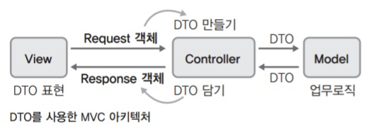
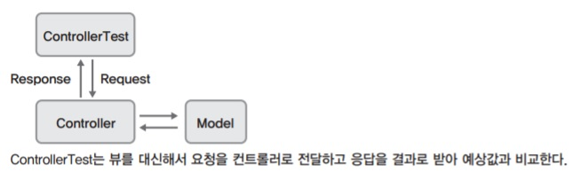

# TDD Patterns

## 일반적인 애플리케이션

TDD가 가장 적극적으로 사용되고 효율이 높은 부분은 애플리케이션의 업무로직을 구현할 때다. 그렇다면 '로직 구현'이 개발의 중심이 되는 일반적인 개발에서는, 테스트 케이스를 작성할 때 어떠한 상황에 접하게 되는지 살펴볼 필요가 있다. 그리고 각각의 경우 어떻게 테스트 케이스를 작성하고, 또 어느 수준까지 진행할 것인지 미리 알아두면 시간절약에 많은 도움이 된다.

### 생성자 테스트

- 단순히 클래스를 생성한다는 의미를 갖는 생성자(constructor)는 굳이 테스트 케이스를 작성하지 않는다. 다만, 객체 사용을 위해 반드시 갖춰야 하는 값을 생성자에 설정하는 경우는 필요에 따라 테스트를 작성한다.
- 단, 가끔 생성자에서 객체 생성의 의미뿐 아니라, 선행조건이나 업무로직을 직접 기술하는 경우도 있는데, 이럴 경우에는 테스트 케이스를 작성해야 한다. 이를테면 DAO 객체 생성 시 DB 커넥션까지 확보해야 하는 경우라면 다음과 같이 테스트 케이스를 만들 것이다

```java
public class EmployeeDaoTest {
    @Test
    public EmployeeDaoTest {
        EmployeeDao dao = new EmployeeDao();
        assertTrue(dao.isConnected());
    }
}
```

### DTO 스타일의 객체 테스트

- 클래스가 속성 필드와 단순 setter/getter로만 이뤄진 DTO 스타일로 만들어진 경우에는 굳이 테스트 케이스를 작성하지 않는다.
- 단, 특정한 목적을 갖고 만들어진 불변 객체(immutable object)의 경우에는 getter 계열 메소드나 상태를 확인할 수 있는 is 계열(isReady, isConnected 등)의 메소드를 이용한 테스트 케이스를 작성하기도 한다.

### 닭과 달걀 메소드 테스트

메소드가 서로 맞물려 있어서, 완전히 하나만 독립적으로 테스트하기 어려운 경우가 있다. 보통 로직 메소드(add, remove, set 계열 메소드)와 상태확인 메소드(get, show, is 계열 메소드)가 짝을 이루는 경우에 해당한다. 이럴 경우엔 어느 한쪽의 테스트 케이스를 먼저 만들기가 어렵다. 이를테면 참가자(Attendee) 목록을 관리하는 클래스가 있다고 가정해보자. 테스트 케이스로 작성해야 하는 메소드는 다음과 같다.

##### Attendee 클래스

| 메소드                | 설명                                                |
| --------------------- | --------------------------------------------------- |
| void add(String name) | 참가자 목록에 이름을 추가한다.                      |
| String get(int order) | 해당 번째(order)로 등록된 참가자의 이름을 보여준다. |

이제, Attendee 클래스를 위한 테스트 클래스와 테스트 케이스를 작성해보자. 흔히 다음과 같은 흐름으로 작성될 것이다.

```java
public class AttendeeTest {
    @Test
    public void testAdd() throws Exception { // (1)
        Attendee attendee = new Attendee();
        attendee.add("홍승현"); // (2)
        assertEquals("홍승현", attendee.get(1)); // (3)
    }
    
    @Test
    public void testGet() throws Exception { // (4)
        Attendee attendee = new Attendee();
        attendee.add("홍승현"); // (5)
        assertEquals("홍승현", attendee.get(1)); // (6)
    }
}
```

(1) : 참석자를 추가하는 add 메소드에 대한 테스트 케이스 작성을 시작한다.

(2) : '홍승현'이라는 참가자를 추가한다.

(3) : 시나리오의 흐름상 참석자가 정상적으로 추가됐는지 확인하기 위해 get 메소드를 호출한다. 그런데 아직 get 메소드는 만들어지지 않은 상태다. get 메소드가 선행 구현되어 있어야 add 메소드 구현을 위한 테스트 케이스 작성이 가능하다는 사실을 알게 된다.

(4) : get 기능을 구현하기 위해 testGet 테스트 메소드 작성을 시작한다.

(5) : 테스트 케이스 시나리오상, get 메소드의 기능을 테스트하려면 참가자 추가기능에 해당하는 add 메소드 작성이 선행되어 있어야 한다. 뭔가 조금 꼬이는 느낌이다. add를 구현할 수 없어서 만들다 말고 get 먼저 구현하려고 넘어온 건데?

(6) : add가 선행 구현되어 있지 않으면 asssertEquals 문장이 의미가 없어진다.

위의 두 테스트 케이스는 어느 한쪽만 먼저 구현하기가 어려운 상황을 보여주는 한 예다. 서로가 상호 의존적으로 테스트 케이스 작성에 참여하는 형태다. 좋은 테스트 케이스 작성법 중 하나는 한 번에 실패하는 케스트 케이스 하나씩 작성하는 것이라고 앞에서 이야기했었다. 현 상황은, 그 규칙을 지키기 어려운 상태다. 이런 상황에서 택할 수 있는 방법은 보통 세 가지다.

#### 해결책1 : 실패하는 테스트 케이스가 두 개인 상태에서 작업하기(일반적인 방법)

위와 같은 케이스는 난이도가 낮아서 두 개의 실패하는 테스트를 놓고 작업하기가 어렵지 않다. 하지만 각각 쉽지 않는 난이도의 메소드이고, 작성 도중 실패가 계속된다면, 어느 쪽 문제로 테스트가 실패하는지 파악하기 어려울 수 있다.

#### 해결책2 : 안정성이 검증된 제3의 모듈을 사용하기(가능만 하다면, 권장)

5장 DbUnit을 이용한 경우에서 확인이 가능하다. 검증은 다른 모듈로 하는 방법이다. 굳이 외부 모듈이 아니더라도, 이미 검증된 다른 메소드를 사용해 검증할 수 있 다면 해당 메소드를 이용한다.

#### 해결책3 : 자바 리플렉션을 이용해 강제로 확인하기(대체적으로 비권장)

자바 리플렉션을 이용한 방식은, 어쩔 수 없는 한정된 상황일 경우에 사용한다. 다음은 위와 같은 상황에서 리플렉션을 사용해 작성한 테스트 케이스다.

```java
@Test
public void testAddByReflection() throws Exception {
    Attendee attendee = new Attendee();
    attendee.add("홍승현");
    Field attendeeList = attendee.getClass().getDeclaredField("attendeeList"); // (1)
    attendeeList.setAccessible(true); // (2)
    
    assertEquals("홍승현", ((List<String>)attendeeList.get(attendee)).get(0)); // (3)
}
```

(1) : Attendee 클래스의 필드 중 attendeeList라는 이름의 필드를 강제소환한다. 이때 문자열, 즉 “attendeeList”가 필드명이라는 숨겨진 의미를 갖는다. 이런 식의 의미가 내포된 문자열을 리터럴(literal)이라 한다.

(2) : private으로 되어 있는 필드 변수이지만 강제로 접근 가능하게 만든다.

(3) : attendee 객체의 해당 필드 변수에 접근해서 값을 가져온 다음 강제로 첫 번째 객체를 추출해낸다. 사전에 이미 List 타입으로 이름이 저장되리라는 정보를 알고 있었기 때문에 가능했다. 추출된 값이 예상값과 일치하는지 확인한다.

테스트 케이스 작성에 리플렉션을 이용하려면 작성하고자 하는 대상 클래스의 내부에 대한 이해나 선행설계가 먼저 되어 있어야 한다. 이 예제에서는, 아래와 같은 식으로 Attendee 클래스가 구현될 것이라고, 미리 가정해서 작성했다.

```java
public class Attendee {
    private List <String>attendeeList = new ArrayList<String>();
    ...
}
```

가끔, 작성하기 어려운 테스트 케이스를 리플렉션을 통해 해결했다고 이야기하는걸 듣곤 하는데, 대부분의 경우는 잘못된 접근 방식이다. 리플렉션을 테스트 케이스 작성 에 사용하는 일은 정말 부득이한 경우가 아니면 사용하지 않는다. 이를테면 접근제한자(scope)를 변경할 수 없는 private 메소드를 부득이하게 테스트해야 하거나 소스코드 없는 외부 모듈을 받았는데, 신뢰도 검증을 위해 해당 모듈의 내부 메소드를 테스트 해야 하는 경우 등이 특별한 예외에 해당한다. 그나마도 곧잘 깨지기 쉬운 테스트 케이스가 돼버리기 때문에, 좋은 테스트 케이스가 되진 않는다. 

### 배열 테스트

#### 해결책1 : JUnit 4의 assertArrayEquals를 이용한다.

기본적으로는 순서까지 따지기 때문에, 만일 순서는 고려하지 않고 비교할 때는 Arrays.sort를 이용한다.

```java
@Test
public void testArrayEqual() {
    String[] arrayA = new String[] {"A", "B", "C"};
    String[] arrayB = new String[] {"A", "B", "C"};
    
    assertArrayEquals("두 배열의 값과 순서가 같아야 함", arrayA, arrayB);
}

@Test
public void testArrayEqual_NotSorted() {
    String[] arrayA = new String[] {"A", "B", "C"};
    String[] arrayB = new String[] {"B", "A", "C"};
    Arrays.sort(arrayA);
    Arrays.sort(arrayB);
    
    assertArrayEquals("두 배열의 순서는 달라도 무방", arrayA, arrayB);
}
```

#### 해결책2:  Unitils의 assertReflectionEquals나 assertLenientEquals를 이용한다.

(상세 내용은 6장 [단위 테스트 지원 라이브러리: Unitils](./Unitils.md)를 참조한다.)

```java
@Test
public void testArrayEqual_NotSorted() {
    String[] arrayA = new String[] {"A", "B", "C"};
    String[] arrayB = new String[] {"B", "A", "C"};
    
    assertLenientEquals("두 배열의 순서는 달라도 무방", arrayA, arrayB);
}
```

#### 해결책3: JUnit 3의 경우라면 List로 변환해서 비교한다.

필요하다면 미리 정렬을 해도 된다.

```java
public void testArrayEqual_NotSorted() {
    String[] arrayA = new String[] {"A", "B", "C"};
    String[] arrayB = new String[] {"A", "B", "C"};
    
    assertEquals("List로 만들어서 비교", Arrays.asList(arrayA), Arrays.asList(arrayB));
}
```

#### 객체 동치성 테스트

객체와 객체를 비교할 때는 정말 동일한 객체인지를 판별해내야 하는 **동일성 테스트**인지, 아니면 같은 값을 갖는 객체인지만 판별하면 되는 **동치성 테스트**(equivalent test)인지를 구분해서 생각해야 한다. 대부분의 경우 객체를 비교할 때는 동치성 테스트가 많이 쓰인다. 예를 한번 살펴보자. 노래 제목과 가수를 내부 상태로 갖는 Music 클래스가 있다.

```java
public class Music {
    private String songName;
    private String performerName;
    
    public Music(String songName, String performerName) {
        this.songName = songName;
        this.performerName = performerName;
    }
    ...
}
```

다음은, 두 개의 Music 객체를 assertEquals로 비교하는 테스트 클래스다. 각각의 성공/실패 여부를 미리 따져보자. 둘 중 어느 것은 성공하고, 어느 것은 실패하게 될까?

```jade
@Test
public void testEquals_case1() {
    Music musicA = new Music("Better in time", "Leona Lewis");
    Music musicB = musicA;
    
    assertEquals(musicA, musicB);
}
```

```java
@Test
public void testEquals_case2() {
    Music musicA = new Music("Better in time", "Leona Lewis");
    Music musicB = new Music("Better in time", "Leona Lewis");
    
    assertEquals(musicA, musicB);
}
```

testEquals_case1은 성공하고 testEquals_case2는 실패한다. case2의 실패 메시지는 다음과 같다.

```
java.lang.AssertionError: expected:<Music@1cde100> but was:<Music@16f0472>
	at org.junit.Assert.fail(Assert.java:91)
...
```

musicA와 musicB, 두 객체는 엄연히 서로 다른 객체이고 다른 ID 값을 갖기 때문에 테스트가 실패한다. 하지만 하나의 객체를 어떠한 하나의 상태값으로 봤을 때 musicA와 musicB의 노래도 같고 가수도 같은데, 비교했더니 다르다고 나오는 건 때때로 그다지 유쾌하지 않은 상황이 된다. 이렇게 객체의 상태값을 비교하는 것을 동치비교(equivalent comparison)라고 한다. 객체 안에 있는 필드값들을 상태라고 봤을 때, 두 객체의 상태가 모두 일치하면 동치값의 객체로 보는 것이다. 테스트 케이스 작성 시 객체에 대한 expected 값과 actual 값을 비교하거나 정할 때 종종 고민되는 사항이다. 업무적으로는 서로 일치한다고 봐야 하는 경우가 많다.

두 객체를 서로 동치비교하는 방법에는 몇 가지가 있다.

#### 해결책1 : 내부 상태(보통은 필드값)를 직접 꺼내와서 각각 비교한다.

필드가 많지 않을 경우에 흔히 사용된다. 다만, 필드가 많아지면 비교 구문 작성이 번거로워진다.

```java
@Test
public void testEquals_case2() {
    Music musicA = new Music("Better in time", "Leona Lewis");
    Music musicB = new Music("Better in time", "Leona Lewis");
    
    assertEquals(musicA.getPerformerName(), musicB.getPerformerName());
    assertEquals(musicA.getSongName(), musicB.getSongName());
}
```

내부에 있는 두 개의 필드를 각각 꺼내와서 동일한지 비교하고 있다. 테스트는 통과할 것이다.

#### 해결책2 : toString을 중첩구현해(override)놓고, toString 값으로 비교한다.

편하게 비교할 수는 있지만, 만일 이미 toString 구현이 있을 경우 사용할 수 없다. 또한 toString의 목적 자체도 무언가 비교를 위한 것은 아니기 때문에 일종의 트릭이라고 볼 수 있다. 대상 클래스가 확장될 가능성이 적을 경우 사용한다.

```java
@Test
public void testEquals_case2() {
    Music musicA = new Music("Better in time", "Leona Lewis");
    Music musicB = new Music("Better in time", "Leona Lewis");
    
    assertEquals(musicA.toString(), musicB.toString());
}
```

마찬가지로 테스트 케이스는 성공한다.

#### 해결책3 : equals 메소드를 중첩구현한다.

toString을 이용한 방법보다는 다소 번거롭지만, 개념적으로는 가장 올바른 방법이다. 그리고 Object 클래스로부터 내려오는 equals 메소드의 목적과도 잘 맞는다. 이 예제에서는 Music 클래스에서 equals를 중첩구현하면 된다. JUnit의 assertEquals는 이미 중첩되어 있는 기본 타입이 아닐 경우 두 클래스를 equals로 비교하기 때문이다. 직접 equals를 구현할 수도 있지만, 이펙티브 자바(Effective Java)로 유명한 조슈아 블로쉐(Joshua Bloch)의 그 유명한 equals 구현을 이클립스에서 자동 생성으로 지원해주니까 이용해보자.

```java
@Test
public void testEquals_case1() {
    Music musicA = new Music("Better in time", "Leona Lewis");
    Music musicB = musicA;
    
    assertEquals(musicA, musicB);
}

@Test
public void testEquals_case2() {
    Music musicA = new Music("Better in time", "Leona Lewis");
    Music musicB = new Music("Better in time", "Leona Lewis");
    
    assertEquals(musicA, musicB);
}
```

다시 테스트 케이스를 수행하면 이번엔 모두 통과할 것이다. 객체 비교가 아닌 동치비교를 했기 때문이다.

참고로, equals 메소드 재정의를 통한 동치비교를 할 때는, 아파치 커먼즈(apache commons)의 EqualsBuilder를 사용하는 것도 한 가지 방법이다. 

##### EqualsBuilder를 이용한 equals 메소드 구현

```java
import org.apache.commons.lang.builder.EqualsBuilder;

public class Music {
	private String songName;
    private String performerName;
        
    @Override
    public boolean equals(Object obj) {
    	return EqualsBuilder.reflectionEquals(this, obj);
    }
}
```

이 외에도 아파치 커먼즈의 builder 패키지에는 비교 시에 유용하게 사용할 수 있는 좋은 유틸리티가 많이 있다.

> **org.apache.commons.lang.builder 패키지의 클래스**
>
> CompareToBuilder
>
> EqualsBuilder
>
> HashCodeBuilder
>
> ReflectionToStringBuilder
>
> StandardToStringStyle
>
> ToStringBuilder
>
> ToStringStyle

#### 해결책4 : Unitils의 assertReflectionEquals를 이용한다.

Unitils를 사용하는 프로젝트라면 당연 권장하는 방식이다. 내용 자체는 Unitils를 소개하는 부분에서 이미 다뤘던 내용이다.

```java
import static org.unitils.reflectionassert.ReflectionAssert.*;

@Test
    public void testEquals_case2() {
    Music musicA = new Music("Better in time', "Leona Lewis");
    Music musicB = new Music("Better in time", "Leona Lewis");
                             
    assertReflectionEquals(musicA, musicB);
}
```

마찬가지로 테스트를 통과한다.

> **테스트 수행을 위한 assertEquals 메소드 재정의**
>
> 단위 테스트 케이스를 수행할 때 객체를 비교하기 위해, equals 메소드를 재정의하는 것은 여러 가지 측면에서 좋은 방법이다. 하지만 만들려면 확실하게 만들어줘야 한다. 만일 equals 메소드 를 대충 작성한다면, 향후 문제가 발생할 수 있다. 조금은 부담이 되는 부분이다. 그리고 그렇다 하더라도, 경우에 따라서는 equals나 toString 같은 메소드를 구현하지 않은 서드파티 모듈의 객체를 비교해야 할 일이 생길 수도 있다. 이럴 때는 equals나 toString 재정의 대신, 비교 대상 클래스를 지원하는 assertEquals를 정의하는 것도 하나의 해결책이 될 수 있다.
>
> ```java
> private boolean assertEquals(Car expected, Car actual){
>     assertEquals(expected.getModelNo(), actual.getModelNo());
>     assertEquals(expected.getBrandAlias(), actual.getBrandAlias());
>     assertEquals(expected.getDoorType(), actual.getDoorType());
>     assertEquals(expected.getPrice(), actual.getPrice());
> }
> ```
>
> 자주 쓰는 타입들에 대해 작성해놓은 다음, 유틸리티처럼 사용하면 된다. 항상 그렇듯, 문제는 그때그때 여러 가지 방향으로 풀 수도 있다는 점을 명심하자.

### 컬렉션 테스트

객체를 담을 수 있는 자바의 컬렉션(collection)에는 종류가 많이 있지만, 대표적으로 많이 쓰는 것으로 List, Set, Queue가 있다. 한 부모 아래 자식들이라 사용법이 대동소이하다. 그중 List를 예제로 사용해서 컬렉션 객체 비교를 어떻게 할 것인지 살펴보자.

#### 해결책1 : 자바 기본형(primitive type)이나 String이 컬렉션에 들어 있는 경우

이런 경우엔 곧바로 비교가 가능하다. 기본적으로 컬렉션들은 안에 담겨 있는 객체들을 열거 형태로 꺼내서 순차적 equals를 하게 되어 있다.

```java
@Test
public void testListEqual_Primitive() {
    List<String> listA = new ArrayList<String>();
    listA.add("이호원");
    listA.add("홍승현");
    
    List<String> listB = new ArrayList<String>();
    listB.add("이호원");
    listB.add("홍승현");
    
    assertEquals("리스트 비교", listA, listB);
}
```

테스트를 정상 통과한다.

#### 해결책2 : 일반 객체가 컬렉션에 들어 있는 경우

assertEquals는 기본적으로 기대값과 실제값을 서로 equals 비교한다. 그리고 컬렉션은 equals 비교 시에 원소를 하나씩 꺼내서 다시 각각에 대해 equals 비교를 한다. 그런데 담긴 객체가 이미 equals를 중첩구현해 놓았다면 문제가 없지만, 아니라면 제대로 비교가 안된다. 이때는 toString 메소드를 이용해서 문자열로 비교할 수 있게 하자. 

```java
@Test
public void testListEqual_NotSorted() {
    List<Employee> listA = new ArrayList<Employee>();
    listA.add(new Employee("이호원"));
    listA.add(new Employee("홍승현"));
    
    List<Employee> listB = new ArrayList<Employee>();
    listB.add(new Employee("이호원"));
    listB.add(new Employee("홍승현"));
    
    assertEquals("리스트 비교", listA, listB);
}
```

만일 위 예제처럼, 두 개의 List 객체를 바로 비교한다면 List 안에 들어간 객체의 Object ID에 해당하는 toString 값으로 비교한다. 실행 결과로 출력된 ID 값을 보면, 네 개의 객체가 모든 다른 객체라는 사실을 알 수 있다. 객체 ID가 직접 찍히지 않도록, Employee 클래스에 toString을 오버라이드해보자.

```java
public class Employee {
    private String name;
    
    public Employee(String name) {
		this.name = name;
    }
    
    @Override
    public String toString() {
    	return this.name;
    }
}
```

다시 테스트 케이스를 실행해보자.

기대값(Expected) [이호원, 홍승현]와 실제값(but was) [이호원, 홍승현], 두 값이 동일한 것 같은데, 왜 다르다고 하는 걸까? 이유는 Array 클래스의 equals가 사용돼서 listA와 listB의 객체 ID 값이 서로 다르다고 인식하기 때문이다. 따라서 객체를 비교하는 것이 아닌, 문자열만 비교할 수 있도록 listA와 listB를 각각 toString으로 변경해서 비교하자.

```java
@Test
public void testListEqual_Objects() {
    List<Employee> listA = new ArrayList<Employee>();
    listA.add(new Employee("이호원"));
    listA.add(new Employee("홍승현"));
    
    List<Employee> listB = new ArrayList<Employee>();
    listB.add(new Employee("이호원"));
    listB.add(new Employee("홍승현"));
    
    assertEquals("리스트 비교", listA.toString(), listB.toString());
}
```

테스트를 정상 통과한다.

## 웹 애플리케이션

웹 애플리케이션의 기본 흐름은 사실 지나칠 정도로 간단하다. HTTP(Hypertext Transfer Protocol) 기반에서의 요청(request)/응답(response)이 전부다. 사용자는 화면의 브라우저에서 무언가를 요청하면 서버는 적절한 응답을 한다. 기반이 HTTP(하 이퍼텍스트 전송 규약)라고 했으니 개인 PC와 서버가 서로 주고받는 것도 하이퍼텍스트가 전부다. 말은 간단한데, 자세히 살펴보지 않으면 잘 드러나지 않는 여러 개발 영역이 그 사이에 자리잡고 있다. 따라서 '웹 애플리케이션을 개발한다! 그리고 TDD로 개발하겠다!'라고 마음을 먹는다면 어떤 개발 영역이 있는지 살펴보고, 영역별로 접근 전략을 잘 세워야 한다.

### MVC 아키텍처

MVC 아키텍처는 앞서 말한 웹 애플리케이션을 모델-뷰-컨트롤러(Model-ViewController)라는 세 개의 영역으로 나누어 구성하는 것을 지칭한다. 시각적인 요소를 갖고 있는 웹 애플리케이션의 표현 영역을 뷰라 부르고, 업무로직과 데이터를 묶어서 모델이라고 부른다. 그리고 뷰와 모델을 중간에서 중재해주는 역할을 컨트롤러가 책임진다. 뷰는 컨트롤러하고만 대화하고, 모델도 마찬가지로 컨트롤러하고만 대화하는 게 원칙이다. 이때 대화의 매개체로 DTO가 종종 사용된다.



대표적인 MVC의 장점은 다음과 같다.

- 표현(View)과 로직(Model)의 느슨한 결합(loose coupling)
- 관심의 분리
- 테스트 주도 개발 작성이 좀 더 용이함
- 각 영역에 대한 재사용성이 높아짐

결과적으로 변화에 대한 적응성이 높아지기 때문에, MVC 아키텍처를 많이 사용한다. 

#### 뷰

뷰(view)는 웹 애플리케이션의 사용자와 직접적으로 대화가 이뤄지는 부분이다. 웹 애 플리케이션 측면에서는 HTML, JSP, PHP, ASP 등에 해당한다. 뷰는 사용자의 동작과 연관되어 있는 부분이 많고, 비교적 자주 변경되는 부분이라 웹 애플리케이션 개발에서 많은 시간이 소요되는 영역이다. 때문에 뷰를 TDD로 개발하려면 쉽지 않다. 그리고 뷰에는 다양한 요소들이 혼재되어 있다. 그럼에도 보통은 이를 분리해서 생각하지 않고 뷰라는 한 가지 개념으로만 접근하기 때문에 더욱 어렵게 느껴지기 쉽다. 다음은 구성요소에 따라 뷰를 분류해본 표다. 각 분류별로 TDD 적용과 적용의 효율성에 대한 의견을 함께 적었다.

| 구성요소                        | 주요 사용                                                    | TDD 적용                                                     | TDD 효율                                                     |
| ------------------------------- | ------------------------------------------------------------ | ------------------------------------------------------------ | ------------------------------------------------------------ |
| UI (User Interface)             | 심미적인 부분이나 사용 편의성<br />이미지나 테두리, 글자모양 등 이 이에 해당한다 | TDD 적용이 불가능하거나 TDD 적용의 가치를 찾기 어렵다.       | 매우 낮음                                                    |
| 페이지 구성요소 (Page Elements) | 각종 정보나 사용자의 의도가 담기는 화면요소<br />화면상의 텍스트, 아이디/비밀 번호 입력, 검색, 게시판 글 쓸 때 사용하는 영역, 각종 버튼 등 | 화면 설계 시 필요한 요소를 미리 정해놓고 다 음과 같은 조건으로 판단한다.<br />1. 화면 내에 해당 요소가 존재하는가? <br />2. 해당 요소 내에 들어 있는 값이 예상과 같은가? | 보통                                                         |
| 이벤트 (Event)                  | 동작(action)은 일어나지만 사용자가 개입하지 않는 것<br />유효성 검사나 커서 이동, 경고창 팝업 등이 이에 해당한다. 웹 애플리케이션에서는 스크립트가 흔히 사용되며, 일반적으로 서버 쪽으로의 요청은 발생하지 않는다. | 보통 웹 애플리케이션에서는 Ajax를 제외한 뷰 영역의 이벤트를 컨트롤러에서 직접 제어 하지 않기 때문에, 자바 언어 레벨에서는 TDD 적용이 힘들다. 자바스크립트용 xUnit 라이브러리인 JsUn it 등을 사용하면 테스트 가능하다. | 낮음<br />페이지 구성요소, 특히 HTML 폼 필드들과의 커플링이 높기 때문에 변경의 요인이 크다. JsUnit을 사용해서 개발할 때조차도 쉽지 않다. |
| 사용자 액션 (User Action)       | 사용자의 의도가 반영되는 요청<br />서버 쪽으로 요청이 발생한다. | 액션의 요청이 제대로 설정됐는지 확인할 수 있어야 하는데 , 이건 뷰 영역에서 테스트하기 어렵다. 다만, 사용자 테스트 측면으로 접근해서 특정 화면에서 유저가 특정 액션을 요청했을 때 결과 화면이 정상인지를 테스트하는 방식은 가능하다. | 보통                                                         |

뷰에 대한 TDD 적용은 매우 까다롭고, 유지보수 시 변경 작업도 잦은 편이라 ROI가 잘 나오는 작업은 절대 아니다. 굳이 TDD를 적용한다면, 보통은 HTML 폼 필드들과 사용자 액션 위주로 작성하게 된다. 웹 페이지 내의 이벤트는 자바스크립트가 흔히 사용되는데, 이때는 JsUnit 같은 자바스크립트 기반의 테스트 라이브러리를 사용한다. 하지만 JsUnit을 사용했을 때조차도 자바스크립트가 함수적인 기능, 예를 들면 글자를 30자마다 잘라서 다음 줄로 넘긴다든가 하는 식의 기능이 아닌, 폼 구성요소와 결합되어 있는 이벤트라면 TDD를 위한 테스트 케이스 작성이 효과가 적거나 거의 없다. 

#### 컨트롤러

컨트롤러(controller)는 모델과 뷰를 분리하기 위해 사용되는 중간 층이다. 뷰로부터 넘어온 요청에서 데이터 모델을 발췌해서 적절한 모델 쪽으로 넘겨주고, 모델로부터 받은 응답을 다시 뷰로 돌려준다. 뷰 입장에서는 컨트롤러만 알면 되고, 모델 입장에서도 컨트롤러만 알면 된다. 모델과 뷰를 재사용할 수 있게 해준다는 부가적인 장점도 만들어준다. 결론부터 이야기하자면, 컨트롤러에 대한 TDD 작성은 비교적 수월하다. 요청으로부터 적절한 데이터를 발췌해내고, 해당 데이터를 모델로 넘긴다. 다시, 그 결과로 모델로부터 받은 데이터를 응답에 담아서 뷰로 넘기는 구조가 가장 기본적이다.

#### 모델

MVC에서는 모델(model)과 뷰를 완전히 분리하는 방식으로 작성할 것을 권장한다. 모델이 통신하는 컨트롤러와의 관계도 사실 자세히 살펴보면 모델이 컨트롤러를 호출하는 경우는 없다. 모델은 오로지 무언가의 호출에 응답할 뿐이고, MVC 모델의 웹 애플리케이션에서는 컨트롤러가 모델을 호출하는 역할을 맡고 있을 뿐이다. 모델에 대한 TDD는 앞에서 계속 이야기했던, 일반적인 애플리케이션 을 작성하던 방식대로 TDD를 진행하면 된다. 웹 애플리케이션 구성요소 중 가장 TDD 가 쉽게 적용되는 부분이고, 또 적용해야 하는 부분이다.

#### 뷰 TDD

HttpUnit, Selenium, CubicTest과 같은 방법이 있지만 생략하고 넘어가기로 한다.(저자가 통째로 스킵해도 무방하다고 언급)

#### 컨트롤러 TDD

컨트롤러(controller)는 모델과 뷰를 분리하기 위해 사용되는 중간 층이다. 뷰로부터 넘어온 요청에서 데이터 모델을 발췌해 적절한 모델 쪽으로 넘겨주고, 모델로부터 받은 응답을 다시 뷰로 돌려준다. 뷰 입장에서는 컨트롤러만 알면 되고, 모델 입장에서도 컨트롤러만 알면 된다. 모델과 뷰를 재사용할 수 있게 해준다는 부가적인 장점도 제공한다. 

MVC 모델에서 컨트롤러를 테스트하는 가장 간단한 방법은 뷰로부터 넘어오는 요청(Request)를 가상으로 만들어주고, 그 결과에 해당하는 응답이 예상과 일치하는지 판단하는 것이다. 이런 방식의 장점 중 하나는 뷰를 먼저 작성하지 않아도 되고, 뷰로부터 발생하는 액션을 정상 동작시키기 위한 Tomcat이나 WebLogic 같은 웹 컨테이너가 따로 필요 없다는 점이다.



흔히 MVC 아키텍처에서는 서블릿이 컨트롤러의 역할을 맡게 된다. 서블릿을 컨트롤러 역할로 사용해서 테스트 케이스를 작성해보자.