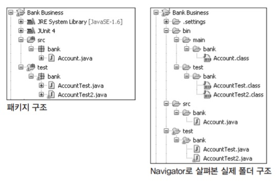

# TDD 좀 더 잘하기

## 테스트 케이스 클래스의 위치

1. ###  테스트 대상 소스와 테스트 클래스를 같은 곳에

   

   간단하게 테스트를 만 들 때 외에는 잘 사용되지 않는다.

   | 구분       | 설명                                                         |
   | ---------- | ------------------------------------------------------------ |
   | **장점**   | 클래스 이름 규칙을 잘 정했을 경우 테스트 클래스를 찾기가 쉽다. |
   | **단점**   | 패키지 내에 제품 코드 클래스와 테스트 클래스가 함께 존재하기 때문에 혼란을 줄 수 있다.<br />배포 시에 테스트 클래스만 발췌해야 하는 불편함이 있다. |
   | **선호도** | 아주 낮음.                                                   |

2. ### 테스트 클래스는 하위 패키지로

   

   대상 소스의 하위에 테스트 패키지를 만드는 방식이다.

   | 구분       | 설명                                                         |
   | ---------- | ------------------------------------------------------------ |
   | **장점**   | 테스트 코드가 가까운 곳에 위치한다.                          |
   | **단점**   | 이미 하위 패키지가 존재할 경우에는 혼란스러울 수 있다.<br />테스트 클래스와 제품 클래스를 따로 분리해서 배포하는 데 어려움이 있다. |
   | **선호도** | 낮음. 지금은 거의 사용되지 않음.                             |

3. ### 최상위 패키지를 분리

   

   흔히 많이 사용하는 방식으로, 최상위 패키지로부터 업무 코드와 테스트 코드를 분리해서 작성할 수 있게 만들어준다.

   | 구분       | 설명                                                         |
   | ---------- | ------------------------------------------------------------ |
   | **장점**   | 업무 코드와 테스트 코드가 섞일 염려가 없다.<br />테스트 코드만 분리해내기 쉽다. |
   | **단점**   | default나 protected로 선언된 메소드들에 대해서는 테스트 코드를 작성할 수 없다.<br />어렵진 않지만 어쨌든 운영환경 배포 시나 제품 패키징 시에 test 패키지 이하를 따로 발췌해내야 하는 불편함이 있다. |
   | **선호도** | 보통.                                                        |

4. ### 소스 폴더는 다르게, 패키지는 동일, 컴파일된 클래스는 각각 다른 곳으로(추천)

   

   추천하는 방식 중 하나이다.

   | 구분       | 설명                                                         |
   | ---------- | ------------------------------------------------------------ |
   | **장점**   | 대상 클래스와 테스트 클래스를 동일한 패키지로 선언할 수 있다.<br />접근 범위(scope) default나 protected로 선언된 메소드도 테스트 케이스로 작성할 수 있다.<br />컴파일된 대상 클래스와 테스트 클래스의 위치가 최상위 폴더로부터 다르게 만들어지기 때문에, 서로 섞일 염려가 없다.<br />배포 시에도 분리가 쉽고 빠르게 패키징이 가능하다. |
   | **단점**   | 환경 구성 방법이 Eclipse IDE에 다소 의존적이다.              |
   | **선호도** | 매우 높음. 대부분의 사람에게 가장 권장하는 스타일이다.       |

5. ### 테스트를 프로젝트로 분리

   

   아무리 폴더를 변경한다 하더라도 동일 프로젝트 내에 제품 코드 클래스와 테스트 클래스가 함께 존재하면, 각자 사용하는 라이브러리를 클래스패스로 공유하게 된다. 이렇게 되면 제품 코드 동작을 위해 필요한 외부 라이브러리와 테스트를 위해 필요한 외부 라이브러리를 구별해내기 어려워진다. 이럴 경우 테스트 수행 시에만 필요한 라이브러리들을 제품 배포 시에 일일이 구분해줘야 하는 불편함이 발생한다(아니면, 업무 코드에서는 불필요함에도 함께 배포되기도 한다). 따라서 이런 외부 라이브러리 의존 관계를 좀 더 확실하게 구분하고자 할 때는, 프로젝트 단위로 분리해놓기도 한다. 이클립스 플러그인 개발이나 안드로이드 앱 개발 등의 컴포넌트식 개발과 테스트에 흔히 쓰이는 방식이다.

   | 구분       | 설명                                                         |
   | ---------- | ------------------------------------------------------------ |
   | **장점**   | 제품 코드와 테스트 케이스 코드의 외부 라이브러리 의존관계를 명확히 분리해낸다. <br />즉, 테스트를 위해 사용되는 라이브러리는 어떤 것이고, 순수하게 제품 코드를 위한 라이브러리는 어떠한 것인지 구분할 수 있다. <br />이클립스 IDE 프로젝트 차원에서 분리되므로, 제품 코드와 테스트 코드를 프로젝트 레벨로 개별적 배포가 용의하다. |
   | **단점**   | 환경 구성 방법이 Eclipse IDE에 다소 의존적이 된다.<br />Ant 스크립트 등의 외부 툴을 함께 쓸 경우, 클래스패스 관련해서 스크립트 작성이 번거로워진다. |
   | **선호도** | 프로젝트 라이브러리에 대해 상세화된 전권행사(Detailed Full control)를 원하는 개발자에게 추천 |

6. ### 메이븐(Maven) 스타일

   

   CoC(Convention over Configuration) 사상 기반의 Maven을 사용할 경우 기본적으로 구성되는 구조다. 기본적으로 source 폴더가 네 개로 구성된다.

   | 위치                | 설명                                                       |
   | ------------------- | ---------------------------------------------------------- |
   | /src/main/java      | 제품 코드가 들어가는 위치                                  |
   | /src/main/resources | 제품 코드에서 사용하는 각종 파일, XML 등의 리소스 파일들   |
   | /src/test/java      | 테스트 코드가 들어가는 위치                                |
   | /src/test/resources | 테스트 코드에서 사용하는 각종 파일, XML 등의 리소스 파일들 |

   수많은 오픈소스 라이브러리가 이 구조를 따르고 있기 때문에, 익숙해지면 다양한 이점이 뒤따른다.

   | 구분       | 설명                                                         |
   | ---------- | ------------------------------------------------------------ |
   | **장점**   | 제품 코드에 필요한 리소스와 테스트에 사용하는 리소스를 분리해서 관리하기에 편하다.<br />메이븐 방식으로 구성된 프로젝트를 접할 때 어색하지 않다 |
   | **단점**   | 이런 형태의 구조를 처음 접하는 유저의 경우 익숙해질 때까지는 구조가 불편하게 느껴지거나 환경에 적응하는 데 시간이 걸릴 수 있다. <br />프로젝트 팀 전체가 이 구조로 가기 위해서는 교육과 의지가 동반되어야 한다. |
   | **선호도** | 보통. 국내 전자정부 프레임워크에서 표준 관리툴로도 채택됐기 때문에 향후 확산될 가능성이 높다. |

> **제품 코드와 테스트 코드를 함께 배포하기**
>
> 보통 업무 코드와 테스트 코드를 최대한 분리해서 배포하는 것이 일반적이다. 그런데 경우에 따라서는 함께 배포하는 편이 더 유용할 때가 있다. 모듈의 이식성을 테스트하는 경우가 그 대표적인 예다. JDK 버전이나 OS 등이 다른 경우, 아니면 특정 장비안에서도 동일하게 동작하는지를 보장하고 싶을 때 테스트 코드를 함께 배포해서 테스트를 한다. TDD로 만들어진 자동화된 테스트 케이스를 하드웨어의 셀프 테스트 수준으로 만들 순 없겠지만, 적어도 새로운 플랫폼에 이식하게 될 때 테스트 코드를 함께 배포해서 테스트를 하는 건 충분히 고려해볼 만한 내용이다.

## 테스트 메소드 작성 방식

테스트 클래스 내에 테스트 메소드를 추가하는 방법에는 몇 가지가 있다.

1. ### 테스트 대상 메소드와 이름을 1:1로 일치

   | 테스트 대상 코드                | 테스트 코드                                     |
   | ------------------------------- | ----------------------------------------------- |
   | public int getBalance() { ... } | @Test<br />public void testGetBalance() { ... } |

   | 구분     | 설명                                                         |
   | -------- | ------------------------------------------------------------ |
   | **장점** | 테스트 메소드의 숫자가 적어져서 보기가 편하고, 대상이 되는 클래스의 메소드와 1:1로 연관지어 생각할 수 있다. |
   | **단점** | 추가적인 테스트 케이스가 하나의 테스트 메소드 내에 전부 존재하게 만들 경우, 메소드 내의 초반 테스트 단정문이 실패하면, 뒤쪽 테스트 케이스들은 실행되지 않는다.<br />이럴 경우 성공하는 케이스와 실패하는 케이스가 중간 중간 섞여 있을 수도 있지만, 구별해낼 수 없다. |

2. ### 테스트 대상 메소드의 이름 뒤에 추가적인 정보를 기재(추천)

   | 테스트 대상 코드                        | 테스트 코드                                                  |
   | --------------------------------------- | ------------------------------------------------------------ |
   | public void withdraw(int money) { ... } | @Test<br />public void testWithdraw\_마이너스통장인출() { ... }<br /><br />@Test<br />public void testWithdraw\_잔고가0원일때(){ ... } |

   기본적으로는 테스트 대상 코드의 메소드 단위로 작성하게 되고, 케이스별로 테스트 메소드를 추가하는 방식이다. 가장 권장되는 방식이다. 보통 상세 케이스들은 메소드 이름 뒤에 밑줄(_)을 붙여 구별하는데, 이때 한글을 사용해도 무방하며 한글 사용을 적극 권장한다. 테스트 메소드 목록을 뽑은 다음에 엑셀에서 \_로 구분해넣으면 자연스럽게 테스트 케이스 항목이 표로 만들어지기 때문이다.

   | 구분     | 설명                                                         |
   | -------- | ------------------------------------------------------------ |
   | **장점** | 더 다양한 케이스별로 성공/실패를 알 수 있다.<br />케이스마다 독립적으로 수행할 수 있어 오류의 가능성이 좀 더 줄어든다. |
   | **단점** | 테스트 케이스만큼 메소드를 만들기 때문에 메소드 숫자가 많아진다.<br />테스트 메소드 이름을 짓는 데 상당한 요령이 필요하다.<br />케이스마다 리소스 초기화(setup) 작업이 필요하다. |

3. ### 테스트 시나리오에 집중

   | 테스트 대상 코드                                             | 테스트 코드                                                  |
   | ------------------------------------------------------------ | ------------------------------------------------------------ |
   | 특정한 메소드를 대상으로 하기보다는 테스트 시나리오가 대상이 된다. | @Test<br />publci void VIP고객이\_인출할때\_수수료계산() { ... }<br /><br />@Test<br />public void 일반고객이\_인출할때\_수수료계산() { ... } |

   통합 테스트(integration test)나 사용자 테스트(acceptance test)에 가까운 형태로 테스트 케이스를 만들 필요가 있을 때 사용한다. 작성 대상 클래스의 메소드 구현을 위해 사용한다기보다는 테스트 시나리오에 집중해서 대상 클래스 자체의 통합적인 기능을 테스트할 때 사용한다. 단, 이때 단순히 ‘한글로 테스트 메소드 이름을 짓는다’라고 정하기보다는 일정한 형식을 갖고 이름을 짓도록 유도하면 좀 더 도움이 된다. 통합 테스트나 사용자 테스트는 그 특성상 일반적으로 ‘**선조건 → 수행 → 예상결과**’ 식의 테스트 시나리오를 갖는다.

   ```java
   public class 환승테스트 {
       
       @Test
       public void 평일_30분이내에_환승_성공한다() {
           // 테스트 케이스
       }
       
       @Test
       public void 평일_30분이후에_환승_실패한다() {
           // 테스트 케이스
       }
       ...
   }
   ```

   테스트 결과만 정리해도 하나의 어엿한 테스트 문서가 될 수있다.

   | 구분     | 설명                                                         |
   | -------- | ------------------------------------------------------------ |
   | **장점** | 테스트 케이스를 시나리오에 따라 체계적으로 작성할 수 있다.<br />테스트 클래스를 하나의 업무단위 테스트 단위처럼 문서화할 수 있다. |
   | **단점** | 테스트 대상 클래스의 단위 메소드 구현 시에 사용하기에는 다소 무리가 따른다. |

## 테스트 케이스 접근 방식

테스트 클래스의 구성뿐만이 아니라, 테스트를 작성하는 데 있어서 어떤 형태로 접근할 것인가에 대한 논의가 필요하다. 보통 테스트 케이스를 작성할 때 기본적으로 케이스를 작성하는 기준은 '빠짐없이!'인데, 지나치게 집중하다 보면, 개발자가 개발자인지 QA 테스터인지 경계선이 모호해질 수 있다.

- ### 설계자와 개발자가 분리되어 있는 경우

  만일 설계자와 개발자가 분리되어 있는 경우라면, 설계자가 설계문서에 테스트 케이스를 작성해놓아야 한다. 이 경우엔 코드가 아닌 말 그대로의 '**테스트 시나리오**'**를 적어서 개발자에게 전달해야 한다.** 그렇지 않으면 개발자는 잘 동작한다고 믿는 코드의 모습 그대로 테스트 케이스를 작성하게 될 것이다. 설계 문서를 받아서 개발하는 개발자 입장에서는 머리를 혹사시켜 가면서 테스트 케이스를 작성할 여력이나 의지를 갖기 어렵다. 개발자의 문제라기보다는 상황 자체가 종종 그렇게 만든다는 걸 이해해야 한다.

- ### 개발자가 설계와 개발을 함께 하는 경우

  물론 개발자가 설계에 적극 참여해서, 제품 자체에 주인의식을 갖고 스펙을 작성할 수 있다면, 혹은 애자일에서 이야기하는 것처럼 사용자 스토리를 작성해서 스토리 카드 뒷면에 테스트 케이스 조건까지 적고 그것이 고객에게까지 합의가 가능할 정도로 능동적으로 참여할 수 있는 상황이라면 테스트 작성 범위에 대해 크게 고민할 필요가 없다. 알고 있는 그대로, 해당 케이스에 대해 작성하면 되기 때문이다.

  

  

- ### 무엇을 테스트 케이스로 작성할 것인가?

  이런저런 것 다 걷어내고, '그래, 뭐가 됐든 테스트 케이스를 찾아내서 우선 개발 좀 하자'라는 일반적인 상황이라면, 초창기에 어떤 것을 테스트로 삼을 건지, 바로 찾아내기가 쉽지 않을 때가 많다. 

  이럴 때 사용할 수 있는 흔한 접근 방식이 몇 가지 있다. 우선, 시나리오식 접근 방법을 들 수 있다. **해피데이 시나리오**(happy day scenario)라고도 하는 방식으로, **정상적인 흐름일 때 동작해야 하는 결과값을 선정해놓는 방식**이다. 그 다음에는 **발생할 수 있는 예외나 에러 상황에 대한 결과값을 적은 블루데이 시나리오**(blue day scenario) **방식**이 있다. 그리고 또 삼각측량법이라는 것이 있는데, 이를테면 '두 숫자 곱하기(a,b)' 메소드는 a*b와 같은지 비교해보고, a를 b번 더한 것과도 같은지 비교해보는 방식이라고 생각하면 되겠다. 에지 케이스(Edge Case)라 불리는 경계조건 찾아내기는 양수, 음수, 0, 아주 큰 값, 소수점 등을 떠올리면 된다.

  ```
  - 결과가 옳은가?
  - 모든 경계조건이 옳은가?
  - 역(inverse)관계를 확인할 수 있는가?
  - 다른 수단을 사용해서 결과를 교차확인할 수 있는가?
  - 에러 조건을 강제로 만들어낼 수 있는가?
  - 성능이 한도 내에 있는가?
  ```

  간단하지만, 테스트 메소드 작성에 있어 가이드가 되는 질문들이다.

## TDD의 한계

- ### 동시성 문제

  동시성 (concurrency)이 걸려 있는 코드에 대한 테스트 케이스 작성이다. 이런 경우 테스트 자체를 무결하게 유지하기가 매우 어렵다. 상식적으로 파악하기 어려운 불규칙한 문제가 적지 않게 발생하기 때문이다. 현재, 유일한 해결책을 제시하기는 어렵지만 다양한 방식으로 극복되고 있다.

- ### 접근제한자(private/protected 메소드)

  private으로 되어 있는 메소드는 일반적 인 방법으로는 테스트가 불가능하다. 현재는 '**public으로 되어 있는 메소드만 테스트해도 무방하다**'라는 경향이 대세인 것으로 보인다. 왜냐하면 private 메소드는 public 메소드들이 사용하는 메소드들이고, public 메소드가 테스트될 때, private 메소드들도 함께 테스트가 이뤄진다고 보기 때문이다. 다만, 경우에 따라 우선은 모든 메소드를 public으로 만들어서 테스트가 끝난 다음, 차후에 판단하여 public을 private으로 바꾸는 식의 범위(scope)를 줄이는 형태로 접근하는 것도 한 가지 방법이다. 그럴 때에 기존에 생성한 테스트 케이스는 지우지 말고 주석 형태로 남겨놓을 것을 권장한다.(혹은 @Ignore)

- ### GUI

  GUI는 심미적인 부분이 강하고, 사용자의 동작에 따라 화면이 많은 영향을 받기 때문에 단순히 '결과상태예상 -> 수행 -> 확인' 순으로 테스트하기가 어렵거나 복잡해진다. 웹 애플리케이션 같은 경우엔 뷰(View)에 해당하는 영역이 TDD를 적용하기 곤란한 GUI 영역이다. GUI는 TDD에 있어서 몸에 편한 옷은 아니다.

- ### 의존성 모듈 테스트(target = A but A -> B)

  테스트하려는 부분에 의존성이 있는 모듈을 사용하고 있는 경우의 테스트도 종종 문제가 된다. 즉, '테스트의 대상이 되는 A가 기타 메소드나 클래스를 참조하고 있을 경우, 그리고 해당 참조 부분에 대한 접근이 쉽지 않을 경우에 B는 어떻게 할 것인가?'라는 문제다. B가 아무런 문제 없이 확실한 모듈이라면 상관없는데, 그렇지 않다면 문제의 소지가 있는 부분이다. 이럴 때는, B를 둘러싼 일종의 프록시 클래스(proxy class)를 하나 만들어서 온전히 B부터 테스트하는 방식으로 접근하는 방식을 취하든가, 아니면 B를 신뢰한다는 가정하에서 A만을 테스트한다. 보통은, 개발자의 성향상 후자를 많이 선택한다. 근래에는 의존성 제거를 위해서 Mock 객체를 많이 사용한다.
