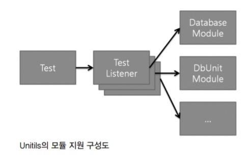
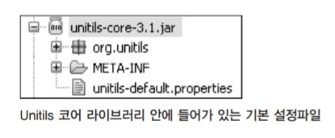

# Unitils

오픈소스 중 하나인 Unitils(유닛틸즈)는 단위 테스트를 좀 더 쉽게 만들고 더 유연하게 유지할 수 있게 도와주는 일종의 단위 테스트 지원 라이브러리다. DbUnit과 마찬가지로, 독립적으로 사용된다기보다는 주로 다른 테스트 프레임워크와 함께 사용된다.

## Unitils를 사용하기 위한 환경 준비

실제 예제를 살펴보기 전에, Unitils를 사용할 수 있는 환경을 먼저 구축해보자. Unitils 를 사용하기 위해 Unitils 라이브러리를 사이트(https://mvnrepository.com/artifact/org.unitils/unitils-core)에서 내려받는다. 다음 실습을 따라 하려면, unitils-core 폴더와 unitils-core/lib 폴더 안의 라이브러리를 클래스패스에 포함시켜 줘야 한다.

그리고 소스에서는 JUnit 4와 마찬가지로 static import를 주로 사용한다. 이를테면 다음과 같은 식으로 말이다.

```java
import static org.unitils.reflectionassert.ReflectionAssert.*;
```

JUnit 4의 static 메소드들을 자동완성 기능으로 사용하기 위해 favorite으로 등록하는 방법을 2장에 정리해놓았다. Unitils의 static 메소드들도 같은식으로 등록해놓으면 편리하게 사용할 수 있다.

## Unitils의 단위 테스트 지원 기능들

### 객체 동치성 비교

TDD를 위해 테스트 케이스를 작성하다 보면, 객체끼리 동치성 비교를 해야 하는 경 우가 흔히 발생한다. 그런데, 이때 assertEquals만으로는 원하는 답이 나오지 않는 경우가 많다. 다음은 Book이라는 클래스와 그 클래스를 기반으로 만들어진 두 객체에 대한 동치성 비교 문장이다.

##### Book 클래스

```java
public class Book {
    private String name;
    private String author;
    private int price;
    
    public Book(String name, String author, int price) {
        this.name = name;
        this.author = author;
        this.price = price;
    }
    ...
}
```

##### 두 Book 객체를 비교하는 테스트 케이스

```java
@Test
public void testBook() throws Exception {
	Book aBook = new Book("사람은 무엇으로 사는가?","톨스토이", 9000);
    Book otherBook = new Book("사람은 무엇으로 사는가?","톨스토이", 9000);
    
	assertEquals(aBook, otherBook);
}
```

##### 실행 결과

```java
Java.lang.AssertionError: expected:<main.Book@16f0472> but was:<main.Book@18d107f>
	at org.junit.Assert.fail(Assert.Java:91)
```

이를테면 이런 종류의 객체 비교는 단순히 참조 비교를 하기 때문에 두 aBook과 otherBook은 의도된 객체의 상태라는 측면에서는 동일하지만, JUnit의 assertEquals 결과는 두 객체가 서로 다르다고 판정한다.

```java
@Test
public void testBook() throws Exception {
    Book aBook = new Book("사람은 무엇으로 사는가?","톨스토이", 9000);
    Book otherBook = new Book("사람은 무엇으로 사는가?","톨스토이", 9000);
    
    assertEquals(aBook.getName(), otherBook.getName());
    assertEquals(aBook.getAuthor(), otherBook.getAuthor());
    assertEquals(aBook.getPrice(), otherBook.getPrice());
}
```

그래서 위와 같은 식으로 각 필드를 비교해야 한다. 하지만 필드가 많아지면 여간 불편한 게 아니다. Unitils는 이런 불편함을 해소하기 위해, 객체의 필드에 저장되어 있는 값을 알아서 비교해주는 리플렉션 단정문(reflection assertion)이라는 기능을 제공한다.

### 리플렉션 단정문(Reflection Assertion)

```java
assertReflectionEquals(예상 객체, 실제 객체);
assertReflectionEquals([메시지], 예상 객체, 실제 객체);
```

형식은 일반적으로 사용되는 assertEquals와 동일하며, 마찬가지로 첫 번째 인자로 '메시지'를 적을 수도 있다. 실제 적용 시에는 가급적이면 의도를 확실히 하기 위해 assert의 의도를 설명해주는 '메시지'를 적는 걸 권장한다.

```java
import static org.unitils.reflectionassert.ReflectionAssert.*;

public class BookTest {
    @Test
    public void testBook() throws Exception {
        Book aBook = new Book("사람은 무엇으로 사는가?","톨스토이", 9000);
        Book otherBook = new Book("사람은 무엇으로 사는가?","톨스토이", 9000);

        assertReflectionEquals("Book 객체 필드 비교", aBook, otherBook);
    }
    ...
```

리플렉션 단정문을 사용하면 테스트가 깔끔하게 성공한다.

Unitils의 assertReflectionEquals를 사용하면 이런 식으로 객체의 동치성을 증명해준다. 이걸 Unitils에서는 리플렉션을 이용한 단정(reflection assertion)이라고 부른다. Unitils의 이런 리플렉션 단정문에 몇 가지 옵션을 지정할 수 있는데, 대부분은 소스코드가 리팩토링이 일어나면서 발생하는 테스트 케이스의 깨짐(fragility of test)을 보완하기 위해 사용된다. 이 방식을 너그러운 단정문(lenient assertions) 적용이라고 부른다.

### 리플렉션 단정문의 너그러운 비교(Lenient Assertion)

```java
assertReflectionEquals(예상 객체, 실제 객체, ReflectionComparatorMode);
```

앞서 본 assertReflectionEquals의 맨 마지막에 ReflectionComparatorMode(리플렉션 비교모드)라는 옵션이 하나 더 붙어 있는 모습이다. ReflectionComparatorMode는 리플렉션으로 대상을 비교할 때 좀 더 유연한 비교를 할 수 있도록 다음과 같은 세 가지 옵션을 제공한다.

| ReflectionComparatorMode | 설명                                                         |
| ------------------------ | ------------------------------------------------------------ |
| LENIENT_ORDER            | 컬렉션이나 배열을 비교할 때 순서는 무시한다.                 |
| IGNORE_DEFAULTS          | 예상 객체의 필드 중 타입 기본값을 갖는 필드에 대해서는 비교를 하지 않는다. |
| LENIENT_DATES            | 시간이나 날짜 타입은 서로 비교하지 않는다.                   |

#### LENIENT_ORDER(너그러운 순서)

배열 객체를 서로 비교하게 될 때 순서가 다르면 다른 객체로 판정한다. 그런데 경우에 따라서 배열 안에 들어 있는 원소들이 중요하지, 들어가 있는 순서는 상관없는 경우가 있다. 이럴 때 LENIENT_ORDER라는 옵션을 사용한다.

```java
List<Integer> myList = Arrays.asList(3, 2, 1);
assertReflectionEquals(Arrays.asList(1, 2, 3), myList, LENIENT_ORDER);
```

참고로 ReflectionComparatorMode를 사용하려면 org.unitils.reflectionassert. ReflectionComparatorMode 클래스를 static import로 추가해줘야 한다.

#### IGNORE_DEFAULTS(필드 기본값 무시)

Java의 타입 기본값, 이를테면 int 타입의 0, 객체의 null, boolean의 false는 각 타입의 기본값이다. assertReflectionEquals로 두 객체의 동치성을 비교할 때, 만일 필드 의 값에 위에 같은 타입 기본값이 할당되어 있을 경우 동치성 판단 여부에 포함시키 지 않는다.

```java
Item expectedItem = new Item("IKH-001", null, 24000);
Item actualItem = new Item("IKH-001", "20200101", 24000);
assertReflectionEquals(expectedItem, actualItem, IGNORE_DEFAULTS);
```

위와 같은 경우에는 Item 객체의 두 번째 필드 값에 할당하는 값은 동치성 비교에 포함되지 않도록 해줬기 때문에 assertReflectionEquals는 참(true)이 되고 테스트는 성공한다. IGNORE_DEFAULTS 옵션이 없었다면 테스트가 실패하고 붉은색 막대(false)가 나타났을 것이다. 이때 유의할 점이 하나 있는데, 필드 기본값을 비교에서 제외하는 건 expected 객체를 기준으로 한다는 점이다. 만일 위 예제에서 actualItem과 expectedItem의 순서를 바꿔서 테스트했다면, 실패로 단정한다

```java
Item expectedItem = new Item("IKH-001", "20200101", 24000);
Item actualItem = new Item("IKH-001", null, 24000);
assertReflectionEquals(expectedItem, actualItem, IGNORE_DEFAULTS);
```

즉, 위와 같이 expected에는 type 기본값이 없지만, actual에는 0이나 null 같은 타입 기본값이 존재한다면 실패로 판정된다. 미묘한 부분이긴 한데, 어쨌든 IGNORE_DEFAULTS 옵션을 사용한다면 expected와 actual의 위치를 지켜줘야 한다.

#### LENIENT_DATES(너그러운 날짜)

객체값을 비교할 때 종종 테스트를 만들기가 어려운 경우는, 로그성 날짜가 들어가는 필드값이 쓰일 때다. 이를테면 주문일시, 등록일자, 접수시간 등의 필드는 실제 해당 값이 생성되는 시점의 '시스템 타임'이 값으로 채워지는 경우가 많다. 그런데 테스트 케이스를 만들어서 수행하는 경우에는 테스트할 때마다 시스템 시간이 달라지기 때문에 예상값을 특정해놓기가 어렵다. 그래서 이런저런 편법을 사용해 날짜 비교를 무시하도록 유도하곤 하는데, Unitils에서는 해당 부분을 LENIENT_DATES라는 옵션으로 해결해주고 있다.

```java
Item expectedItem = new Item("IKH-001", null, 24000,
new Date(System.currentTimeMillis()+100));
Item actualItem = new Item("IKH-001", null, 24000,
new Date(System.currentTimeMillis()));
assertReflectionEquals(expectedItem, actualItem, LENIENT_DATES);
```

위 경우, 두 객체의 필드값을 비교할 때 Date 타입에 해당하는 필드는 동치성 비교에서 제외한다. 즉, 위 테스트 케이스는 녹색 막대로 표시된다.

흔히 날짜/시간 등은 비교 시 불편한 점이 많아, Date 타입을 만들어 사용하기보다는 SimpleDateFormat 등을 이용해 String으로 변환해서 사용하는 경우가 종종 있다. 이럴 경우 LENIENT_DATES를 사용하면 String으로 굳이 변환하는 작업을 줄일 수 있고, DB 등을 이용하지 않고 시스템 내에서 날짜 관련 작업을 처리해야 하는 경우에 유용한 옵션이다.

참고로, Unitils에는 **assertLenientEquals**라는 것이 있는데, ReflectionComparatorMode를 사용하는 assertReflectionEquals의 간략화 버전으로, 위에 세 개의 옵션 중 LENIENT_DATES를 제외한 두 개를 동시에 적용해서 비교하는 버전이다.

```java
// 컬렉션의 순서가 다른 경우
List<Integer> bag = Arrays.asList(100, 200, 300);
assertLenientEquals(Arrays.asList(300, 200, 100), bag);

// 배열의 순서가 다른 경우
assertLenientEquals(new String[]{"a", "B", "c"}, new String[]{"B",
"c","a"});

// 필드값이 타입 기본값일 경우 비교에서 제외
Item expectedItem = new Item("IKH-001", null, 24000);
Item actualItem = new Item("IKH-001", "20200101", 24000);
assertLenientEquals(expectedItem, actualItem);
```

위 세 개의 단정문은 모두 참이 된다.

### 프로퍼티 단정문(Property Assertions)

보통, 객체의 특정 필드에 예상하는 값이 제대로 할당됐는지 확인하는 가장 간단한 방법은 getter 메소드를 통해 해당 필드 변수에 들어가 있는 값을 직접 확인해보는 것이다.

```java
@Test
public void testLoadPlayerTest() throws Exception {
	// 저장소에서 주장 캐릭터의 정보를 불러온다.
    Player player = VolleyballTeamRepository.getCaptain();
    assertEquals("Ku Min-jung", player.getName());
}
```

이런 식으로 비교를 하면 된다. 그런데 경우에 따라서는 getter 메소드가 제공되지 않는 경우도 있다. 아래는 배구 게임의 선수에 해당하는 Player 클래스의 모습이라고 가정해보자.

```java
public class Player {
    private String name;
    private int age; // 나이
    private int experienceYear; // 경력

    public Player(String name, int age, int experienceYear) {
        this.name = name;
        this.age = age;
        this.experienceYear = experienceYear;
    }
    
    public String getName() {
        return this.name;
    }
    
    public int getAbilityPoint(){ // 나이 30이 넘으면 능력이 떨어진다..
        return (30 - this.age) + experienceYear;
	}
}
```

나이와 경력 값이 제대로 할당되는지를 확인하고 싶은데 현재 해당 값에 접근할 수 있게 하는 getter가 없다. Player 클래스에 getter를 만들어도 되긴 되지만, 다음 같은 상황 중 하나라고 가정해보자

- 테스트할 때 외에는 해당 getter 메소드를 사용할 일이 없다. 
- 외부에서 받은 라이브러리라서 Player 클래스를 수정할 수 없다.

이런 경우 Java의 강력한 기능 중 하나인 리플렉션을 이용하면 소스를 수정하지 않고도 문제 상황을 돌파할 수 있다. 직접 만들 수도 있는데, 그러지 말고 Unitils의 assertPropertyLenientEquals를 이용하자.

```java
assertPropertyLenientEquals(속성 이름, 예상되는 속성 값, 실제 객체)
```

객체의 특정 필드값(속성값)만을 비교하고자 할 때 사용하는 기능이다.

```java
@Test
public void testPlayerPropertyTest() throws Exception {
    Player player = VolleyballTeamRepository.getCaptain();
    assertPropertyLenientEquals("age", 31, player);
    assertPropertyLenientEquals("experienceYear", 15, player);
}
```

getter 메소드가 없지만 비교가 가능하다. assertPropertyLenientEquals의 장점 중 하나는 자바빈(JavaBeans) 규칙을 따르는 식으로 프로퍼티를 비교한다는 점이다. 만일 추후 Player 클래스 내에 getter 메소드가 생기게 된다면, assertPropertyLenientEquals는 해당 bean 규약에 맞는 getter 메소드를 이용해 프로퍼티 값을 불러와서 비교를 수행한다는 뜻이다. 단순히 리플렉션으로 클래스의 필드 변수값만을 가져와서 비교하는 수준을 넘어서고 있다.

## Unitils 모듈

일반적인 수준에서는 앞에서 설명한 Unitils의 기능만으로도 테스트 케이스를 작성하는 데 도움이 많이 된다. 하지만 Unitils는 이 외에도 DB 관련 기능, Hibernate, JPA, Spring, Mock Object 등에 대해서도 유용한 기능을 모듈(module)이라는 개념으로 제공하고 있다.



Unitils의 모듈은 다양한 서비스를 제공하는데, 테스트 케이스 작성 시에 해당 모듈을 사용하려면 UnitilsJUnit3, UnitilsJUnit4, UnitilsTestNG 등의 Test Listener가 필요하다. Test Listener를 사용하는 방법은 해당 Unitils의 Test Listener를 테스트 클래스가 상속하거나 @RunWith 같은 어노테이션으로 Test Runner로 지정하면 된다.

##### JUnit 3의 경우, 상속을 이용한다.

```java
import org.unitils.UnitilsJUnit3;

public class MyTest extends UnitilsJUnit3 {
}
```

##### JUnit 4의 경우, UnitilsJUnit4 클래스를 상속해도 되고 Runner를 지정해도 된다.

```java
import org.junit.runner.RunWith;
import org.unitils.UnitilsJUnit4TestClassRunner;

@RunWith(UnitilsJUnit4TestClassRunner.class)
public class MyTest {
}
```

현재 Unitils에서 제공하는 모듈은 다음과 같다.

| 모듈명          | 설명                                                         |
| --------------- | ------------------------------------------------------------ |
| DatabaseModule  | 데이터베이스 관리와 커넥션 풀 관련                           |
| DbUnitModule    | DbUnit을 사용할 때 사용하는 테스트 데이터 관리               |
| HibernateModule | 하이버네이트 설정 지원과 DB 매핑 체크                        |
| MockModule      | Unitils에서 제공하는 Mock 프레임워크                         |
| EasyMockModule  | EasyMock 지원 기능                                           |
| InjectModule    | 오브젝트를 강제로 할당시켜 버리는 Injection 기능             |
| SpringModule    | 스프링의 애플리케이션 컨텍스트 지원과 스프링 빈(beans)의 주입 기능 지원 |

우선 데이터베이스 관련 기능 지원  살펴보자. 다음 소스는 사용했던 판매자 관리 기능을 테스트하던 클래스다.

```java
public class RepositoryTest {
    private final String driver = "org.apache.derby.jdbc.EmbeddedDriver";
    private final String protocol = "jdbc:derby:";
    private final String dbName = "shopdb";
    
    private IDatabaseTester databaseTester;
    private IDatabaseConnection connection;
    
    @Before
    public void setUp() throws Exception{
        databaseTester = new JdbcDatabaseTester(driver, protocol + dbName);
        connection = databaseTester.getConnection();
        IDataSet dataSet = new FlatXmlDataSetBuilder().build(new File("seller.xml"));
        DatabaseOperation.CLEAN_INSERT.execute(connection, dataSet);
    }
    
    @After
    public void tearDown() throws Exception{
    	this.connection.close();
    }
    
    @Test
    public void testFindById() throws Exception {
        Repository repository = new DatabaseRepository();
        Seller actualSeller = repository.findById("akahwl");

        assertPropertyLenientEquals("id", "akahwl", actualSeller);
        assertPropertyLenientEquals("name", "이호원", actualSeller);
        assertPropertyLenientEquals("email", "akahwl12@gmail.com", actualSeller);
    }
}
```

앞으로 이 소스를 기반으로 설명이 진행될 예정이다.

## DbUnit과 함께 사용하는 데이터베이스 지원 모듈

DbUnit은 데이터베이스 단위 테스트에 매우 유용하다. Unitils는 DbUnit을 좀 더 편하게 사용할 수 있도록 편리한 기능들을 제공한다.

### 환경 준비를 위한 unitils.properties 파일 설정

Unitils에서 DB 접속 기능을 지원받기 위해 클래스패스 내에 unitils.properties라는 이름의 텍스트 파일을 하나 만들자(src 폴더 바로 아래에 놓아도 된다). 다음은 unitils.properties 파일의 모습이다.

```properties
database.driverClassName=org.apache.derby.jdbc.EmbeddedDriver
database.url=jdbc:derby:shopdb
database.userName=
database.password=
database.schemaNames=APP
database.dialect=derby
DatabaseModule.Transactional.value.default=disabled
```

driverClassName이나 url은 계속 사용해왔던 부분이다. 만일 오라클 DB를 사용했다면 이 부분은 다음과 같을 것이다.

```properties
database.driverClassName=oracle.jdbc.driver.OracleDriver
database.url=jdbc:oracle:thin:@yourmachine:1521:YOUR_DB
```

Derby DB 임베디드 모드의 기본 스키마 이름은 APP이다. database.dialect에는 Unitils에서 DB에 맞는 내부 SQL을 사용할 수 있게 DB 종류를 적어줬다. 마지막으로 현재 애플리케이션은 자동커밋(auto-commit) 기준으로 작성됐기에, Unitils가 트랜잭션 처리를 하지 않도록 disabled로 지정해줬다. 참고로, Unitils에서 DB 사용 시의 기본 트랙잭션 관리는 커밋이다.

### @DataSet

Unitils는 @DataSet이라는 어노테이션을 지원하는데, 클래스이름.xml이라는 파일을 기본 데이터셋으로 인식하고 DB로 읽어들인다. 이때 데이터셋 파일은 FlatXmlDataSet 타입이어야 한다. DB로 읽어들일 때의 기본 동작은 모두 삭제하고 집어넣는 CLEAN_INSERT이다. 위 예제 소스를 Unitils의 @DataSet을 이용해 작성하면 다음과 같다.

```java
@RunWith(UnitilsJUnit4TestClassRunner.class) // (1)
@DataSet // (2)
public class DatabaseRepositoryTest {
    
    @Test
    public void testFindById() throws Exception {
        Repository repository = new DatabaseRepository();
        Seller actualSeller = repository.findById("horichoi");
        
        assertPropertyLenientEquals("id", "seongmink", actualSeller); // (3)
        assertPropertyLenientEquals("name", "김성민", actualSeller);
        assertPropertyLenientEquals("email", "sminggo5@naver.com", actualSeller);
    }
}
```

(1) : Unitils 모듈의 서비스를 이용하기 위해 Test Listener를 지정했다. 

(2) : 클래스 레벨에서 @DataSet 어노테이션이 사용되면 클래스이름.xml 파일을 데이터셋으로 인식한다. 따라서 이 예제에서는 DatabaseRepositoryTest.xml 파일을 읽어들이게 되어 있다. seller.xml 파일을 테스트 클래스가 있는 위치에 DatabaseRepositoryTest.xml라는 이름으로 복사해놓자.

(3) : actualSeller.getId()가 "seongmink"인지 equals 비교를 한다.

앞 소스에 비해 테스트 클래스가 좀 더 간결해졌다. 또한 데이터셋과 클래스 파일의 이름을 일치시킨다는 관례적인 규칙(conventional rule)으로 데이터셋을 관리하니까 일관성 측면에서도 더 나아졌다. 현재 DatabaseRepositoryTest.xml 파일의 모습은 다음과 같다.

```xml
<?xml version='1.0' encoding='UTF-8'?>
<dataset>
    <seller ID="seongmink" NAME="김성민" EMAIL="sminggo5@naver.com"/>
    <seller ID="wooyoung" NAME="장우영" EMAIL="tmlu48@naver.com"/>
    <seller ID="kidong" NAME="강기동" EMAIL="ki0050@naver.com"/>
</dataset>
```

만일 클래스 이름과 데이터셋 파일 이름이 일치하지 않는다면 직접 지정해줄 수도 있고, 필요하다면 여러 개의 데이터셋을 지정할 수도 있다.

```java
@DataSet("seller.xml")
@DataSet("seller.xml", "item.xml")
```

그리고 클래스 레벨로 데이터셋을 지정하는 것이 아니라, 메소드 레벨에서 데이터셋을 지정할 수도 있다.

```java
@Test
@DataSet("DatabaseRepositoryTest.testAddNewSeller.xml")
public void testAddNewSeller() throws Exception {
    Seller newSeller = new Seller("akahwl", "이호원", "akahwl12@gmail.com");
    Repository repository = new DatabaseRepository();
...
```

하지만 메소드 레벨로 데이터셋을 지정하는 경우가 많아지면 데이터셋 관리가 또 하나의 부담이 될 수 있으니 유의해서 사용하자. 그리고 FlatXMLDataSet 외의 데이터셋 타입, 이를테면 XlsDataSet 타입이나 csv 파일 등을 이용하고 싶다면, DataSetFactory 인터페이스를 직접 구현한 다음, 설정파일에 DbUnitModule.DataSet.factory.default 항목으로 지정하면 된다.

다음은 unitils-core 라이브러리 안에 unitils의 기본 설정파일이 들어 있는 모습과, 그 설정파일 안에 들어 있는 기본 데이터셋 타입이 지정된 모습이다. Unitils-default.properties 파일을 직접 수정할 일은 없지만 기본 세팅을 확인 할 때 사용한다.



##### 기본 설정파일 안에 들어 있는 기본 데이터셋 형식 지정 부분

```properties
# Default factory that is used to create a dataset object from a file for the @DataSet annotation
DbUnitModule.DataSet.factory.default=org.unitils.dbunit.datasetfactory.impl.MultiSchemaXmlDataSetFactory
```

직접 만든 DataSetFactory의 구현체에 이 부분을 직접 적어놓을 순 없으니까, 앞서와 마찬가지로 클래스패스 내에 있는 unitils.properties 파일에 적어서 오버라이드되도록 만들면 된다.