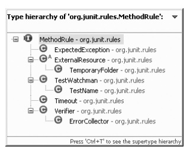

# 부록

## 놓치기엔 아까운 JUnit 4의 고급 기능들

### 파라미터화된 테스트

파라미터화된 테스트(parameterized test)는 여러 가지 값에 대해 테스트를 한꺼번에 진행할 필요가 있을 때 사용하는 방법이다. 이때 테스트 클래스의 생성자 파라미터 및 필드값을 이용하게 된다. 이를테면 소득세 계산 로직을 작성해야 할 필요가 있다고 가정해보자.

| 2008년 과세표준                     | 세율 | 누진공제액 |
| ----------------------------------- | ---- | ---------- |
| 1200만 원 이하                      | 8%   | 0원        |
| 1천2백만 원 초과 ~ 4천6백만 원 이하 | 17%  | 108만 원   |
| 4천6백만 원 초과 ~ 8천8백만 원 이하 | 26%  | 522만 원   |
| 8천8백만 원 초과                    | 35%  | 1,314만 원 |

위와 같은 조건을 만족하는 로직을 작성하려면 적어도 구간별로 1개씩은 테스트 케이스가 만들어져야 하고, 경우에 따라서는 경계조건(edge condition)값도 함께 따져봐야 하기 때문에 결국 픽스처 생성과 assert 문장이 복잡해지고 길어진다. 이럴 때 파라미터화된 테스트라는 방식을 사용하면 작업이 간결해진다. 다음은 해당 방식을 사용한 예이다.(편의상 import 부분은 포함시키지 않았다)

```java
@RunWith(Parameterized.class) // (1)
public class StandardIncomeTaxTest {
    
    @Parameters
    public static Collection data() {
        return Arrays.asList(new Object[][]{ // (2)
            /* 소득액 연도 세금액수 */
            { 0, 2008, 0},
            { 1000, 2008, 80},
            { 1200, 2008, 96},
            { 1205, 2008, 96},
            { 1206, 2008, 97},
            { 4600, 2008, 674},
            { 5000, 2008, 778}
        });
    }

    private int income;
    private int taxAmount;
    private int year
        
    public StandardIncomeTaxTest(int income, int year, int taxAmount){ // (3)
        this.income = income;
        this.year = year;
        this.taxAmount = taxAmount;
    }

    @Test // (4)
    public void testGetTaxAmount() throws Exception {
        StandardTax incomeTax = new StandardTax();
        assertEquals(this.taxAmount, incomeTax.getTaxAmount(this.income));
    }
}
```

(1) : 파라미터화된 테스트 방식을 이용하기 위해서는 @RunWith(Parameterized.class) 로 테스트 클래스를 만든다.

(2) : 그 다음엔 @Parameters로 선언된 파라미터 제공 메소드가 필요하다. 단, @Parameters로 지정된 메소드는 반드시 정적(static) 메소드여야 하고 테스트 항목의 값들을 배열처럼 만든 Collection을 리턴하도록 만들어야 한다. 이때 메소드 이름은 무엇이 됐든 무방하다. 메소드가 @Parameters로 지정되어 있기만 하면 된다. 이때 주의할 점은, Collection에 담기는 객체들은 객체(Object) 배열로 되어 있 어야 하고, 클래스 생성자의 파라미터와 숫자와 타입이 정확히 일치해야 한다는 점이다. 위 예제에서는 배열 객체 하나에 세 개의 숫자가 담겨 있고, 각 숫자는 생성자에 해당하는 StandardIncomeTaxTest(int income, int year, int taxAmount) 메소드의 인자와 같이 income, year, taxAmount를 의미한다.

(3) : 테스트 클래스의 생성자인데, 멤버(field)로 선언된 변수에 값이 할당된다. 이 작업은 생성자가 호출되는 시점에 JUnit 프레임워크가 리플렉션을 이용해 컬렉션 (Collection) 배열에 담긴 값을 생성자의 파라미터로 넘겨준다.

(4) : 이제 @Test로 작성된 메소드들은 컬렉션 배열의 size()만큼 반복해서 수행된 다. 아래는 위 예제를 실행한 모습이다. 0~6까지, 총 7개의 테스트 값에 대해 testGetTaxAmount() 테스트 케이스가 수행됐음을 알 수 있다.


만일 테스트 조건을 좀 더 쉽게 추가/변경/삭제하고자 할 때는 엑셀에서 지원하는 csv(comma-separated value) 파일을 이용하는 것도 한 가지 방법이다.


위와 같은 엑셀 파일을 csv 파일 형식으로 지정해서 저장하면 아래와 같은 모습의 텍 스트 파일로 저장된다.


읽어들이는 방식은 간단한데, open csv나 Apache commons 프로젝트의 commons csv나 open csv 같은 오픈소스 csv reader를 사용하면 된다. 하지만 작업 자체가 매우 간단한 관계로 직접 작성해도 무방하다. 이참에 한 번 CSV 로더를 TDD로 만들어보자. 아래는 CSVLoader를 만들기 위해 사용한 테스트 케이스다. src/test 패키지 밑에 TaxData.csv 파일을 위치시켜 놓았고, 상대경로로 해당 파일을 지정하고 있는 걸 볼 수 있다.

```java
public class CVSLoderTest {
    private CSVLoader loader;
    @Before
    public void setUp() throws Exception {
        loader = new CSVLoader("src/test/TaxData.csv");
    }
    
    @Test
    public void testLoadAll() throws Exception {
        List <Object[]>loadedObject = loader.loadAll();
        List<Object[]> expectedList = Arrays.asList( new Object[][]{
            /* 소득액 연도 세금액수 */
            { 0, 2008, 0},
            { 1000, 2008, 80},
            { 1200, 2008, 96},
            { 1205, 2008, 96},
            { 1206, 2008, 97},
            { 4600, 2008, 674},
            { 5000, 2008, 778}} );
        assertEquals(expectedList.size(), loadedObject.size());
        assertArrayEquals(expectedList.toArray(), loadedObject.toArray());
    }

    @Test
    public void testCommaSeperatedStringsToObjects() throws Exception {
        assertArrayEquals(new Object[]{0,2008,0}, loader.commaSeperatedStringsToObjects("0,2008,0"));
    }
} 
```

이제 테스트 코드에 맞춰 CSVLoader를 개발했다.

```java
public class CSVLoader {
    private File file;
    
    public CSVLoader(String filename) {
        file = new File(filename);
    }
    // csv 파일을 읽어들여서 안에 들어 있는 내용을 오브젝트 배열 타입의 collection에 담는다.
    public List<Object[]> loadAll() {
        List<Object[]> objectList = new ArrayList<Object[]>();
        try {
            BufferedReader br = readerInitialize();
            String line = null;
            while((line = br.readLine()) != null){
                objectList.add(commaSeperatedStringsToObjects(line));
            }
        } catch (IOException e) {
            e.printStackTrace();
        }
        return objectList;
    }
    
    private BufferedReader readerInitialize() {
        BufferedReader br = null;
        try {
            br = new BufferedReader(new FileReader(this.file));
        } catch (FileNotFoundException e) {
            e.printStackTrace();
        }
        return br;
    }

    // 콤마로 연결되어 있는 문자열을 오브젝트 배열로 만들어주는 메소드
    public Object[] commaSeperatedStringsToObjects(String str) {
        String[] splitedStrings = str.split(",");
        Object[] obj = new Object[splitedStrings.length];
        for (int i = 0; i < splitedStrings.length; i++) {
            obj[i] = toIntegerIfPossible(splitedStrings[i]);
        }
        return obj;
    }
    
    // 문자를 숫자 타입으로 형변환해주는 메소드
    private Object toIntegerIfPossible(String str) {
        Object obj = null;
        try {
            obj = Integer.parseInt(str);
        } catch (NumberFormatException nfe){
            obj = str;
        }
        return obj;
    }
}
```

commaSeperatedStringsToObjects(String str) 메소드는 private으로 지정해도 무방하지만, 테스트 케이스를 만들기 위해 우선은 public으로 만들었다. 실제적으로는 loadAll()이라는 메소드 하나만 public이면 된다. 이렇게 만들어진 CSVLoader의 사용 방식은 예상 배열 객체를 만들어 지정하는 부분을 CSVLoader로 대체하면 된다.

##### 원래 setUp 부분에 있던 코드

```java
List<Object[]> expectedList = Arrays.asList(new Object[][]{
    /* 소득액 연도 세금액수 *
    { 0, 2008, 0},
    { 1000, 2008, 80},
    { 1200, 2008, 96},
    { 1205, 2008, 96},
    { 1206, 2008, 97}, 
    { 4600, 2008, 674},
    { 5000, 2008, 778}});
```

##### CSVLoader로 setUp 부분을 변경한 코드

```java
loader = new CSVLoader("src/test/TaxData.csv");
List<Object[]> loadedObject = loader.loadAll();
```

물론 CSVLoader 소스를 보면 알겠지만, 현재 버전은 csv 파일을 단순히 String과 Integer 두 타입으로 나누고 있다. Double 타입도 지원해야 한다면 위 소스를 조금 응 용해서 만들면 된다. 다음은 최종적으로 만들어진 소득세 계산 메소드다

```java
public class StandardTax {
    public int getTaxAmount(int income) {
        if(income < 1200){
            return (int)(income * 0.08);
        } else if (income < 4600) {
            return (int) (income * 0.17 - 108);
        } else if (income < 8800) {
            return (int) (income * 0.26 - 522);
        }
        return 0;
    }
}
```

### Rule

4.7 버전에서 추가된 Rule은 하나의 테스트 클래스 내에서 각 테스트 메소드의 동작 방식을 재정의하거나 추가하기 위해 사용된다. 기본적으로 제공되는 Rule을 사용할 수도 있고, 사용자가 직접 만들 수도 있다. 테스트 메소드 실행 중간에 끼어들어 테스트 진행 방식에 간섭할 수 있도록 만들어진 확장 기능이기 때문에 한때 interceptor라는 이름으로 불리기도 했다. 공식 배포 버전에서는 Rule로 명명됐다. 이론적으로는 Rule 기능을 이용해 JUnit 프레임워크의 무한 확장이 가능하지만, 아직까지는 실험적인 성격이 다소 강하다. 기본적으로 지원하는 @Rule 확장 클래스는 다음과 같다.

| 규칙 이름                      | 설명                                                         |
| ------------------------------ | ------------------------------------------------------------ |
| TemporaryFolder(임시 폴더)     | 테스트 메소드 내에서만 사용 가능한 임시 폴더나 임시 파일을 만들어준다. |
| ExternalResource(외부 자원)    | 외부 자원을 명시적으로 초기화한다.                           |
| ErrorCollector(에러 수집기)    | 테스트 실패에도 테스트를 중단하지 않고 진행할 수 있게 도와준다. |
| Verifier(검증자)               | 테스트 케이스와는 별개의 조건을 만들어서 확인할 때 사용한다. |
| TestWatchman(테스트 감시자)    | 테스트 실행 중간에 사용자가 끼어들 수 있게 도와준다.         |
| TestName(테스트 이름)          | 테스트 메소드의 이름을 알려준다.                             |
| Testout(타임아웃)              | 일괄적인 타임아웃을 설정한다.                                |
| ExpectedException(예상된 예외) | 테스트 케이스 내에서 예외와 예외 메시지를 직접 확인할 때 사용한다. |

참고로, 여러 개의 Rule을 하나의 테스트 메소드에 적용할 수도 있다. 

- #### 임시폴더(TemporaryFolder)

  테스트 메소드가 실행될 때 사용하는 임시폴더나 임시파일을 만들어준다. 테스트 메소드가 수행되고 나면 성공했든 실패했든, 테스트할 때 사용한 임시파일과 임시폴더를 시스템에서 .깨끗하게 제거한다.

  ```java
  public class NioUtilTest {
      
      @Rule
      public TemporaryFolder folder = new TemporaryFolder();
      
      @Test
      public void testCopy() throws Exception {
          File autoGenFile = folder.newFile("AutoGen.xml");
          File autoGenFolder = folder.newFolder("temp");
          NioUtil nioUtil = new NioUtil();
          File destinationFile = new File(autoGenFolder.getPath() +"/" + autoGenFile.getName());
          nioUtil.copy(autoGenFile).to(destinationFile);
          assertEquals("원본파일과 복사본 파일 크기 비교", autoGenFile.length(), autoGenFolder.listFiles()[0].length());
      }
  }
  ```

  앞의 예제는 Java NIO를 이용해 파일을 복사하는 유틸리티를 만들 때의 테스트 케이스이다. 매번 폴더와 파일을 만들고 지우는 작업을 하는 대신 Rule의 TemporaryFolder 클래스를 이용하고 있다. 픽스처 자체가 좀 더 간결해지고, 테스트하려는 부분에 집중 할 수 있게 된다. 

- #### 외부 자원(ExternalResource)

  테스트 메소드가 실행될 때 사용하는 외부 자원, 이를테면 DB 연결이나 네트워크 소켓 연결, 서버나 파일 등을 명시적으로 초기화할 수 있게 도와준다. TemporaryFolder와 일부 내용이 겹치며 @Before, @After와도 일부 겹친다. 왜냐하면 TemporaryFolder는 사실 ExternalResource를 상속받아서 만든 ExternalResource의 특정 형태 중 하나이기 때문이다. 그리고 외부 자원이라는 것은 대부분 테스트 전에 세팅하고 테스트가 끝나면 정리하는 식으로 이전에도 setUp이나 tearDown을 이용해 작업했기 때문이다. 굳이 ExternalResource라는 항목을 Rule로 만든 이유는 무엇일까? ExternalResource는 테스트 메소드 작성 시에, 좀 더 세분화된 형태로 작업의 의도 전달을 명확하게 하고 가독성을 증진시키기 위해 사용한다.

  다음은 ExternalResource의 소스다.

  ```java
  public abstract class ExternalResource implements MethodRule {
      public final Statement apply(final Statement base, FrameworkMethod method, Object target) {
          return new Statement() {
              @Override
              public void evaluate() throws Throwable {
                  before(); // 1. 자원 세팅
                  try {
                      base.evaluate(); // 2. 테스트 메소드 실행
                  } finally {
                      after(); // 3. 자원 해제
                  }
              }
          };
      }
      /**
      * 특정 외부 자원을 정리하기 위해 오버라이드로 작성하세요.
      * @throws 셋업 실행 시에 오류가 발생할 경우
      */
  
      protected void before() throws Throwable {
          // 아무것도 안 함
      }
      
      /**
      * 특정 외부 자원을 정리하기 위해 오버라이드로 작성하세요.
      * @throws 셋업 실행 시에 오류가 발생할 경우
      */
      
      protected void after() {
          // 아무것도 안 함
      }
  }
  ```

  ExternalResource 클래스는 메소드가 세 개 있는데, 그중 apply(…) 메소드는 final로 되어 있다. 따라서 ExternalResource 클래스를 상속받는 클래스들은 before와 after 메소드 두 개만 구현하면 된다. 아래는 앞서 설명한 TemporaryFolder 클래스 구현 모습의 일부다. ExternalResource를 상속받아서 before와 after 메소드를 자신의 목적에 맞게 구현하고 있다

  ```java
  public class TemporaryFolder extends ExternalResource {
      private File folder;
      
      @Override
      protected void before() throws Throwable {
          create();
      }
      
      @Override
      protected void after() {
          delete();
      }
      ...
  }
  ```

  이런 식으로 자신에게 맞는 ExternalResource Rule을 구현하면 된다.

- #### 에러 수집기(ErrorCollector)

  보통 테스트 메소드 내에서 에러나 테스트 실패가 발생하면 해당 테스트 메소드는 더 이상 진행되지 않고 실패로 남는다. ErrorCollector는 Assertion Fail이나 에러가 발생하더라도 테스트를 계속 수행할 수 있게 해준다. @Rule 어노테이션으로 ErrorCollector를 선언한 다음 assertThat에 대응되는 checkThat을 이용해 테스트를 수행한다.

  ```java
  @Rule
  public ErrorCollector collector = new ErrorCollector();
  
  @Test
  public void testGetBalance() throws Exception {
      collector.checkThat(10000, is(account.getBalance()));
      account = new Account(100);
      collector.checkThat(10000, is(account.getBalance())); // 의도적인 실패
      account = new Account(10);
      collector.checkThat(10000, is(account.getBalance())); // 의도적인 실패
  }
  ```

  테스트를 수행해보면, assert 구문이 실패해도 중단되지 않고 계속 수행되고 있는 걸 알 수 있다. 위 예제에서는 checkThat 메소드 하나만을 사용했는데, ErrorCollector에서 사용 가능한 메소드는 checkThat, checkSucceeds, addError 총 3개다(public 으로 선언된 메소드가 다음 3개라는 이야기다). 그중 checkThat은 checkSucceeds를 사용하고 checkSucceeds는 addError를 사용하는 식으로 물고 물려 있다. 아래는 ErrorCollector의 소스다. Verifier 클래스를 상속하고 있으며, checkThat 메소드에서 checkSucceeds를 호출하는 걸 알 수 있다.

  ```java
  public class ErrorCollector extends Verifier {
  ...
  ...
      public <T> void checkThat(final T value, final Matcher<T> matcher) {
      checkSucceeds(new Callable<Object>() {
          public Object call() throws Exception {
              assertThat(value, matcher);
              return value;
          }
      });
  }
  ...
  }
  ```

- #### 검증자(Verifier)

  테스트를 통과했다 하더라도 특정 조건을 만족시키지 않으면 실패로 간주할 때 사용하는 Rule이다. 보통 테스트 자체보다는 테스트 케이스 실행 후 만족시켜야 하는 환경조건을 검사하는 데 쓰인다. @After 어노테이션이 테스트 후 픽스처를 정리하는 데 쓰인다면 Verifier는 후행조건(post condition)을 검사하는 데 쓰인다. 앞서 설명한 ErrorCollector도 Verifier를 상속해서 구현하고 있다. 실제 Verifier 클래스는 매우 단순하게 구성되어 있다.

  ```java
  public class Verifier implements MethodRule {
      public Statement apply(final Statement base, FrameworkMethod method, Object target) {
          return new Statement() {
              @Override
              public void evaluate() throws Throwable {
                  base.evaluate(); // 테스트 케이스 수행
                  verify(); // 테스트 후 필요한 검증 작업 수행
              }
          };
      }
      
      /**
      * 검증 로직을 추가하기 위해 이 메소드를 오버라이드하세요.
      * 검증이 실패할 경우에는 반드시 예외를 던져서 알 수 있게 합니다.
      */
      
      protected void verify() throws Throwable {
          
      }
  }
  ```

- #### 테스트 감시자(TestWatchman)

  TestWatchman은 테스트 케이스 수행 시점 중간에 사용자가 직접 끼어들 수 있게 해주는 Rule이다. 

  ```java
  public class TestWatchman implements MethodRule {
      public Statement apply(final Statement base, final FrameworkMethod method, Object target) {
          return new Statement() {
              @Override
              public void evaluate() throws Throwable {
                  starting(method); // 필요 시 사용자가 직접 구현
                  try {
                      base.evaluate();
                      succeeded(method); // 필요 시 사용자가 직접 구현
                  } catch (Throwable t) {
                      failed(t, method); // 필요 시 사용자가 직접 구현
                      throw t;
                  } finally {
                      finished(method); // 필요 시 사용자가 직접 구현
                  }
              }
          };
      }
  ...
  }
  ```

  테스트 케이스가 수행되기 전(starting), 테스트 케이스가 성공했을 때(succeeded), 실패했을 때(failed), 성공했든 실패했든 하나의 테스트 케이스 수행이 끝났을 때 (finished), 이렇게 네 군데 시점에서 끼어들 수 있게 해준다. 위 모양은 일종의 템플릿 메소드 패턴으로, 필요한 경우에 해당하는 메소드만 구현하면 된다. 실제 테스트 클래스에서 사용할 때 명시적인 클래스를 만들지 않고, 익명(Anonymous) 클래스 방식으로 만들어서 사용할 수도 있다.

  ```java
  public static int totalTestCount = 0;
  public static int successCount = 0;
  public static int failCount = 0;
  
  @Rule
  public MethodRule watchman= new TestWatchman() {
      
      @Override
      public void starting(FrameworkMethod method) {
          totalTestCount++;
      };
  
      @Override
      public void failed(Throwable e, FrameworkMethod method) {
          failCount++;
      }
  
      @Override
      public void succeeded(FrameworkMethod method) {
          successCount++;
      }
  };
  
  @AfterClass
  public static void afterClass(){
      System.out.println( "Total Test count : " + totalTestCount );
      System.out.println( "Success count : " + successCount );
      System.out.println( "Fail count : " + failCount );
  }
  
  -----실행 결과-----
  Total Test count : 3
  Success count : 3
  Fail count : 0
  ```

  다소 억지스럽지만, 이런 식으로 사용할 수도 있다.

- #### 테스트 이름(TestName)

  테스트 케이스 메소드가 자기 자신의 이름을 확인하고자 할 때 사용된다.

  ```java
  public class TestNameRuleTest {
  
      @Rule
      public TestName name = new TestName();
      
      @Test public void testA() {
          assertEquals("testA", name.getMethodName());
      }
  
      @Test
      public void testB() {
          assertEquals("testB", name.getMethodName());
      }
  }
  ```

  TestName Rule은 TestWatchman을 상속해서 구현하고 있다.

- #### 타임아웃(Timeout)

  기존 @Test에도 타임아웃이 있는데, 아쉬운 점은 테스트 메소드마다 매번 타임아웃을 지정해줘야 한다는 점이다. 이런 불편함을 일부 해소할 수 있는 Rule이 Timeout이다. Timeout Rule은 해당 테스트 클래스의 테스트 케이스들 전체에 일괄적으로 시간 제한을 적용하고자 할 때 사용한다. 단위는 메소드별 타임아웃과 동일하게 밀리초다.

  ```java
  @Rule
  public MethodRule globalTimeout = new Timeout(1000);
  ```

  이제 해당 테스트 클래스의 모든 테스트 케이스는 1초 이내에 테스트가 완료되지 않을 경우 실패로 간주된다.

- #### 예상된 예외(ExpectedException)

  테스트 케이스를 하나의 테스트 시나리오 스펙이라고 간주했을 때, 그때그때 발생하는 예외와 메시지를 테스트 케이스 내에서 직접 확인하기 위해 사용하는 Rule이다. 기존 @Test(ExpectedException=예외클래스)의 경우는 메소드 내에서 예외가 발생했는가만 판단할 수 있었다면, ExpectedException Rule은 예외뿐 아니라, 예외 발생 시에 나타나는 메시지까지도 일치하는지 여부를 체크할 수 있다.

  ```java
  @Test
  public void throwsSQLExceptionWithMessage() throws Exception{
      String VALUE_TOO_LARGE_FOR_COLUMN = "12899";
      
      thrown.expect(SQLException.class);
      thrown.expectMessage("value too large");
      thrown.expectMessage("ORA-12899");
      throw new SQLException("ORA-12899: value too large for column");
  }
  ```

  이런 식으로 메시지까지도 섬세하게 체크할 수가 있다. 단, 유의할 점은 expectMessage 메소드는 내부적으로 특정 문자열을 포함하고 있는지 여부만 검사하는 containsString 메소드로 만들어져 있기 때문에 좀 더 확실하게 체크하기 위해서는 startsWith나 endsWith 등의 다른 Hamcrest Matcher와 함께 사용하는 걸 권장한다.

  ##### expectedMessage의 구현 모습

  ```java
  public void expectMessage(String substring) {
      expectMessage(containsString(substring));
  }
  ```

  ##### Hamcrest Matcher와 함께 사용한 모습

  ```java
  ...
  thrown.expectMessage(startswith("ORA-12899"));
  ...
  ```

### 사용자 정의 규칙

지금까지 앞에서 설명한 Rule을 이용한 JUnit 확장 클래스들의 계층도(hierarchy)를 정리하면 다음과 같다.



모든 Rule은 MethodRule 인터페이스를 구현하는 걸로 시작한다. 따라서 자신만의 Rule을 만들어 사용하기 위해 특정한 Rule을 만들고자 할 때도 MethodRule이라는 인터페이스를 구현하는 걸로 시작한다. 만약 테스트 메소드가 수행될 때마다 로그를 남길 필요가 있다고 가정해보자. 이를 위해 자신만의 TestLog라는 Rule을 만든다면 아래와 같을 것이다.

```java
import org.junit.rules.MethodRule;
import org.junit.runners.model.FrameworkMethod;
import org.junit.runners.model.Statement;

public class TestLogRule implements MethodRule {
    @Override
    public Statement apply(Statement base, FrameworkMethod method, Object target) {
        return null;
    }
}

public class RulesOfAccountTest {
    private Account account;
    
    @Rule
    public TestLogRule logRule = new TestLogRule();
    
    @Before
    public void setup() {
        account = new Account(10000);
    }
    
    @Test
    public void testGetBalance() throws Exception {
        assertThat(1000, is(account.getBalance()));
    }
}
```

테스트 클래스에 사용하는 방식은 위와 같다. 만일 이 상태에서 바로 테스트 케이스를 실행시키면 모조리 에러가 나게 된다. TestLogRule의 apply 메소드의 리턴값이 Statement 객체가 아닌 null로 되어 있기 때문이다. 이 부분을 수정해보자. 인라인 클래스로 Statement를 만들어서 정상적인 리턴이 이뤄질 수 있게 한다.