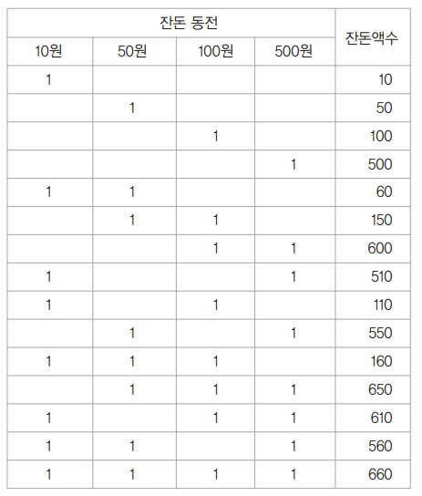
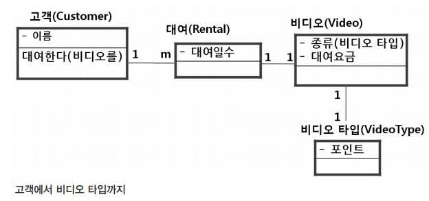
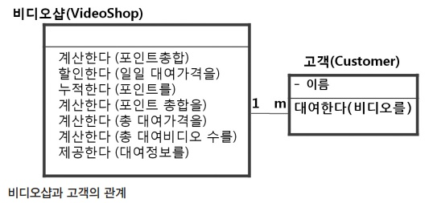

# 실습 예제

## 자동판매기 잔돈 계산 모듈

음료 자판기에 탑재될 거스름돈 반환 모듈 개발 업무를 맡게 됐다.

> \- 최소 개수의 동전으로 잔돈을 돌려준다.
>
> 예) 1000원 넣고 650원짜리 음료를 선택했다면, 잔돈은 100, 100, 100, 50원으로 반환한다.
>
> \- 지폐를 잔돈으로 반환하는 경우는 없다고 가정한다.

비교적 간단한 예제로, 많은 사람이 TDD를 학습할 때 한 번 정도씩은 작성해보게 되는 예제다. 실제 프로젝트라면, 해당 요구사항을 좀 더 상세화하는 작업이 필요하겠지만, 여기서는 상식적인 수준으로 요구사항을 정련해서 개발을 마치기로 하자. 한 가지 조건을 덧붙이자면, 고객은 구현을 잘 모르기에 특정 구현 방식을 지정하고 있지 않다고 가정하기로 하자. 그저 반환되는 동전이 최소한이 되는 자판기 잔돈 계산 모듈을 구현해서 제공하면 충분하다.

### 개발 시작하기

만일 개발할 부분에 대한 이해가 명확하지가 않다면, 개발 시작하기 전에 간단한 사용자 시나리오를 작성해보는 것도 좋은 방법이다. 물론 많은 개발자의 경우, 우선 IDE 툴의 새 파일로 바로 시작해 타이핑에 바로 들어가는 경향이 있다. 하지만 그럴 경우 개발방향이 어디로 가게 될지 모르게 되기가 쉬우므로, 적어도 ToDo 리스트 정도는 가지고 시작하는 편이 좋다. 만일 현재 예제 상황이 실제 상업적인 업무 프로젝트이고 해당 개발영역이 본인이 잘 모르는 분야라면 고객 인터뷰라든가 관련 지식 학습이 함께 필요하겠지만, 다행히도 이번 경우는 우리가 흔히 접하고 쉽게 이해하고 있는 상황인 만큼 일반적인 경험을 토대로 사용자 관점에서의 시나리오를 한번 작성해보자.

> **업무 시나리오**
>
> 돈을 넣는다.
>
> → 투입한 금액이 표시된다.
>
> → 투입한 금액 내에서 선택 가능한 음료가 있다면 해당 버튼에 불이 들어온다.
>
> → 음료를 선택한다.
>
> → 음료가 나온다.
>
> → 투입금액 표시화면에는 선택한 음료 가격만큼 제외된 가격이 표시된다.
>
> → 만일 표시된 남은 금액이 다른 음료를 선택할 수 있는 금액 이하이면 바로 잔돈으로 반환한다.
>
> → 다른 음료를 선택할 수 있는 금액이 남아 있다면 최초 동전을 넣었을 때와 동일하게 동작한다.
>
> → 반환 버튼을 눌렀을 경우 상황에 관계없이 표시되어 있는 금액을 최소 잔돈으로 반환한다.

현재 상황은 사람과 기계의 고독한 대화 상황이라고 볼 수 있다. 이 정도 시나리오를 만들고 개발에 들어가려고 보면, 우리는 사람의 행동을 구현할 수는 없으니까 그 부분은 찾아서 제외시켜 보자.

> **업무 시나리오**
>
> ~~돈을 넣는다.~~ (사람)
>
> → 투입한 금액이 표시된다.
>
> → 투입한 금액 내에서 선택 가능한 음료가 있다면 해당 버튼에 불이 들어온다.
>
> → ~~음료를 선택한다.~~ (사람)
>
> → 음료가 나온다.
>
> → 투입금액 표시화면에는 선택한 음료 가격만큼 제외된 가격이 표시된다.
>
> → 만일 표시된 남은 금액이 다른 음료를 선택할 수 있는 금액 이하이면 바로 잔돈으로 반환한다.
>
> → 다른 음료를 선택할 수 있는 금액이 남아 있다면 최초 동전을 넣었을 때와 동일하게 동작한다.
>
> → ~~반환 버튼을 눌렀을 경우~~ 상황에 관계없이 표시되어 있는 금액을 최소 잔돈으로 반환한다. (일부 사람)

이제 사람의 행동은 제외하고, 자판기의 동작만 남았다. '자, 그럼 이제 구현에 들어가야겠다'라고 생각하고 작업하려고 보면, 어떻게 할 수 없는 부분이 있다는 걸 알게 된다. 즉, 남은 시나리오에는 하드웨어적인 액션과 소프트웨어적인 액션이 혼재되어 있는데, 하드웨어는 업무범위를 벗어나니까 제외해보자.

> **업무 시나리오**
>
> ~~돈을 넣는다.~~ (사람)
>
> → 투입한 금액이 표시된다.
>
> → ~~투입한 금액 내에서 선택 가능한 음료가 있다면 해당 버튼에 불이 들어온다.~~(하드웨어)
>
> → ~~음료를 선택한다.~~ (사람)
>
> → ~~음료가 나온다.~~(하드웨어)
>
> → 투입금액 표시화면에는 선택한 음료 가격만큼 제외된 가격이 표시된다.
>
> → 만일 표시된 남은 금액이 다른 음료를 선택할 수 있는 금액 이하이면 바로 잔돈으로 반환한다.
>
> → 다른 음료를 선택할 수 있는 금액이 남아 있다면 최초 동전을 넣었을 때와 동일하게 동작한다.
>
> → ~~반환 버튼을 눌렀을 경우~~ 상황에 관계없이 표시되어 있는 금액을 최소 잔돈으로 반환한다. (일부 사람)

이번엔 개발범위를 한정할 수 있도록 업무 시나리오를 다시 정련해보자.

> **개발 가능 범위**
>
> \- 투입한 금액이 표시된다. → 투입한 금액을 알 수 있다. 즉, 현재 잔액을 알 수 있다.
>
> \- 투입금액 표시화면에는 선택한 음료 가격만큼 제외된 가격이 표시된다. → 현재 잔액을 알 수 있다. 
>
> \- 만일 표시된 남은 금액이 다른 음료를 선택할 수 있는 금액 이하이면 바로 잔돈으로 반환한다. → 잔액이 최소음료가격 이하인지 여부를 확인한다.
>
> \- 다른 음료를 선택할 수 있는 금액이 남아 있다면 최초 동전을 넣었을 때와 동일하게 동작한다. (소프트웨어) 
>
> \- 표시되어 있는 금액을 최소 잔돈으로 반환한다.

가능 범위를 적고 보면 크게 몇 가지 기능으로 축약된다.

> \- 음료수의 가격 확인
>
> \- 잔액 확인
>
> \- 잔돈 반환

한참을 돌아왔는데, 이 중에서 우리가 구현할 부분은 잔돈 반환 부분이다. 아니, 처음부터 잔돈 반환인데, 왜 이렇게 돌아온 거냐고 의아해할 수도 있다. 하지만 이런 식으로 미리 파악해놓으면, 우리가 구현해야 하는 부분은 전체 중에서 어디쯤에 속해 있는지, 다른 부분과 어떤 식으로 연계가 되는지를 알 수 있으며, 결과적으로 더 올바른 방식으 로 구현할 수 있게 도와준다. 많은 경우에 있어, 고객의 말에만 의존하지 말고 고객의 업무도 함께 확인해야 한다.

그리고 이런 식으로 접근하면 얻게 되는 이점이 하나 있는데, 바로 이번 예제의 핵심 부분을 발견하게 된다. 즉, 잔액 확인 기능이 필요한 부분이다. 처음 요구사항만 보고 개발에 들어가는 많은 개발자는 다음과 같은 식으로 논리를 전개해가는 경우가 많다.

> 동전을 투입한다. → 음료를 화면에 출력한다. → 음료를 선택한다. → 남은 돈을 반환한다.

이런 식으로 지나치게 단순화되거나, 행위의 주체 구분이 모호하게 섞이고 생략되면 어떤 부분에서 어떻게 개발을 시작해야 할지 헷갈리며, 문제가 복잡해진다. 그리고 흔히 빠지는 함정 중 하나는, 동전을 정의하는 부분과 화면 출력 부분을 자신도 모르는 사이에 깊게 고민하게 되고, 구현범위에 넣어버리게 된다는 점이다. 결국엔 개발시간 부족에 시달리게 된다.

자, 어쨌든 이제 구현범위는 간단 명확해졌다. '잔액 확인', '잔액만큼 최소 동전으로 거스름돈 반환', 두 개다.

테스트 케이스를 작성해보자.

```java
public class VendingMachineTest {
    
    @test // 잔액 확인
    public void testGetChagneAmount() throws Exception {
        
        VendingMachine machine = new VendingMachine();
        machine.putCoin(100); // 동전 100원 투입
        assertEquals("투입금액 100원", 100, machine.ggetChangeAmount());
        
        machine.putCoin(500);
        assertEquals("추가 투입금액 500원", 600, machine.getChangeAmount());
    }
    
    @Test // 거스름돈 50원
    public void testReturnChangeCoinSet_oneCoin_50() throws Exception {
        
        VendingMachine machine = new VendingMachine();
        machine.putCoin(100);
        machine.putCoin(100);
        machine.putCoin(500);
        machine.selectDrink(new Drink("Cola", 650));
        CoinSet expectedCoinSet = new CoinSet(); // 코인 컨테이너 클래스
        
        expectedCoinSet.add(50);
        assertEquals("700원 투입 후 650원 음료선택", expectedCoinSet, machine.getChangeCoinSet());
    }
    
    @Test // 거스름돈 180원
    public void testReturnChangeCoinSet_coins_180() throws Exception {
        
        VendingMachine machine = new VendingMachine();
        machine.putCoin(100);
        machine.putCoin(100);
        machine.putCoin(500);
        machine.selectDrink(new Drink("Soda", 520));
        
        CoinSet expectedCoinSet = new CoinSet();
        expectedCoinSet.add(100);
        expectedCoinSet.add(50);
        expectedCoinSet.add(10);
        expectedCoinSet.add(10);
        expectedCoinSet.add(10);
        
        assertEquals("700원 투입 후 520원 음료선택", expectedCoinSet, machine.getChangeCoinSet());
    }
}
```

만일 상세하게 테스트 케이스를 작성할 필요가 있는 업무라면 테스트 케이스를 매트릭스 형태로 작성할 수도 있다.



참고로 위와 같은 케이스 케이스 표를 만들 때는 잔돈을 먼저 예상하기보다는, 동전 개수를 먼저 적어서 조합해 만들어진 잔돈금액으로 테스트 케이스를 작성할 수도 있다.

하지만 엄밀히 말하면 위와 같은 방법은 개발을 위한 테스트 케이스라기보다는 테스트를 위한 테스트 케이스에 더 가깝다. 경계가 모호하게 들릴 수 있지만, TDD의 테스트 케이스는 개발에 좀 더 초점을 맞춘다.

```java
// 잔돈 코인을 담기 위해 사용하는 코인 컨테이너
public class CoinSet {
    
    private List <Integer> coinSets = new ArrayList<Integer>();
    
    public void add(int coin) {
        this.coinSets.add(coin);
    }
    
    @Override // CoinSet끼리 동치비교를 위해 equals 재정의
    public boolean equals(Object coinSet) {
        if (!(coinSet instanceof CoinSet)) {
            return false;
        }
        return this.toString().equals(coinSet.toString());
    }
    
    @Override // 코인을 일렬로 늘어놓는 문자열을 만든다.
    public String toString() {
        StringBuilder builder = new StringBuilder();
        for (Integer coin : this.coinSets) {
            builder.append(coin);
        }
        return builder.toString();
    }
}
```

```java
public class VendingMachine {
    private int changeAmount;
    public void putCoin(int coin) {
        this.changeAmount += coin;
    }
    
    public int getChangeAmount() {
        return this.changeAmount;
    }
    
    public void selectDrink(Drink drink) {
        changeAmount -= drink.getPrice();
    }

    public CoinSet getChangeCoinSet() {
        
        CoinSet coinSet = new CoinSet();
        
        while(changeAmount >= 500) {
            changeAmount -= 500;
            coinSet.add(500);
        }
        
        while(changeAmount >= 100) {
            changeAmount -= 100;
            coinSet.add(100);
        }
        
        while(changeAmount >= 50) {
            changeAmount -= 50;
            coinSet.add(50);
        }
        
        while(changeAmount >= 10) {
            changeAmount -= 10;
            coinSet.add(10);
        }

        return coinSet;
    }
}
```

최종 구현된 자판기 잔돈 계산 기능은 위와 같다. 이쯤에서 구현을 마무리지을 수도 있는데, 몇 가지 논의해볼 이야기가 남아 있다.

- 잔돈 계산 모듈인데, 구현해나가면서 동전 넣기(putCoin)와 음료선택(selectDrink) 같은 부분까지 임의로 구현을 하고 있다.

  ```java
  machine.putCoin(100);
  ...
  machine.selectDrink(new Drink("Soda", 520));
  ```

- Drink라는 임의의 클래스를 만들었고, VendingMachine에서 사용하게 만들었다.

  ```java
  Public class VendingMachine {
      private int changeAmount;
      
      public void selectDrink(Drink drink) {
          changeAmount -= drink.getPrice();
      }
  ...
  ```

CoinSet도 새롭게 만들어진 클래스인데, 이건 잔돈 계산을 위해서는 어떤 이름의 무슨 모습이 됐든지 간에 필연적으로 생기는 부분이라 뭐라 트집 잡기 어렵지만 위의 두 부분은 우리의 아쉬운 시간 자원을 소비했을 뿐 아니라, 나중에 실제 다른 팀이나 이미 구현된 부분과 연동시킬 때도 다시 문제를 일으킬 소지가 크다

여기서 사전에 우리가 취할 수 있는 해결책은 두 가지가 있다.

### 해결책1 : 인터페이스(스펙)를 이용한 개발

### 해결책2 : 오로지 잔돈 계산 모듈에만 집중

분업일 경우에는 인터페이스를 먼저 정의해서 다른 팀과 공유한 다음에 진행하는 것이 정답이다. 다만, 인터페이스를 이용한 경우 테스트 케이스 작성 시에 어쩔 수 없이 Mock 객체를 사용하게 된다. 현재 상황에서는 잔돈 계산 모듈에만 집중하는 걸 선택하기로 하자. 이 경우, '테스트 시나리오'가 극도로 줄어들게 된다. 이 점은 때론 장점이 되고 때론 단점이 된다.

##### 업무 시나리오 없이 기능만 테스트하는 형태로 작성된 테스트 케이스

```java
public class VendingMachineTest {
    @Test // 거스름돈 50원
    public void testReturnChangeCoinSet_oneCoin_50() throws Exception {
        ChangeModule module = new ChangeModule();
        CoinSet expectedCoinSet = new CoinSet(); // 예상하는 잔돈 세트
        expectedCoinSet.add(50);
        assertEquals("700원 투입 후 650원 음료선택", expectedCoinSet, module.getChangeCoinSet(50));
   }
    
    @Test // 거스름돈 180원
    public void testReturnChangeCoinSet_coins_180() throws Exception {
        ChangeModule module = new ChangeModule();
        CoinSet expectedCoinSet = new CoinSet();
        expectedCoinSet.add(100);
        expectedCoinSet.add(50);
        expectedCoinSet.add(10);
        expectedCoinSet.add(10);
        expectedCoinSet.add(10);
        
        assertEquals("700원 투입 후 520원 음료선택", expectedCoinSet, module.getChangeCoinSet(180));
    }
}
```

##### 테스트 케이스를 이용해서 작성된 getChangeCoinSet 메소드

```java
public class ChangeModule {
    public CoinSet getChangeCoinSet(int changeAmount) {
        CoinSet coinSet = new CoinSet();
        while(changeAmount >= 500) {
            changeAmount -= 500;
            coinSet.add(500);
        }
        
        while(changeAmount >= 100) {
            changeAmount -= 100;
            coinSet.add(100);
        }
        
        while(changeAmount >= 50) {
            changeAmount -= 50;
            coinSet.add(50);
        }
        
        while(changeAmount >= 10) {
            changeAmount -= 10;
            coinSet.add(10);
        }
        return coinSet;
    }
}
```

잔돈 교환 모듈을 독립적으로 만들었다. VendingMachine 안에 들어 있을 때와 달리 잔돈 상태에 영향을 받지 않는다. 앞선 방식에서도, 그리고 이 방식에서도 여전히 눈을 괴롭히는 부분이 있는데, 바로 잔돈 동전 세트인 CoinSet를 계산하는 부분에서 반복적으로 나타나는 while 패턴 부분이다.

```java
...
while(changeAmount >= 500) {
    changeAmount -= 500;
    coinSet.add(500);
}
...
```

이 부분은 리팩토링의 여지가 많이 남아 있다. 현재 녹색 막대 상태인지 확인한 다음, 리팩토링에 들어가자. 우선 먼저 어떻게 리팩토링을 하면 좋을지 생각해보자. 접근 방법은 여러 가지가 있기 때문에, 이후 소스는 리팩토링 방식 중 하나라고 생각해주면 좋겠다. 우선 동전의 종류를 한곳으로 모아서, 종류를 한눈에 볼 수 있고, 새로운 동전의 추가/삭제를 쉽게 만들었으면 좋겠다. 취할 수 있는 흔한 선택지는 몇 가지가 있다.

\- 동전의 종류만큼 상수를 만든다.

\- int나 Integer 등의 배열로 동전의 종류를 만든다.

\- List나 Set 등의 Collection 타입을 선언한 다음 동전 종류만큼 해당 값을 집어넣는다.

\- 열거형 타입인 enum을 사용한다.

가능하다면 특정 타입이나 값을 표현할 때 enum을 사용하자. 예제에서도, 동전의 종류와 값을 COIN이라는 이름의 enum 클래스로 만들어봤다.

```java
public class ChangeModule {
    enum COIN{
        KRW500(500), KRW100(100), KRW50(50), KRW10(10);
        private int value;
        COIN(int value){
            this.value = value;
        }
    }
}
```

흔한 방법으로 int 배열을 사용하기도 하는데, 좀 더 의미를 명확히 하기 위해 enum을 선택했다. 기존 코드를 건드리지 않고 추가한 부분이기 때문에, 테스트 케이스를 돌려봐도 여전히 녹색 막대 상태가 유지된다.

이제는 종류별로 동전의 값을 나타냈던 숫자인 매직넘버(magic number)들을 지역 상수(local constant variable)로 만들어보자.

```java
int KRW500 = 500;
while(changeAmount >= KRW500){
    changeAmount -= KRW500;
    coinSet.add(KRW500);
}
```

이제, 다른 동전에 해당하는 숫자들도 모두 지역 상수 로 변환한 후 반복적으로 나타나고 있는 while 문을 메소드로 추출해보자.

```java
int KRW500 = 500;
changeAmount = addCoinsToCoinSet(changeAmount, coinSet, KRW500);
```

위와 같은 식으로 만든다. 만일 매직넘버들을 지역 변수로 모두 제대로 만들었다면, 메소드로 추출해낸 이 부분에서 다른 비슷한 패턴이 나타나는 부분도 동일하게 치환이 되는 걸 볼 수 있을 것이다.

이제 테스트 케이스를 실행해보자. 나름 많은 변경이 일어났기 때문에 오류가 있을 수 있다. 앞으로 테스트 케이스를 수행하라는 말은 굳이 하지 않더라도, 중간 중간 테스트 케이스를 수행하는 걸 잊지 말자. 이젠 지역 변수들을 모두 지역 상수로 변환해서 마찬가지로 문제가 없는지 확인한다.

```java
public CoinSet getChangeCoinSet(int changeAmount) {
    CoinSet coinSet = new CoinSet();
    final int KRW500 = 500;
    final int KRW100 = 100;
    final int KRW50 = 50;
    final int KRW10 = 10;
    
    changeAmount = addCoinsToCoinSet(changeAmount, coinSet, KRW500);
    changeAmount = addCoinsToCoinSet(changeAmount, coinSet, KRW100);
    changeAmount = addCoinsToCoinSet(changeAmount, coinSet, KRW50);
    changeAmount = addCoinsToCoinSet(changeAmount, coinSet, KRW10);
    
    return coinSet;
}
```

그 다음엔, 맨 처음에 만들었던 enum을 이용해 반복적으로 addCoinsToCoinSet 메소드를 호출하는 부분을 없애보자. 우선 단계별로, 하지만 빠르게 진행하자. 500원짜리부터 시작해서 지역 상수를 하나씩 enum으로 바꿔나가면서 테스트를 실행해나간다.

```java
final int KRW500 = COIN.KRW500.value;
```

지역 상수들 대신엔 enum을 쓸 수 있다는 걸 확인했다면, 이제 이 COIN이라는 enum 을 열거식으로 사용해 addCoinsToCoinSet 메소드를 호출하도록 만들자.

```java
public CoinSet getChangeCoinSet(int changeAmount) {
    CoinSet coinSet = new CoinSet();
    
    final int KRW500 = COIN.KRW500.value;
    final int KRW100 = COIN.KRW100.value;
    final int KRW50 = COIN.KRW50.value;
    final int KRW10 = COIN.KRW10.value;
    
    for (COIN coin : COIN.values()) {
        changeAmount = addCoinsToCoinSet(changeAmount, coinSet, coin.value);
    }
    return coinSet;
}
```

이제 마무리 단계다. 더 이상 필요 없는 지역 상수들을 없애고, changeAmount 라는 변수를 좀 더 의미를 잘 나타낼 수 있는 변수로 바꾸자. 그런 다음엔 addCoinsToCoinSet 메소드의 인자를 정리하면서 리팩토링을 마치기로 하자. 최종 소스는 다음과 같다.

```java
Public class ChangeModule {
    enum COIN{
        KRW500(500), KRW100(100), KRW50(50), KRW10(10);
        private int value;
        COIN(int value){
            this.value = value;
        }
    }
    public CoinSet getChangeCoinSet(int changeAmount) {
        CoinSet coinSet = new CoinSet();
        // 넘겨받은 변수에 직접 대입이 일어나지 않도록
        // remainChangeAmount라는 지역 변수를 지정
        int remainChangeAmount = changeAmount;
        for (COIN coin : COIN.values()) {
            remainChangeAmount = addCoinsToCoinSet(remainChangeAmount, coinSet, coin.value);
        }
        return coinSet;
    }
    private int addCoinsToCoinSet(int changeAmount, CoinSet changeCoinSet, int coinValue) {

        while(changeAmount >= coinValue){
            changeAmount -= coinValue;
            changeCoinSet.add(coinValue);
        }
        return changeAmount;
    }
}
```

addCoinsToCoinSet 메소드의 경우 좀 더 리팩토링할 게 남아 있는데, 그건 독자의 몫 으로 남겨두기로 한다.

## 비디오 가게

마틴 파울러의 유명한 저서인 '리팩토링'을 보면, 처음에 비디오 가게의 타이틀 대여 애플리케이션에 대한 예제가 나온다. 그 예제는 이미 작성되어 있는 프로그램을 리팩토링해나가면서, 리팩토링 방법을 설명해준다. 여기서는 순서를 반대로 해서, 요구사항을 받아 든 백지상태에서 어떻게 하면 TDD를 통해 비디오 가게 애플리케이션을 만들 수 있는지 살펴본다.

우선 해당 도메인의 대략적인 업무 시나리오는 다음과 같다. 고객에게 비디오 타이틀을 대여하고 대여한 타이틀에 대한 요금을 알려준다. 비디오 가게에서는 포인트 제도를 운영 중이며, 영화 종류와 대여기간에 따라 포인트가 조금 다르다. 구현해야 하는 기능을 중심으로 요구사항을 상세히 발췌해봤더니 다음과 같았다.

> 목적
>
> 비디오 가게에서 고객이 대여하는 비디오의 대여정보를 조회할 수 있는 프로그램을 작성한다.
>
> 요구사항
>
> 1. 고객은 이름을 갖는다. 
>
> 2. 고객은 한 번에 여러 개의 비디오를 대여할 수 있으나 각각의 대여기간은 다를 수 있다.
>
> 3. 비디오는 영화, 스포츠, 다큐멘터리의 세 종류가 있다.
>
> 4. 각 비디오는 독립적인 일일 대여요금을 갖는다. 
>
> 5. 영화는 대여기간이 2일 이상 되면 3일째부터는 대여요금이 1/2로 할인된다. 
>
> 6. 다큐멘터리는 3일 이상 대여하면 4일째부터는 1/3로 할인된다. 
>
> 7. 스포츠는 장기대여 할인이 없다.
>
> 8. 비디오 1개 대여할 때마다 보너스 포인트는 1포인트씩 올라간다. 단, 스포츠는 2포인트씩 올라간다.
>
> 9. 과거의 대여기록을 보유하고 있을 필요는 없으나 고객이 얻은 총 보너스 포인트 정보는 알 고 있어야 한다.
>
> 10. 고객의 현재 대여정보를 구할 수 있는 기능을 작성하라.
>
>     \- 총 대여비디오 수
>
>     \- 대여정보: 비디오(종류 + 제목 + 가격), 대여기간 리스트
>
>     \- 총 대여가격
>
>     \- 현재 대여하고 있는 비디오로 인해 추가된 포인트

많은 개발자가 이런 요구사항을 받아본 다음에 별로 복잡하지 않다는 느낌이 오면, 바로 에디터 창을 띄워 개발에 들어가려는 경향이 있다. 그건, 경험 많은 개발자에게조차 그다지 권장할 만한 방법은 아니다. 이 예제 같은 경우엔 사용자 시나리오도 시나리오지만, 그전에 요구사항 정련이 먼저 필요하다. 본인이 취하는 대표적인 기본 규칙은 다음과 같다.

> \- **하나의 목적을 갖는 의미나 동작으로 최대한 간결히 표현한다.** 
>
> \- **'업무규칙'과 '기능 요구사항'을 분리한다.** 
>
> \- **'고유명사는 대명사로, 명시적인 숫자는 변수로' 참조할 수 있도록 표시해두면 도움이 된다.** 
>
> ​	이때 종류 중 하나를 나타낼 때는 어떤(any)으로 치환해 표현하는 것도 때로 도움이 된다. 
>
> \- **행동의 주체를 가급적 명확히 표현한다.** 
>
> \- **동작과 소유를 분리한다.**
>
> ​	예: 객체의 동작인가? 객체의 소유인가? 
>
> \- **복합 한자어는 유심히 봐서 분리 가능한지 확인해서 풀어쓰면 더 좋다.**
>
> ​	예: 대여요금 → 대여행위 시에 발생하는 요금 
>
> \- **상호작용을 유심히 관찰한다.**
>
> ​	예: 시스템의 행위인가? 고객의 행위인가? 
>
> \- **구어체는 좀 더 명확한 의미를 가진 문어체로 변경한다.** 
>
> ​	예: 구한다 → 화면에 보여준다. 계산한다. 저장한다
>
> ​		  올라간다 → 증가한다. 누적된다.

이를 기반으로 요구사항을 정련하는 모습은 다음과 같다. 요구사항 항목별로 업무규칙인지 기능 요구사항인지 구분해 표기했다. 번호가 없는 항목들은 정련 작업 없이 그대로 사용할 생각이다.

> 고객은 한 번에 여러 개의 비디오를 대여할 수 있으나 각 대여기간은 다를 수 있다.
>
> **업무규칙**
>
> \- 고객은 한 번에 여러 개의 비디오를 대여할 수 있다. 
>
> \- 대여기간은 비디오마다 각각 다를 수 있다.

> 비디오는 영화, 스포츠, 다큐멘터리의 세 종류가 있다.
>
> **업무규칙** 
>
> \- 비디오에는 종류가 있다. 
>
> \- 현재 비디오의 종류는 영화, 스포츠, 다큐멘터리의 세 종류다.

> 영화는 대여기간이 2일 이상 되면 3일째부터는 대여요금이 1/2로 할인된다.
>
>  **업무규칙** 
>
> \- 영화는 대여기간이 n일 이상이 되면 m일째부터는 대여요금이 p로 할인된다.

이런 식으로 요구사항을 상세화해서 다시 적어보면 다음과 같다.

> **업무규칙**
>
> 1. 고객은 이름을 갖는다.
>
> 2. 고객은 한 번에 여러 개의 비디오를 대여할 수 있다.
>
> 3. 대여기간은 비디오마다 각각 다를 수 있다.
>
> 4. 비디오에는 종류가 있다.
>
> 5. 현재 비디오의 종류는 영화, 스포츠, 다큐멘터리의 세 종류다.
>
> 6. 각 비디오는 독립적인 일일 대여요금을 갖는다.
>
> 7. 영화는 대여기간이 2일 이상 되면 3일째부터는 대여요금이 1/2로 할인된다.
>
>    예: 영화는 대여기간이 n일 이상이 되면 m일째부터는 대여요금이 p로 할인된다.
>
> 8. 다큐멘터리는 3일 이상 대여하면 4일째부터는 1/3로 할인된다.
>
>    예: 어떤 비디오의 타입은 n일 이상 대여하면 m일째부터는 p로 할인된다.
>
> 9. 스포츠는 장기대여 할인이 없다.
>
>    예: 어떤 비디오 타입은 장기대여 할인이 없다.
>
> 10. 비디오 1개 대여할 때마다 보너스 포인트는 1포인트씩 누적된다(단, 스포츠는 2포인트씩).
>
>     예: 고객의 보너스 포인트 누적점수는 비디오를 n개 대여할 때마다 보너스 포인트는 m포인트씩 누적된다.(단, 특정 타입은 p포인트씩)
>
> 11. 시스템은 고객의 과거의 대여기록을 보유하고 있을 필요 없다.
>
> 
>
> **고객과 협의해 확정해야 하는 업무규칙**
>
> \- 대여는 일 단위다. 
>
> \- 포인트는 정수다. 
>
> \- 할인은 분수 비율이다.
>
> 
>
> **기능 요구사항**
>
> 1. 고객은 비디오를 대여할 수 있다.
>
> 2. 시스템은 고객의 현재 대여정보를 제공할 수 있다.
>
>    대여정보 
>
>    \- 총 대여비디오 수 
>
>    \- 비디오(종류 + 제목 + 가격), 대여기간 리스트 
>
>    \- 총 대여가격 
>
>    \- 현재 대여하고 있는 비디오로 인해 추가된 포인트
>
> 3. 시스템은 현 대여로 인해 발생하는 포인트 총합을 계산할 수 있다.
>
> 4. 시스템은 대여된 비디오들의 총 대여가격을 계산할 수 있다.
>
> 5. 시스템은 총 대여비디오 수를 계산할 수 있다.
>
> 
>
> **기타 요구사항 확인 작업**
>
> \- 과거의 대여기록을 보유하고 있을 필요는 없으나 고객이 얻은 총 보너스 포인트 정보는 알고 있어야 한다. → 포인트 정보의 기록을 의미하는 건지, 개별 포인트만의 관리가 아닌 대여 반납의 포인트 합산인지를 확인한다.

자, 이번엔 앞선 자동판매기 예제와는 또 다른 방식으로 접근해보자. 사용자 시나리오를 작성해 그걸 기반으로 테스트 케이스를 만드는 식으로 진행하는 것이 아니라, 클래스를 먼저 도출해보는 방식이다. 개발에 필요한 클래스를 정련된 요구사항 목록으로부터 한번 도출해보자. 크게 행위 기반 클래스와 소유 기반 클래스로 나눠봤다.

> **행위 기반 클래스 도출**
>
> 대여한다 (고객이 비디오를)
>
> 할인된다 (비디오 일일 대여가격이)
>
> 누적된다 (보너스 포인트가)
>
> 계산한다 (시스템이 포인트 총합을)
>
> 계산한다 (시스템이 총 대여가격을)
>
> 계산한다 (시스템이 총 대여비디오 수를)
>
> 제공한다 (시스템이 대여정보를)

아직 보정이 필요하다.

**우선 쉬운 것부터**

> OOP에서 객체에 수동 액션을 담는 일은 좀처럼 없다. 그런데 요구사항으로부터 액션(행동)을 도출하고 보면 본의 아니게 수동이 쓰이는 경우가 있다. 만일 수동이 쓰인 상태로 구현을 하게 되면 타 모듈에 대한 의존성이 높아져서 설계가 전체적으로 복잡해진다. 다음 예를 살펴보자.
>
> > 할인된다 (비디오 일일 대여가격이)
> >
> > 누적된다 (보너스 포인트가)
>
> 위 두 가지 액션을 하는 행위를 능동으로 바꿔보자. 바꾸다 보면, 행위의 주체가 시스템이라는 걸 자연스럽게 알 수 있다.
>
> > 할인한다 (시스템이 비디오 일일 대여가격을)
> >
> > 누적한다 (시스템이 포인트를)

**이번엔 살짝 복잡한 걸로**

언제나 느끼지만 요구사항의 한자어는 위험하다. '대여한다'는 말은 사실 매우 어려운 말이다. 무언가를 가져와서 일정 기간 동안 소유로 삼다가 돌려준다는 뜻인데, 요구사항을 보면, 여러 개를 대여할 수 있고, 항목별 대여일수가 다를 수 있으며, 대여한 일수에 따라 대여 항목별로 비용과 포인트가 각각 책정된다고 적혀 있다. 이를 지원하기 위해서는 각 대여항목을 독립적으로 다룰 무언가가 필요하다. 클래스를 도출하기 위해 명사를 기준으로 분석해보면 '대여'라는 실체가 없는 개념이 필요해진다. 대여라는 행위를 하나의 추상 개념으로 구분하지 않고 고객이 영화를 직접 다루는 '고객 → 영화' 식으로 설계할 수도 있는데, 이러면 대여영화 별 대여일자 정보를 같이 다루기가 어려워진다. 따라서 고객은 대여를 참조하고, 대여는 영화를 포함하는 식의 '고객 → 대여 → 영화' 같은 구성을 갖게 되면, 고객:대여=1:m , 대여:영화=1:1 관계를 통해 대여일수 관리가 가능해진다.

다음은 소유 기반으로 클래스를 도출한 부분이다

> **소유 기반 클래스 도출**
>
> 이름을 갖는다 (각 고객은)
>
> 종류를 갖는다 (각 비디오는)
>
> 대여요금을 갖는다 (각 비디오는)
>
> 포인트를 갖는다 (각 비디오)
>
> 대여일수를 갖는다 (비디오가? 고객이?)

마찬가지로 정련 작업을 해보자.

**우선 쉬운 것부터**

> TDD에서는 크게 강조하는 내용에 해당하진 않지만, 소유 기반 클래스를 살펴볼 때는 소유의 기준이 되는 조건이 무엇인지 생각해볼 필요는 있다. 예를 들면, 포인트 정보를 갖고 있어야 하는 것은 대여한 비디오(클래스)인가? 아니면, 대여한 비디오의 타입인가? 비디오가 포인트를 갖는다고 생각하기 쉽지만, 사실 부여되는 포인트는 비디오가 어떤 타입을 갖느냐에 달려있다. 스포츠 타입인가? 아니면 다큐멘터리 타입인가? 하는 식으로 말이다.

**이번엔 살짝 어려운 걸로**

> > 대여일수를 갖는다 (비디오가? 고객이?)
>
> 대여일수 정보는 어디에 둘 것인가에 대한 고민이다. 어느 쪽(클래스)에 놓을지 애매할 경우에는 객체의 구체적인 인스턴스를 예로 들어서 해당 정보를 '갖고있다'는 말이 적당한지 테스트해본다.
>
> > 예: 타이타닉은 대여일수를 갖고 있다. (타이타닉의 대여일이 고정?) 
> >
> > ​	장동건은 대여일수를 갖고 있다. (장동건은 7일?)
>
> 이런 식으로 따져보면, 비디오도, 고객도 대여일수는 갖는 모습이 어색하다는 걸 알 수 있다. 앞서 찾아낸 '대여'라는 추상적인 개념이 이 부분에서 쓰이는 것이 적절해 보인다. 그리고 이때 클래스에 해당 정보가 위치해야 하는 이유를 함께 생각 해볼 필요가 있다. 예를 들자면, '대여일수를 갖는다' → 대여일수로 대체 뭘 하려고 하는가? → 대여가격과 포인트를 계산하려고! 하는 식으로 말이다.
>
> > 예: 타이타닉 비디오 영화에 대한 '대여'는 대여일수를 갖고 있다. (비용과 포인트 계산이 가능!)
>
> 이런 식으로 표현해보면, 영화와 대여가 1:1 관계가 된다는 것도 문장에서 자연스럽게 파악된다. 이 정도까지 발전하면 이제 '대여일수를 갖는다' 주체와 그 클래스에 해야 하는 행동이 눈에 보이게 된다. 이렇게 해서, 최초의 문장을 정련한 모습은 다음과 같다
>
> > 대여일수를 갖는다 (각 대여는)

이쯤 되면 사람에 따라 "TDD는 이런 게 아니라구! 설계를 해버렸잖아!"라고 말하고 싶을 수도 있다. 아쉽지만, 그게 또 그렇지가 않다. TDD에 들어가는 시점엔 이미 최소한의 클래스와 시스템의 행위는 나와 있어야 한다. XP가 극단을 추구했기에 eXtreme이라고 불리지만, 창시자 켄트 벡도, 그의 절친 마틴 파울러 아저씨도 필요한 만큼의 설계는 개발 전에 해야 한다고 말한다. 

그리고 정확히는 TDD란 말 자체도, '시스템 구축을 개발부터'의 의미를 나타내는 것이 아니라, '개발할 때는 테스트 코드부터(Test First Development)'의 의미를 갖는다.

위 내용을 다 따라서 최종적으로 정리해보면 다음과 같이 클래스가 도출된다

> **행위 기반 클래스**
>
> 대여한다 (고객이 비디오를)
>
> 할인한다 (시스템이 비디오 일일 대여가격을)
>
> 누적한다 (시스템이 포인트를)
>
> 계산한다 (시스템이 포인트 총합을)
>
> 계산한다 (시스템이 총 대여가격을)
>
> 계산한다 (시스템이 총 대여비디오 수를)
>
> 제공한다 (시스템이 대여정보를)
>
> **소유 기반 클래스**
>
> 이름을 갖는다 (각 고객은)
>
> 종류를 갖는다 (각 비디오는)
>
> 대여요금을 갖는다 (각 비디오는)
>
> 포인트를 갖는다 (각 비디오 타입은)
>
> 대여일수를 갖는다 (각 대여는)





물론 이 정도 수준의 요구사항 정제만으로 만들어진 위와 같은 설계가 절대 완벽할 리는 없다. 하지만 개발의 시작점은 마련해주기 때문에, TDD로 개발해나가면서 리팩토링과 함께 설계를 개선하는 작업을 통해 충분히 보완할 수 있다. 이제 각 클래스에 대한 테스트 케이스를 만드는 식으로 구현에 들어가면 좀 더 쉽게 작업할 수 있다. 이 때 시작은 소유 기반 클래스부터, 그리고 다른 클래스에 대한 의존성이 낮은 클래스부터 시작하는 걸 권장한다. 그런 클래스들은 자신만으로 테스트 케이스 작성이 가능하기 때문에 테스트 케이스 작성의 난이도가 비교적 낮다. 위의 클래스 다이어그램 기준으로는 비디오 타입 클래스나 비디오 클래스부터 하는 것을 말한다. 행위 기반 클래스들은 이런저런 클래스를 함께 이용해야 하는 경우가 많다. 시스템에 해당하는 VideoShop 클래스를 보면, 기능들(행위)이 잔뜩 포진해 있기 때문에, 기능을 구현할 때 많은 클래스가 필요하다. 그래서 일반적인 상황이라면, VideoShop 클래스에 대한 TDD 개발은 다소 뒷부분에 이뤄질 가능성이 크다.

이 정도 설계를 한 후, 소유 기반 클래스부터 시작해 행위 기반 클래스까지 차분히 테스트 케이스를 만들면서 개발해나가다 보면, 최종적으로는 통합 테스트(integration test) 수준의 테스트 케이스가 자연스럽게 만들어진다. 

> **데이터 모델링과 객체 지향 프로그래밍의 경계점, 엔티티 클래스**
>
> 위에서 본인이 소유 기반 클래스라고 지칭했던 부분은, 사실 엔티티(Entity) 클래스를 말한다. 엔티티 클래스는 데이터 모델링의 엔티티에 대응되는 클래스로, 키(key)와 값(value)의 조합으로 내부가 구성되어 있는 클래스를 지칭한다. 
>
> ```java
> public class Music {
>     private String title;
>     private String perfromer;
>     ...
> }
> ```
>
> 모양 자체는 JavaBean과 동일하다. 그리고 데이터 모델링의 엔티티는 관계형 DB에서 테이블로 구현된다. 그렇기에 엔티티 클래스의 내부 필드들은 특정 테이블의 컬럼값과 일치하는 경우가 매우 많다. 어떠한 업무 도메인에서 시스템을 구축한다면, 비즈니스를 구축하는 프로그램 언어 영역과 데이터를 중점적으로 다루게 되는 데이터 모델링 영역이 곧잘 서로 떼려야 뗄 수 없는 관계가 된다. 그리고 그 접점에 엔티티 클래스가 자리잡고 있다. 그런데 한 가지 재미있는 점은, 데이터 모델링에서 엔티티를 설계에 대한 접근 방법과 객체 지향 프로그래밍에서 엔티티 클래스 설계 접근 방식이 조금 다르다는 점이다. 데이터 모델링에서는 업무 흐름도, 시나리오, 인터뷰 등을 통해 보통 엔티티를 먼저 도출해내고, 그 다음 엔티티 사이의 관계(Referential Integration)를 찾고, 마지막으로 속성을 상세화하는 방식으로 전개한다. 객체 지향 프로그래밍에서는 행위(인터페이스)를 먼저 찾고 그 다음에 엔티티(클래스)와 속성(필드값)을 찾는 식으로 접근한다. 어느 쪽이 더 낫다고 말하려는 것이 아니라, 데이터 모델링은 엔티티와 속성에 특화된 반면 행위는 겉으로 드러나기가 어렵고, 객체 지향 프로그래밍은 행위는 전면에 내세우는 반면에 엔티티 작성 부분은 좀 체계화가 약하다는 생각이 든다. 두 영역의 작업 방식을 함께 알고 있다면, 어느 쪽 업무를 하든 간에 상호 보완적으로 좀 더 나은 설계를 할 수 있다고 본다. 