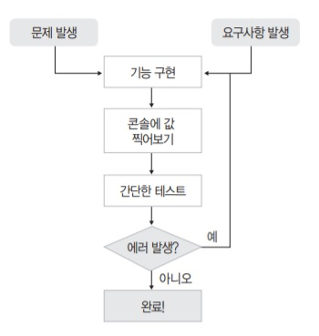
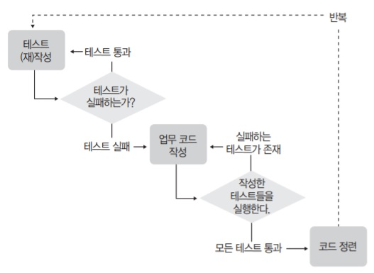

# 테스트 주도 개발

## 흔한 소프트웨어 개발 방식



고전적인 개발 방식에서 아래와 같은 문제점이 나타난다.

1. ##### 특정 모듈의 개발 기간이 길어질수록 개발자의 목표의식이 흐려진다.

2. ##### 작업 분량이 늘어날수록 확인이 어려워진다.

3. ##### 개발자의 집중력이 필요해진다.

4. ##### 논리적인 오류를 찾기가 어렵다.

5. ##### 코드의 사용 방법과 변경 이력을 개발자의 기억력에 의존하게 되는 경우가 많다.

6. ##### 테스트 케이스가 적혀 있는 엑셀 파일을 보며 매번 테스트를 실행하는 게 점점 귀찮아져서 점차 간소화하는 항목들이 늘어난다.

7. ##### 코드 수정 시에 기존 코드의 정상 동작에 대한 보장이 어렵다.

8. ##### 테스트를 해보려면 소스코드에 변경을 가하는 등, 번거로운 선행 작업이 필요할 수 있다.

9. ##### 그래서 소스 변경 시 해야 하는 회귀 테스트는 곧잘 희귀 테스트(rare test)가 되기 쉽다.

10. ##### 이래저래 테스트는 개발자의 귀중한 노동력(man-month)을 적지 않게 소모한다.

해당 문제를 제거하기 위해, 여러 방법을 거쳤다. 그래도 문제 발생 확률을 낮춰줄 수 있는 여러 가지 기법 중 하나가 테스트를 개발의 전면으로 내세운 **TDD**이다.

## 테스트 주도 개발(TDD)

> 프로그램을 작성하기 전에 테스트 먼저 하라!
>
> (Test the program before you write it.) - 켄트 백(Kent Beck)

TDD의 정의는 곧잘 아래와 같이 이야기 되곤 한다.

**"업무 코드를 작성하기 전에 테스트 코드를 먼저 만드는 것!"**

코드를 검증하는 테스트  코드를 먼저 만든 다음에 실제 작성해야 하는 프로그램 코드 작성에 들어가라는 뜻이다. 최초에는 테스트 우선 개발(Test First Development)이라고 불렸으나 지금은 테스트 주도 개발(Test-Driven Development, TDD)이라 불린다. 메소드나 함수 같은 프로그램 모듈을 작성할 때 '작성 종료조건을 먼저 정해놓고 코딩을 시작한다'는 의미로 받아들이면 된다. 예를 들어, 두 숫자의 합을 구해서 반환해야 하는 sum이라는 메소드를 작성한다고 가정하면

| 설명                                | 내용                                                        |
| ----------------------------------- | ----------------------------------------------------------- |
| 작성 메소드 이름                    | sum                                                         |
| 기능 구현에 필요한 재료(argument)   | int a, int b                                                |
| 반환 값의 타입                      | int                                                         |
| 정상 동작 만족 조건(작성 종료 조건) | a와 b를 더한 값을 결과로 돌려줌, 즉 sum(10, 15)는 25를 리턴 |

우리가 프로그램을 작성할 때 머릿속으로 생각하는 내용과 별반 다르지 않다. 다만 **'문서로 만들어 머리로 생각하고 눈으로 확인할 것인가?'** 아니면, **'예상 결과를 코드로 표현해놓고 해당 코드가 자동으로 판단하게 할 것인가?'**의 차이가 있다. 위 설계문서에 따라 sum 메소드를 작성할 때, 코드를 통해 정상적으로 구현됐는지 판단하는 방법을 선택한다면 아래와 같은 코드로 작업할 수도 있다.

```java
public class Calculator {
    public int sum(int a, int b) {
        return 0;
    }
    
    public static void main(String[] args) {
        
        Calculator calc = new Calculator();
        System.out.println(calc.sum(10, 20) == 30);
        System.out.println(calc.sum(1, 2) == 3);
        System.out.println(calc.sum(-10, 20) == 10);
        System.out.println(calc.sum(0, 0) == 0);
    }
}
```

```
-----실행 결과-----
false
false
false
true
```

위 예제에서는 main 메소드를 테스트 메소드처럼 사용했다. sum 메소드는 컴파일 에러만 나지 않도록 해놓고, 내부는 비어 있는 상태이다. sum 메소드를 먼저 구현한 다음에 테스트를 할 수도 있지만, 그렇게 하지 않고 검증코드를 먼저 만들어놓았다. 그 검증코드에 해당하는 테스트 케이스를 모두 만족하면, 즉 main 메소드의 실행 결과가 모두 true로 나오면 sum 메소드가 정상적으로 작성됐다고 판단하기로 한 것이다. 다시 말해, 명시적인 코드로 개발 종료조건을 정해놓은 것이다. 이런식의 개발 접근 방식이 바로, TDD이다. 테스트 케이스 작성으로 구현을 시작하는 것, 그게 바로 TDD이다.

## 테스트 주도 개발의 목표

> 잘 동작하는 깔끔한 코드
>
> (Clean code that works) - 론 제프리(Ron Jeffries)

우리가 TDD라는 방식을 얻고자 하는 최종 목적은 '잘 동작하는 깔끔한 코드'이다. 이는 일반적인 소프트웨어 개발의 목표와 별반 다르지 않다. 다만 TDD에선 정상적으로 동작하는 코드만을 개발의 목표로 삼지 않고, 작성된 코드도 명확한 의미를 전달할 수 있게 작성돼야 한다고 말한다. 즉, '제대로 동작함(works)'뿐 아니라 '깔끔함(clean)'까지도 동등한 수준의 개발 목표로 삼는다는 점이 일반적인 개발 방식과 다르다. 이 차이점은 소프트웨어의 품질을 비롯한 유지보수의 편의성, 가독성, 그리고 그에 따른 소프트웨어의 비용과 안정성 등 여러 가지 측면의 의미를 내포한다.

## 테스트 주도 개발 진행 방식

1. 질문(Ask) : 테스트 작성을 통해 시스템에 질문한다.(테스트 수행 결과는 실패)
2. 응답(Respond) : 테스트를 통과하는 코드를 작성해서 질문에 대답한다. (테스트 성공)
3. 정제(Refine) : 아이디어를 통합하고, 불필요한 것은 제거하고, 모호한 것은 명확히 해서 대답을 정제한다.(리팩토링)
4. 반복(Repeat) : 다음 질문을 통해 대화를 계속 진행한다.

TDD를 이용한 개발은 크게 **'질문 -> 응답 -> 정제'**라는 세 단계가 반복적으로 이루어진다.



TDD는 이와 같은 형태의 반복적인 흐름을 갖는다. 흔히 단위 테스트 프레임워크(Unit Test Framework)를 사용한 테스트 코드 작성이 이뤄진다고 생각하면 된다.

## 실습 먼저 시작해보기

은행 계좌(Account Class) 클래스를 TDD 방식으로 만들어보자.

```
은행계좌 클래스
 - 계좌 잔고 조회
 - 입금/출금
 - 예상 복리 이자(추가 개발)
```

은행계좌(Account) 클래스를 만들어야 한다고 판단됐으며, 기능 요구사항은 위와 같다고 가정한다. 잔고 조회가 가능해야 하고, 입금과 출금을 관리할 수 있어야 한다. 위 내용을 **'질문 -> 응답 -> 정제'**의 단계를 밟아가며, 실습을 진행해보자.

- ### 첫 번째 질문 : 계좌 생성 테스트

  - 구현해야 할 기능을 파악하고, 목록을 작성한다.
  - 계좌 생성 기능을 구현하기 위한 최초의 테스트 케이스를 만들고 실패하는 모습을 확인한다.

  일반적인 소프트웨어의 갭라이 긴응르 구현하고 테스트를 수행하는 형태라고 한다면,  TDD에서는 그와 반대로 진행된다. TDD에는 테스트의 최소 작성 단위를 최하위 모듈의 단위와 일치시킨다. Java 언어 기준으로 최하위 모듈은 '메소드'다. 가장 처음에 해야하는 단계인 질문(ask) 단계에서는 바로 이 메소드 수준의 단위 테스트를 작성하게 된다. 질문 단계에서 실제로 해야하는 일은 **'작성하고자 하는 메소드나 기능이 무엇인지 선별하고 작성 완료 조건을 정해서 실패하는 테스트 케이스를 작성하는 것'**이다. 클래스 설계서 같은 산출물이 있는 경우라면, 크게 고민할 것 없이 메소드 외양부터 만들기 시작하면 된다. 이때 리턴 타입은 기본 초기값(null, 0 등등) 위주로 설정해놓으면 편하다.

  만약 넘겨밭은 산출물이 없다면 개발에 필요한 모든 내용을 개발자가 스스로 머릿속에 떠올려야 하므로 힘들다. 이럴 떄는 우선 대략적인 설계를 먼저 진행한 다음에 질문 단계를 시작한다.

  구현해야 하는 기능과 유의사항을 생각나는 대로 적어보면 다음과 같다.

  ```
  클래스 이름은 Account
  기능은 세 가지
   - 잔고 조회
   - 입금
   - 출금
  * 금액은 원 단위로(예: 천원 = 1000)
  ```

  어느 정도 준비가 됐으면 테스트 케이스를 작성해본다. 보통 이때 두 가지 접근 방식을 이용할 수 있다.

  1. 구현 대상 클래스의 외형에 해당하는 메소드를 먼저 만들고 테스트 케이스를 일괄적으로 만드는 방식
  2. 테스트 케이스를 하나씩 추가해나가면서 구현 클래스를 점진적으로 만드는 방식

  첫 번째 방식을 사용했을 경우에는, 모든 테스트가 정상 통과하는 올 그린(All Green) 상태에 이르기까지 긴 시간이 걸릴 수 있다.

  우선 적당한 이름으로 Java 프로젝트를 생성한다.
  
  ```java
  package test;
  
  public class AccountTest {
  
  }
  ```
  
  테스트 클래스를 만들었으니 이제 테스트 케이스를 만들어보자. 테스트 케이스는 테스트하고자 하는 대상에 대해 간단한 시나리오를 만들고 그것을 코드로 표현한 모습이다. 우선 계좌 생성에 대한 테스트 시나리오는 다음과 같다.
  
  ```
  계좌를 생성한다. -> 계좌가 정상적으로 생성됐는지 확인한다.
  ```
  
  TDD에서는 하나의 테스트 케이스가 하나의 기능을 테스트하도록 만드는 것이 기본 원칙이다. 그리고 대부분의 경우 하나의 테스트 케이스는 하나의 메소드로 표현된다. 이 메소드를 테스트 메소드라고 부른다. 
  
  ```java
  package test;
  
  public class AccountTest {
  	
  	public void testAccount() {
  		Account account = new Account();
  	}
  }
  
  ```
  
  계좌 생성을 테스트하기 위해 만든 메소드이므로 이름을 testAccount()라고 지었다. 그리고 시나리오의 첫 부분인 '계좌를 생성한다' 부분을 코드로 기술했다. Account 클래스를 만든 적이 없으니 에러가 나는 것이 당연하다. 테스트 시나리오를 코드로 기술하는 작업을 먼저 마치고, 그 다음에 해결한다. (테스트 케이스 작성 시 흐름을 잃지 않기 위해서)
  
  이어서 계좌가 정상적으로 생성됐는지 확인하는 부분을 추가한다.
  
  ```java
  package test;
  
  public class AccountTest {
  	
  	public void testAccount() {
  		Account account = new Account();
  		if(account == null) {
  			throw new Exception("계좌 생성 실패");
  		}
  	}
  }
  
  ```
  
  만일 testAccount() 메소드를 실행했을 때 어떤 문제나 메시지도 발생하지 않는다면, 계좌 생성에 대한 테스트가 성공한 것으로 간주한다. 
  
  main 메소드를 이용하는 것이 제일 간단하므로, 테스트 케이스를 실행하는 main 메소드를 작성해보자.
  
  ```java
  package test;
  
  public class AccountTest {
  	
  	public void testAccount() {
  		Account account = new Account();
  		if(account == null) {
  			throw new Exception("계좌 생성 실패");
  		}
  	}
  	
  	public static void main(String[] args) {
  		AccountTest test = new AccountTest();
  		test.testAccount();
  	}
  }
  
  ```
  
- ### 첫 번째 응답 : 계좌 생성 메소드 구현

  - 계좌 생성 테스트 케이스를 통과하는 코드를 작성한다.

  방금 전 실행했던 테스트 케이스는 에러와 함께 실패했다. 즉, 질문에 대한 시스템의 응답(Response)은 실패(Fail)다. 이번엔 테스트를 성공시켜 보자.

  먼저, Account 클래스를 생성한다.

  ```java
  package main;
  
  public class Account {
  
  }
  ```

  그리고 AccountTest 클래스를 다음과 같이 수정한다.

  ```java
  package test;
  
  import main.Account;
  
  public class AccountTest {
  	
  	public void testAccount() throws Exception {
  		Account account = new Account();
  		if(account == null) {
  			throw new Exception("계좌 생성 실패");
  		}
  	}
  	
  	public static void main(String[] args) {
  		AccountTest test = new AccountTest();
  		try {
  			test.testAccount();
  		} catch (Exception e) {
  			System.out.println("실패(X)");
  			return;
  		}
  		System.out.println("성공(O)");
  	}
  }
  ```

  try 구문 안에서 예외가 발생하면 '실패(X)'라고 출력하고, main 메소드를 종료한다. 예외가 발생하지 않으면 '성공(O)'이라고 출력한다. main 메소드를 실행해보면 성공하는 것을 알 수 있다.

  질문(Ask)에 대답하는 응답(Respond) 단계를 마쳤다. 이제 한 주기의 마지막 단계인 정제(Refine) 단계로 들어간다.

- ### 최초의 정제

  - 리팩토링을 적용할 부분이 있는지 찾아본다.
  - ToDo 목록에서 완료된 부분을 지운다.

  한 주기가 끝나기 전에 소스를 정제해보자. 보통 이 단계에서 리팩토링(refactoring) 작업을 수행한다. 리팩토링은 쉽게 말하면, 정상적으로 동작하는 코드를 수정해서, '사람'이 좀 더 '이해하기 쉽고', '변경하기 용이'한 구조로 소스코드를 개선하는 작업을 지칭한다. TDD에서는 한 주기의 마지막 단계로 정제 단계를 만들어 놓고 리팩토링을 권장하고 있다. 리팩토링을 수행하게 되는 정제 단계에서는 일반적으로 다음과 같은 질문에 대해 고민해보는 시간을 갖는다.

  1. **소스의 가독성이 적절한가?**
  2. **중복된 코드는 없는가?**
  3. **이름이 잘못 부여된 메소드나 변수명은 없는가?**
  4. **구조의 개선이 필요한 부분은 없는가?**

  위와 같은 질문을 해보면서, 앞서 작성한 테스트 케이스에 의존해 소스를 가다듬는 단계가 정제 단계이다.

  ```
  클래스 이름은 Account
  기능은 세 가지
   - 잔고 조회
   - 입금
   - 출금
  * 금액은 원 단위로(예: 천원 = 1000)
  ```

  여기서 클래스 Account 단계가 끝났다.(한 주기를 마침) 이제, 현재 코드에 JUnit 단위 테스트 프레임워크를 적용해보자.
  
  코드 내에서 main 메소드를 지운 다음, @Test라고 testAccount() 메소드 위에 적어보자. @Test는 해당 메소들르 테스트 메소드로 지정하기 위한 어노테이션(annotation)이며, 이런 식의 어노테이션 지정은 JUnit 4 버전에서 사용하는 방식이다.
  
  ```java
  package test;
  
  import org.junit.Test;
  import main.Account;
  
  public class AccountTest {
  
  	@Test
  	public void testAccount() throws Exception {
  		Account account = new Account();
  		if (account == null) {
  			throw new Exception("계좌 생성 실패");
  		}
  	}
  
  }
  ```
  
  에러가 발생하면, JUnit이라는 단위 테스트 라이브러리(unit test library)가 클래스 경로, 혹은 빌드 경로에 포함되어 있지 않아서 발생하는 에러다. Java 컴파일러가 참조할 수 있도록 클래스 경로에 JUnit 라이브러리를 추가해놓으면 된다. 'Add JUnit 4 library to the build path'를 선택해서 빌드 경로 내에 Junit 4 라이브러리가 포함될 수 있도록 한다. JUnit 4 버전은 Java JDK 5.0 이상에서 동작한다.
  
  이제는 main 메소드 대신 JUnit 단위 테스트 프레임워크(이하 JUnit)를 통해 테스트 메소드를 실행할 수 있다.[Run] -> [Run As] -> [JUnit Test]를 선택한다.
  
  녹색 막대를 확인했다면 테스트가 성공한 것이다. JUnit 프레임워크를 이용하는 코드로 전환되었으며, 덕분에 테스트 케이스 코드도 훨씬 간결해졌다. testAccount() 메소드의 if 문을 자세히 살펴보면
  
  ```java
  @Test
  	public void testAccount() throws Exception {
  		Account account = new Account();
  		if (account == null) {
  			throw new Exception("계좌 생성 실패");
  	}
  }
  ```
  
  사실 위의 if 문에서 account를 null과 비교했을 때 일치되는 경우는 발생하지 않는다. 단지 시나리오의 흐름상 '검증'이라는 부분을 표현하기 위해 사용했을 뿐이다. 만일 계좌를 생성하는 부분(new Account())에서 문제가 생긴다면 throw new Exception()을 하지 않아도 자동적으로 예외가 던져질 것이다. 그리고 JUnit이 해당 상황을 처리한다. 따라서 if 문은 현재 의미가 없기 때문에 지운다.
  
  ```java
  @Test
  	public void testAccount() throws Exception {
  		Account account = new Account();
  }
  ```
  
  테스트 케이스 항목이 극단적으로 간단해졌다. '계좌를 생성한다. 그때 특별한 에러는 없어야 한다'의 시나리오가 됐다.
  
  JUnit은 테스트 케이스의 실행 성공과 실패를 글자 대신에 색깔이 있는 막대로 표시해준다. 글자보다 훨씬 간결하고 보는 즉시 성공과 실패가 느껴진다. 실패일 경우에는 녹색 대신에 붉은색 막대로 표시한다. JUnit의 기본 사상 중 하나는 테스트의 성공 여부를, 글자를 이해해서 머리로 판단하는 것이 아니라, O/X 개념의 막대로 단순하게 판단하도록 만든다는 것이다. 결과적으로 개발자의 오해와 잘못된 판단의 여지를 줄여준다.
  
  > **클래스 설계 시 속성을 먼저 고민해야 하지 않나?**
  >
  > 클래스의 이름과 그 클래스의 동작이 정해졌담녀 그 동작에 맞는 테스트를 작성하게 된다. 그런데 우리는 흔히 클래스를 설계할 때 속성에 다소 집중해서 설계를 하는 경향이 있다. 클래스를 정의할 때 중요한 건 '속성'이 아니라 '동작'이다. '동작을 먼저 정하고, 그 동작에 필요한 속성을 고려한다'는 식으로 접근하는 편이, 불편한 속성이 클래스 내에 섞여 들어가는 걸 줄여준다. 불필요하거나 자리를 잘못 잡은 속성이 클래스에 포함되면 그 결과 또 다른 불필요한 동작이 클래스에 추가되어 클래스의 정체성이나 모듈성을 훼손시킨다. 일르테면 위 예제에서 Account 클래스의 경우에는 동작만 정했지 Account 클래스의 속성에 대해서는 고민하고 있지 않다.
  
- ### 두 번째 질문 : 잔고 조회

  - 잔고 조회(getBalance) 기능 작성을 위한 테스트 케이스를 작성한다.
  - 테스트 수행 결과가 오류(error)로 표시된 항목은 실패(failure) 항목으로 만든다.
  
  다음 세 가지 기능 중에서 잔고 조회 부분에서 어떻게 하면 제대로 구현됐는지 확인이 가능할까? 테스트 시나리오를 조금 발전시켜 보자.
  
  ```
  기능은 세 가지
   - 잔고 조회
     - 10000원으로 계좌 생성
     - 잔고 조회 결과 일치
   - 입금
   - 출금
  * 금액은 원 단위로(예: 천원 = 1000)
  ```
  
  이번엔 잔고 조회 시나리오에 맞춰 테스트 메소드를 작성해보자. 잔고 조회에 해당하는 테스트 시나리오인 '10000원으로 계좌 생성 -> 잔고 조회 결과 일치'를 앞의 경우와 마찬가지로 코드로 구현해보자.
  
  ```java
  @Test
  public void testGetBalance() throws Exception {
      Account account = new Account(10000);
      if(account.getBalance() != 10000) {
          fail();
      }
  }
  ```
  
  fail()은 JUnit에서 제공하는 메소드인데, fail 메소드가 호출되면 해당 테스트 케이스는 그 순간 무조건 실패한다. fail 메소드 대신에 throw new Exception(); 형태로 작성할 수도 있다.
  
  Account(int value) 생성자를 만들고, getBalance() 메소드를 만든다. 그리고 실행시키면 실패가 발생한다.
  
  > **오류와 실패**
  >
  > 실패는 AssertEquals 등의 테스트 조건식을 만족시키지 못했다는 것을 의미한다. 또 그로인해 내부적으로 fail()이 호출됐다는 의미이기도 하다. 오류는 테스트 케이스 수행 중 예상치 못한 예외(exception)가 발생해서 테스트 수행을 멈췄다는 것을 뜻한다. 테스트 케이스가 가치를 지니기 위해서는, 어떠한 경우에도 테스트 케이스 그 자체는 정상적으로 끝까지 수행돼야 한다. 본인이 작성한 테스트 케이스에 오류(Error)로 인한 실패가 발생하고 있다면, 빠른 시일 내에(Failutres)로 카운트될 수 있게 만들어야 한다.
  
- ### 두 번째 응답: 잔고 조회 기능 구현

  - 앞서 작성된 테스트 케이스를 이용해 잔고 조회 기능을 구현한다.
  - 테스트 실패 시에 메시지를 보여줄 수 있는 구조를 생각해본다.

  이제 실패하는 질문에 대한 응답으로 녹색 막대를 볼 수 있도록, 계좌의 잔고를 알려주는 getBalance 메소드를 구현해보자.

  ```java
  @Test
  public void testGetBalance() throws Exception {
      Account account = new Account(10000);
      if(account.getBalance() != 10000) {
          fail("getBalance() => " + account.getBalance());
      }
  
      account = new Account(1000);
      if(account.getBalance() != 1000) {
          fail("getBalance() => " + account.getBalance());
      }
  
      account = new Account(0);
      if(account.getBalance() != 0) {
          fail("getBalance() => " + account.getBalance());
      }
  }
  ```

  이 상태에서 Account 클래스를 수정한다.

  ```java
  package main;
  
  public class Account {
  	private int balance;
  
  	public Account(int money) {
  		this.balance = money;
  	}
  
  	public int getBalance() {
  		return this.balance;
  	}
  
  }
  ```

  생성자의 값에 따라 잔고가 생성되고, 금액을 리턴하는 로직이 완성되어서 성공적으로 테스트가 마무리 되는 것을 확인할 수 있다.

- ### 두 번째 정제

  - 구현된 잔고 구현 로직에 대한 리팩토리 작업을 한다.
  - 본격적으로 JUnit 테스트 프레임워크를 사용한다.

  ```java
  if(account.getBalance() != 10000) {
  	fail("getBalance() => " + account.getBalance());
  }
  ```

  이 문장은 테스트 케이스의 기본 사상을 나타내고 있는데, **'예상값과 실제값을 비교하는 조건을 만족하지 않으면 실패!'** 라는 컨셉이다. JUnit 테스트 프레임워크에서 제공하는 assertEquals()라는 메소드를 이용하면 좀 더 편리하다.

  ```java
  assertEqauls(예상값, 실제값)
  assertEquals("설명", 예상값, 실제값)
  ```

  예상값(expectedValue)과 실제값(actualValue)은 다양한 타입으로 오버라이드(override)되어 있기 때문에 대부분의 타입에 대해 편리하게 비교 가능하다. assertEquals를 현재 예제에 적용해보면 다음과 같이 변경 가능해진다.

  ```java
  assertEquals(10000, account.getBalance());
  ```

  만약 테스트 실패 메시지까지 정확하게 표현하고 싶다면 다음과 같이 사용한다.

  ```java
  assertEquals("10000원으로 계좌 생성후 잔고 조회", 10000, account.getBalance());
  ```

  TDD를 진행하는 데 있어 assertEquals라는 특정 메소드 자체가 중요한 건 아니다. assertEquals 같은 메소드를 쓰지 않았다고 해서 테스트 주도 개발이 아닌 건 아니다. 자동화된 테스트 케이스를 미리 만들면서 개발한다면 System.out.println() 등을 사용해도 TDD라 불릴 수 있다. TDD에서 중요한건 **'목표 이미지를 미리 세운다 -> 자동화된 테스트 케이스를 작성한다 -> 만족시키는 로직을 작성하고 정련한다'**인 거지, 'JUnit을 사용한다'라든가 'assertEquals나 assertTrue 등의 assert문을 사용한다'가 절대 아니다.

  ```java
  @Test
  public void testGetBalance() throws Exception {
      Account account = new Account(10000);
      assertEquals(10000, account.getBalance());
  
      account = new Account(1000);
      assertEquals(1000, account.getBalance());
  
      account = new Account(0);
      assertEquals(0, account.getBalance());
  }
  ```

  assertEqauls를 사용해 메소드를 위와 같이 바꿨다. 테스트를 실행해보면 여전히 동일한 녹색 막대를 확인할 수 있다.

- ### 세 번째 질문 : 입금과 출금 테스트

  - 입금과 출금 기능을 구현하기 위한 테스트 케이스를 작성한다.

  이번에 구현할 기능은 입금하기(deposit)와 출금하기(withdraw)다. 순서대로 testDeposit()과 testWithdraw() 두 개의 테스트 케이스를 작성해보자.

  ```
  기능은 세 가지
   - 잔고 조회
   - 입금
     - 10000원으로 계좌 생성
     - 1000원 입금
     - 잔고 11000원 확인
   - 출금
     - 10000원으로 계좌 생성
     - 1000원 출금
     - 잔고 9000원 확인
  ```

  위와 같이 시나리오를 좀 더 구체화한 다음, 그에 대응되는 테스트 코드를 만들자.

  ```java
  @Test
  public void testDeposit() throws Exception {
      Account account = new Account(10000);
      account.deposit(1000);
      assertEquals(11000, account.getBalance());
  
  }
  
  @Test
  public void testWithdraw() throws Exception {
      Account account = new Account(10000);
      account.withdraw(1000);
      assertEquals(9000, account.getBalance());
  }
  ```

- ### 세 번째 응답 : 입금과 출금 기능 구현

  - 입금과 출금 기능을 구현한다.

  ```java
  public void deposit(int money) {
  		this.balance += money;
  	}
  
  public void withdraw(int money) {
      this.balance -= money;
  }
  ```

  Account 클래스에 두 메소드를 구현한고 테스트를 실행하면 녹색막대가 나오며 테스트가 성공한다.

- ### 세 번째 정제

  - 중복해서 나타는 계좌 클래스 생성 부분을 리팩토링한다.
  - 테스트에 사용할 객체를 초기화하기 위한 setUp 메소드를 구현한다.
  - ToDo 목록에서 작성된 부분을 제거한다.

  ##### Account 클래스의 최종 모습

  ```java
  package main;
  
  public class Account {
  	private int balance;
  
  	public Account(int money) {
  		this.balance = money;
  	}
  
  	public int getBalance() {
  		return this.balance;
  	}
  
  	public void deposit(int money) {
  		this.balance += money;
  	}
  
  	public void withdraw(int money) {
  		this.balance -= money;
  	}
  
  }
  ```

  ##### AccountTest의 현재 모습

  ```java
  package test;
  
  import static org.junit.Assert.*;
  
  import org.junit.Test;
  import main.Account;
  
  public class AccountTest {
  
  	@Test
  	public void testAccount() throws Exception {
  		Account account = new Account(10000);
  	}
  	
  	@Test
  	public void testGetBalance() throws Exception {
  		Account account = new Account(10000);
  		assertEquals(10000, account.getBalance());
  		
  		account = new Account(1000);
  		assertEquals(1000, account.getBalance());
  		
  		account = new Account(0);
  		assertEquals(0, account.getBalance());
  	}
  	
  	@Test
  	public void testDeposit() throws Exception {
  		Account account = new Account(10000);
  		account.deposit(1000);
  		assertEquals(11000, account.getBalance());
  		
  	}
  	
  	@Test
  	public void testWithdraw() throws Exception {
  		Account account = new Account(10000);
  		account.withdraw(1000);
  		assertEquals(9000, account.getBalance());
  	}
  
  }
  ```

  이번엔 AccountTest 클래스의 소스 구조 다듬기를 진행한다.

  - Account 계정을 생성하는 부분이 반복적으로 나타나고 있다. 이 부분을 클래스의 Field(클래스의 멤버 변수 영역을 지칭)로 옮겨보자.

    ```java
    package test;
    
    import static org.junit.Assert.*;
    
    import org.junit.Test;
    import main.Account;
    
    public class AccountTest {
    
    	private Account account;
    
    	@Test
    	public void testAccount() throws Exception {
    		account = new Account(10000);
    	}
    	
    	@Test
    	public void testGetBalance() throws Exception {
    		account = new Account(10000);
    		assertEquals(10000, account.getBalance());
    		
    		account = new Account(1000);
    		assertEquals(1000, account.getBalance());
    		
    		account = new Account(0);
    		assertEquals(0, account.getBalance());
    	}
    	
    	@Test
    	public void testDeposit() throws Exception {
    		account = new Account(10000);
    		account.deposit(1000);
    		assertEquals(11000, account.getBalance());
    		
    	}
    	
    	@Test
    	public void testWithdraw() throws Exception {
    		account = new Account(10000);
    		account.withdraw(1000);
    		assertEquals(9000, account.getBalance());
    	}
    
    }
    ```

  - 매 테스트 메소드마다 account 변수를 초기화 하는 부분이 있다. 이 부분을 setup() 이라는 메소드로 추출(extarct)하자.

    ```java
    package test;
    
    import static org.junit.Assert.*;
    
    import org.junit.Test;
    import main.Account;
    
    public class AccountTest {
    
    	private Account account;
    
    	@Test
    	public void testAccount() throws Exception {
    		setup();
    	}
    	
    	@Test
    	public void testGetBalance() throws Exception {
    		setup();
    		assertEquals(10000, account.getBalance());
    		
    		account = new Account(1000);
    		assertEquals(1000, account.getBalance());
    		
    		account = new Account(0);
    		assertEquals(0, account.getBalance());
    	}
    
    	private void setup() {
    		account = new Account(10000);
    	}
    	
    	@Test
    	public void testDeposit() throws Exception {
    		setup();
    		account.deposit(1000);
    		assertEquals(11000, account.getBalance());
    		
    	}
    	
    	@Test
    	public void testWithdraw() throws Exception {
    		setup();
    		account.withdraw(1000);
    		assertEquals(9000, account.getBalance());
    	}
    
    }
    ```

    이 부분에서는 크게 드러나고 있진 않지만, 많은 경우 하나의 테스트 케이스는 아래와 같은 순서로 이뤄진다.

    ```
    테스트 환경 준비 -> 테스트 실행 -> 환경 정리
    ```

    그리고 보통 테스트에 사용할 자원이나 객체들을 준비해놓는 부분을 픽스처(fixture, 지지대)라고 부른다. 대부분의 테스트 프레임워크는 픽스처를 지원하고 있다. JUnit에서는 Before와 Afrter라는 개념으로 준비와 정리 작업에 해당하는 처리 방법을 제공한다. 앞에서 만든 setup 메소드 선언부 위에 @Before라고 적고 저장한 다음 Quick Fix를 이용해 import 처리를 하자.

    ```java
    @Before
    private void setup() {
    	account = new Account(10000);
    }
    ```

    이제부터는 @Test로 표시된 각 테스트 케이스가 실행되기 전에 @Before라고 표시된 메소드가 먼저 실행된다. 참고로 이때 setup() 메소드 선언부의 접근자를 private를 public으로 바꿔주지 않으면 테스트 실행 시에 에러가 발생하니 유의해야 한다. 그 다음에는 모든 테스트 케이스 메소드에서 setup() 메소드를 호출하는 부분을 제거한다.

    ```java
    package test;
    
    import static org.junit.Assert.*;
    
    import org.junit.Before;
    import org.junit.Test;
    import main.Account;
    
    public class AccountTest {
    
    	private Account account;
    	
    	@Before
    	public void setup() {
    		account = new Account(10000);
    	}
    
    	@Test
    	public void testAccount() throws Exception {
    		
    	}
    	
    	@Test
    	public void testGetBalance() throws Exception {
    		assertEquals(10000, account.getBalance());
    		
    		account = new Account(1000);
    		assertEquals(1000, account.getBalance());
    		
    		account = new Account(0);
    		assertEquals(0, account.getBalance());
    	}
    	
    	@Test
    	public void testDeposit() throws Exception {
    		account.deposit(1000);
    		assertEquals(11000, account.getBalance());
    		
    	}
    	
    	@Test
    	public void testWithdraw() throws Exception {
    		account.withdraw(1000);
    		assertEquals(9000, account.getBalance());
    	}
    
    }
    ```

    테스트 케이스를 다시 수행해도 여전히 테스트가 통과하는 것을 확인할 수 있다.

## TDD의 장점

- ##### 개발의 방향을 잃지 않게 해준다.

  TDD를 진행할 때 만들어지는 테스트 케이스들은, 자신이 어디까지 왔고, 앞으로 나아가야 하는 곳이 어디인지를 알려주는 나침반이 된다. 그래서 일부 개발자는 개발 도중 자리를 비우게 될 때, 작성하는 부분의 테스트 케이스를 일부러 실패하도록 만들어놓기도 한다. 다음에 자리로 돌아왔을 때 재시작 지점을 바로 알 수 있도록 말이다.

- ##### 품질 높은 소프트웨어 모듈 보유

  TDD를 통해 만들어진 애플리케이션은 필요한 만큼 테스트를 거친 '품질이 검증된 부품'을 갖게 되는 것과 마찬가지이다. 품질 좋은 부품이 꼭 품질 좋은 제품을 보장해주는 것은 아니지만, 좋은 제품을 만드는데 있어 기본 조건임에는 틀림없다.

- ##### 자동화된 단위 테스트 케이스를 갖게 된다.

  TDD의 부산물로 나오는 자동화된 단위 테스트 케이스들은, 개발자기 필요한 시점에 언제든지 수행해볼 수 있다. 그리고 그 즉시 현재까지 작성된 시스템에 대한 이상 유무를 바로 확인할 수 있다. 또한 기능을 추가한다든가, 수정하게 됐을 때 수행해야 하는 회귀 테스트에 대한 부담도 줄어든다.

- ##### 사용설명서 & 의사소통의 수단

  TDD로 작성된 각 모듈에는 테스트 케이스라고 하는 테스트 코드가 개발 종료와 함께 남게 된다. 비록 테스트 케이스 코드는 고객이 돈을 지불하는 코드에 해당하진 않지만, '품질'을 고려한다면 놓쳐서는 안 되는 귀중한 코드들이다. 그리고 그 테스트 코드들의 가치는 시간이 지나면서 두고두고 빛을 발한다. 그 가치 안에는 고객만을 위한 것이 아니라, 현재의 자신과 주위의 개발자, 그리고 미래의 개발자에게 제공되는 상세화된  듈 사용 설명서라는 부분도 포함되어 있다.

  일반적으로 TDD는 리팩토링과 단짝으로 진행되며, 리팩토링의 최대 미덕은 ‘사람이 이해할 수 있는 코드로 만든다’이다. 또한 TDD의 산물인 테스트 케이스들은 그 자체가 API들의 사용 예가 돼준다. 테스트 케이스를 잘 작성하면, 개발 문서뿐 아니라 테스트 문서까 지도 함께 해결할 수 있다

- ##### 설계 개선

  테스트 케이스 작성 시에는 클래스나 인터페이스, 접근제어자(access modifier), 이름 짓기(naming), 인자(argument) 등에 이르는 개발에 포함된 다양한 설계 요소들에 대해 미리부터 고민하게 된다. 흔히 테스트하기 어렵다고 생각되는 코드들은 객체 설계 원리 중 기본에 해당하는 원칙들이 잘못 적용됐거나 충분히 고려되지 않았을 가능성이 높다. TDD를 진행해나가면서, 테스트가 가능하도록 설계 구조를 고민하다 보면 자연스럽게 디자인을 개선하게 된다.

  또한 테스트 케이스를 작성할 때는, 작성하게 되는 모듈이 접할 상황에 대해 사전에 고민해보고 준비하게 된다. 미리 고민해보고 작성하는 것과 작성하면서 그때그때 추가하는 것은, 모듈의 응집도와 의존성 정도에 있어 적지 않은 차이를 만들어낸다.

- ##### 보다 자주 성공한다.

  기본적으로, TDD는 매 주기(cycle)를 짧게 설정하도록 권장한다. 그렇게 하면 녹색 막대를 자주 볼 수 있고, 그때마다 목표를 이뤘다는 성취감을 느낄 수 있다. 이런 성취감은 개발자에게 큰 힘이 되곤 한다. 또한 이런 성공 습관은 개발의 기초를 바꿀 수 있게 도와준다.

## 정리

TDD는 개발자가 목표를 세워 개발을 진행해나가고, 설계에 대해 지속적으로 고민할 수 있게 도와준다. 또한 그 와중에 정형화된 형태의 테스트 케이스들을 작성함으로써 테스트 과정을 자동화하고, 테스트의 수행 결과와 개발의 목표 달성 여부를 즉각적으로 알 수 있게 된다. 그리고 개발 완료 시점 이후로도 TDD의 부산물인 자동화된 단위 테스트 케이스를 이용한 지속적인 테스트가 가능해진다. 결과적으로 TDD는 개발에 좀 더 집중할 수 있게 도와주고, 프로그램의 안정성에 크게 기여한다.

> **엉클 밥의 TDD 원칙**
>
> 엉클 밥이라는 별명으로 불리는 로버트 마틴(Robert C. Martin)은 객체 지향 개발의 선구자이며, 객체 지향의 수많은 원리와 개념을 만든 사람 중 한 명이다. 반드시 따르길 권장하는 TDD 원칙
>
> 1. 실패하는 테스트를 작성하기 전에는 절대로 제품 코드를 작성하지 않는다. 
> 2. 실패하는 테스트 코드를 한 번에 하나 이상 작성하지 않는다. 
> 3. 현재 실패하고 있는 테스트를 통과하기에 충분한 정도를 넘어서는 제품 코드를 작성하지 않는다.


